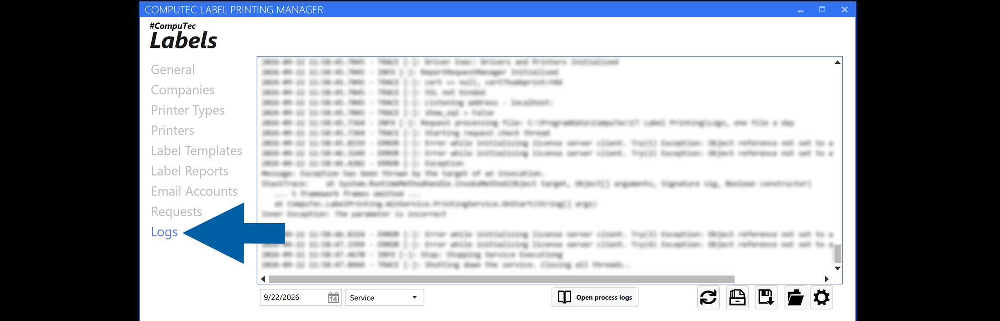
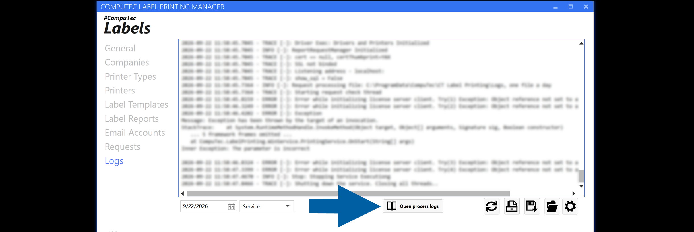

# Troubleshoot Request Processing with Logs

The **Logs** section in **CompuTec Labels** provides information recorded during request processing.

Use the logs to review request processing details and investigate unexpected results.

## Before you start

Identify the request that you want to investigate. You can use the **Requests** section to review the request and its basic information before checking the logs.

## Review logs

To review the CompuTec Labels logs, follow these steps:

1. Open **CompuTec Labels**.
2. Go to **Logs**.

    

3. Find the entries related to the request or operation that you want to investigate.
4. Review the available processing information.
5. Compare the log information with the corresponding request in **Requests**.
6. If necessary, review the rule used to process the request.

Depending on the operation you are troubleshooting, check the relevant configuration, such as:

- **Report**
- **Printer**
- **Email delivery**
- **PDF attachment**

## Process logs

Starting with **CompuTec Labels 4.8.9**, each print request has a structured process log that records the individual steps performed while the request is processed.

**Process logs** make it easier to review the processing of a specific request without searching through the general service log. Each processing step is recorded separately, including successfully resolved parameters.

### Open process logs

To review process logs:

1. Open CompuTec Labels Printer Manager.
2. Go to **Logs**.

    

3. Click **Open process logs**.

    

4. Use the available filters to find the processing information you want to review:
    - **Request ID** – Filters entries by request ID. You can specify a range of request IDs.
    - **Date** – Filters entries by date. You can specify a date range.
    - **Status** – Filters entries by processing status.
5. Click **Apply** to apply the selected filters.

When the process log viewer is opened for a specific request, the **Request ID** filter is automatically populated with that request ID. You can change the filters and click **Apply** to search for other requests.

:::note[info]

Requests created before **CompuTec Labels 4.8.9** do not have process logs. If a process log is not available for a request, the viewer displays a message instead of an empty results table.

:::

### Review process log details

The process log viewer displays the following information:

| Column | Description |
| --- | --- |
| **Timestamp** | Date and time when the processing step was recorded. |
| **RequestID** | ID of the print request. |
| **Seq** | Sequence of the processing step within the request. |
| **Phase** | Processing phase in which the step occurred. |
| **Step** | Processing step that was performed. |
| **Status** | Result of the processing step. |
| **Detail** | Additional information about the processing step. |
| **Duration** | Duration of the processing step. |

The **Phase** column can contain the following values:

- `Received` – The request was received for processing.
- `Templates` – The request was processed in the template phase.
- `Parameters` – Parameters required for the request were processed.
- `Render` – The output was rendered.
- `Print` – The output was processed for printing.
- `Finished` – Request processing was completed.

The **Status** column can contain the following values:

- `OK` – The step completed successfully.
- `Warning` – The step completed with a warning.
- `Error` – An error occurred while processing the step.
- `Skipped` – The step was not performed.

Statuses are color-coded in the process log viewer to make processing results easier to identify.

### Copy and export process logs

The process log viewer provides the following options:

- **Copy** – Copies the selected process log information.
- **Export CSV** – Exports process log information to a CSV file.
- **Show raw** – Displays the raw process log data for troubleshooting and support purposes.

### Process log files

CompuTec Labels stores process logs in the same directory as the service logs:

`C:\ProgramData\CompuTec\CT Label Printing\Logs\`

A separate process log file is created for each day using the following naming format:

`RequestProcessing_yyyy-MM-dd.csv`

For example: `RequestProcessing_2026-08-31.csv`

The date in the file name identifies the date of the records stored in the file. A new file is created at midnight for the next day.

The process log uses the following CSV format:

- UTF-8 with BOM
- Semicolon (`;`) as the delimiter
- `sep=;` on the first line

This format allows the file to open directly in Microsoft Excel with the values separated into columns.

:::warning[important]
Process log files **are not deleted automatically**. Administrators should periodically review the **Logs** directory and remove old process log files when they are no longer required.
:::

### Configure the service log level

You can change the service log level directly from the **Logs** screen in **CompuTec Labels Printer Manager**.

The default log level is **Info**. The selected log level is saved and remains in use until it is changed again.

Use the log level setting to control how much information the Printing Service writes to the service log without manually editing the configuration file.

:::note[info]
The service log itself has not changed. It continues to use the same content and format. The log level setting only controls the level of information written to the service log.
:::

## Correct the configuration

If the logs indicate that the result is related to the configuration:

1. Open the applicable rule.
2. Review the relevant settings.
3. Correct the configuration as required.
4. Save the rule.
5. Process the request again.
6. Review **Requests** and **Logs** to verify the result.

## Result

You can use **Logs** together with **Requests** to investigate request processing and review the relevant CompuTec Labels configuration.

## Additional information

Start with **Requests** when you need to identify a request and review its basic information.

Use **Logs** when you need more details about its processing.

For related configuration, see:

- [**Configure custom rules in CompuTec Labels**](/docs/labels/using-computec-labels/reports/config-report-rules)
- [**Send reports by email**](/docs/labels/using-computec-labels/reports/send-reports)
- [**Attach generated PDF reports to requested documents**](/docs/labels/using-computec-labels/reports/attach-reports-to-docs)
