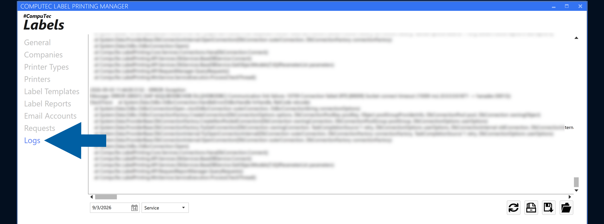

# Troubleshoot Request Processing with Logs

The **Logs** section in **CompuTec Labels** provides information recorded during request processing.

Use the logs to review request processing details and investigate unexpected results.

## Before you start

Identify the request that you want to investigate. You can use the **Requests** section to review the request and its basic information before checking the logs.

## Review logs

To review the CompuTec Labels logs, follow these steps:

1. Open **CompuTec Labels**.
2. Go to **Logs**.

    

3. Find the entries related to the request or operation that you want to investigate.
4. Review the available processing information.
5. Compare the log information with the corresponding request in **Requests**.
6. If necessary, review the rule used to process the request.

Depending on the operation you are troubleshooting, check the relevant configuration, such as:

- **Report**
- **Printer**
- **Email delivery**
- **PDF attachment**

## Correct the configuration

If the logs indicate that the result is related to the configuration:

1. Open the applicable rule.
2. Review the relevant settings.
3. Correct the configuration as required.
4. Save the rule.
5. Process the request again.
6. Review **Requests** and **Logs** to verify the result.

## Result

You can use **Logs** together with **Requests** to investigate request processing and review the relevant CompuTec Labels configuration.

## Additional information

Start with **Requests** when you need to identify a request and review its basic information.

Use **Logs** when you need more details about its processing.

For related configuration, see:

- [**Configure custom rules in CompuTec Labels**](/docs/labels/using-computec-labels/reports/config-report-rules)
- [**Send reports by email**](/docs/labels/using-computec-labels/reports/send-reports)
- [**Attach generated PDF reports to requested documents**](/docs/labels/using-computec-labels/reports/attach-reports-to-docs)
