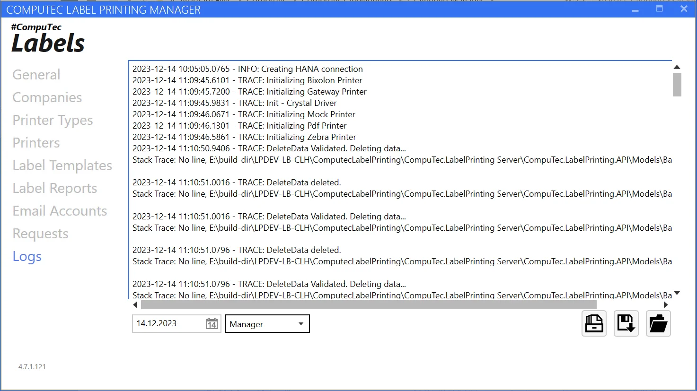
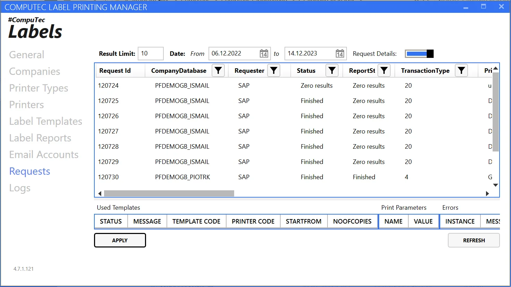
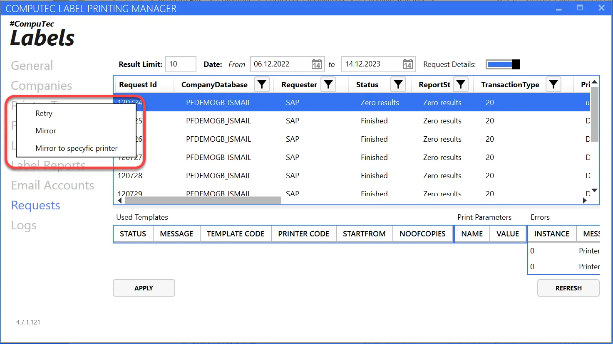
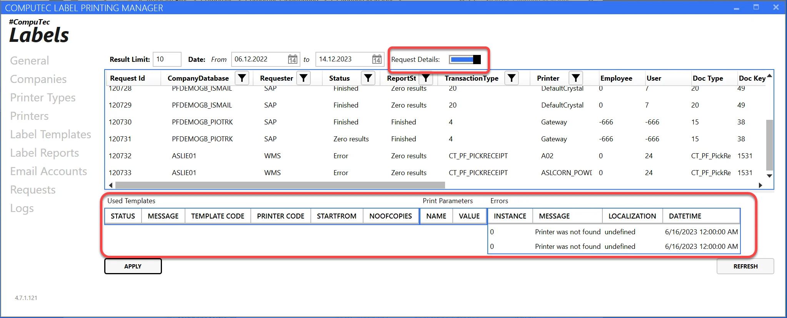
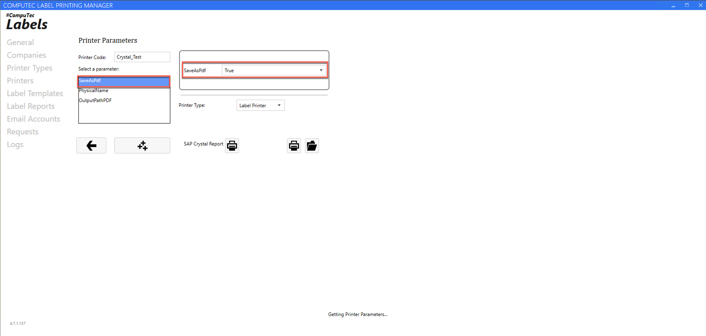
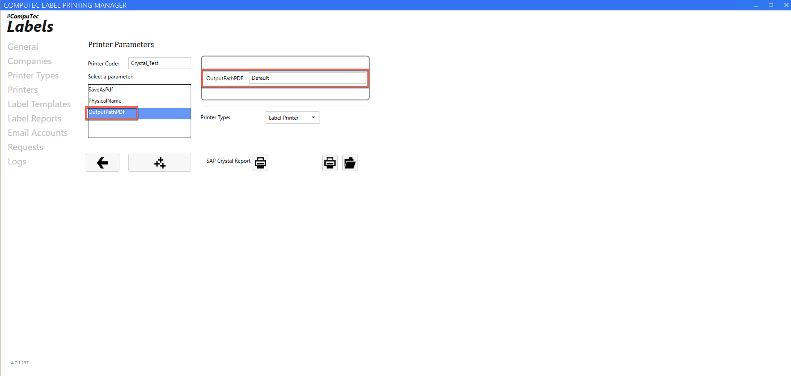

# Other Functions

This section provides an overview of additional utilities that enhance the application's functionality. By leveraging these features, users can streamline workflows, troubleshoot issues, and optimize document storage.

---

## Logs tab

The Logs tab provides a log viewer for tracking system events. Users can select a specific date and logging source (service, installation, or manager) to review relevant logs. On the right side, there are quick options for exporting logs to a file for further analysis.

## Requests tab

The Requests tab displays database requests from `CT_LP_Requests`. Users can filter requests by date (up to 100 entries), company, requester, status, transaction type, and printer.

Right-clicking on a request provides additional options:

- **Resend Request**: Creates a new request.
- **Retry Request**: Attempts to re-run the exact request, changing its status to "C."

    

Users can also view detailed request parameters, information, and error logs by dragging the upper strip to the right-hand side.

    

## Customizing Output Path and File Name

Crystal Printer offers a flexible way to generate and save print outputs as PDF files. By leveraging dynamic parameters and customizable paths, users can streamline their label printing process, ensuring efficient organization and easy retrieval of files.

To save each print as a PDF file using Crystal Printer, you need to enable the relevant parameter to activate this feature.

    

By default, PDF files are saved to: `C:\ProgramData\CompuTec\CT Label Printing\Reports\Crystal`

    

However, you can customize both the file path and the file name by entering a custom value in the designated field. The application supports parameters (defined in the mapping table) and special placeholders for dynamic customization.

### Supported Special Parameters

You can use the following parameters to define dynamic file paths and names:

| Parameter | Description |
| --- | --- |
| @NumberOfCopies | How many labels to be printed |
| @RequestId | Request ID created in CTLABEL database |
| @TemplateCode | Template Code |
| @PrinterCode | Printer Code |
| @CCNo | Current number of label |

### Configuration Examples

You can see the below examples for configuration:

| Input Path | Description | Variables | Output Path | Type |
| --- | --- | --- | --- | --- |
| `e:\tests\p1\@RequestId_@CCNo.pdf` | Static path + file name dynamic | @RequestId = 450  @CCNo = 1 | e:\tests\p1\450_1.pdf | Whole Path |
| `e:\tests\p1\@StringPar20\@StringPar21\@RequestId_@CCNo.pdf`| Dynamic path + dynamic file name | @StringPar20 = 'Final Goods'  @StringPar21 = 'Foods'  @RequestId = 450  @CCNo = 1 |e:\tests\p1\Final Goods\Foods\450_1.pdf | Whole Path |
| `@RequestId_@CCNo.pdf` | Default path + dynamic file name | @RequestId = 450  @CCNo = 1 | C:\ProgramData\CompuTec\CT Label Printing\Reports\Crystal\450_1.pdf | File Name |
| `@StringPar20\@StringPar21\@RequestId_@CCNo.pdf` | Default path + dynamic path + dynamic file name | @StringPar20 = 'Final Goods'  @StringPar21 = 'Foods'  @RequestId = 450  @CCNo = 1 | `C:\ProgramData\CompuTec\CT Label Printing\Reports\Crystal\Final Goods\Foods\@RequestId_@CCNo.pdf`| Path + File Name |

**Important Notes**

- When using dynamic file names, you must explicitly include the .pdf extension. Example: `@RequestId_@CCNo.pdf` is valid, but `@RequestId_@CCNo` is not.
- If a file name conflict occurs (duplicate names), the system will automatically append a suffix in the format: "_@CCNo" (e.g., 450_1.pdf).
- The default save path is: C:\ProgramData\CompuTec\CT Label Printing\Reports\Crystal
- This feature is available in CompuTec Labels version 4.7.1.37 or newer.

---
