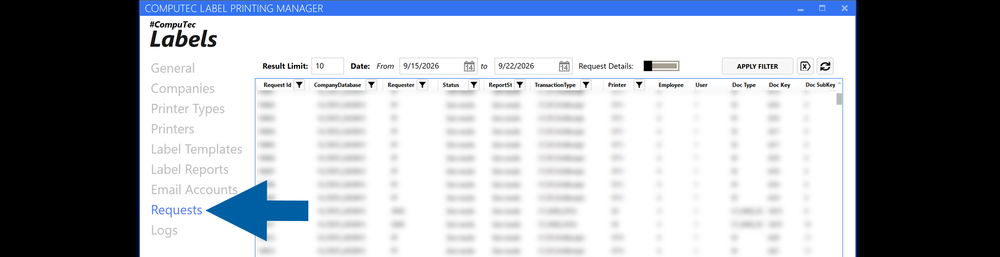
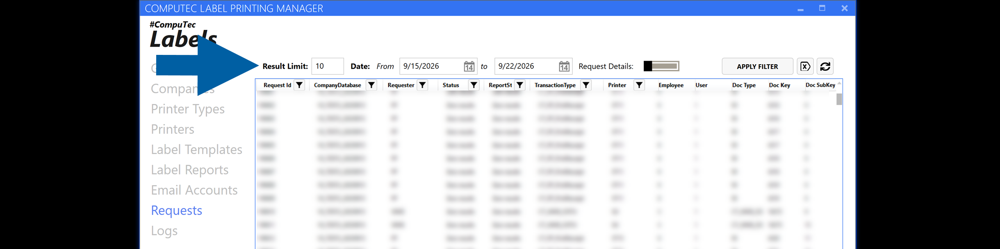
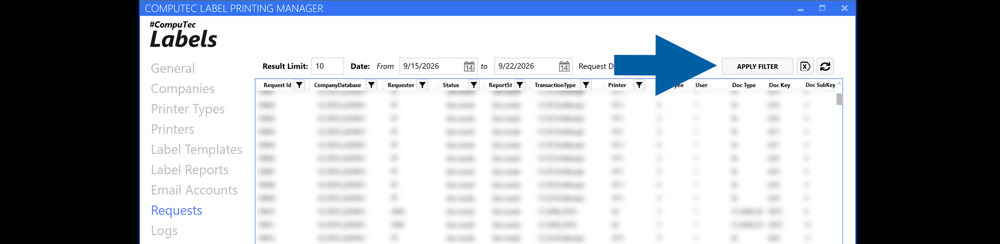
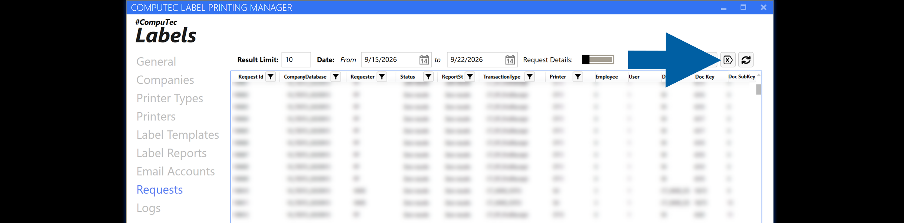
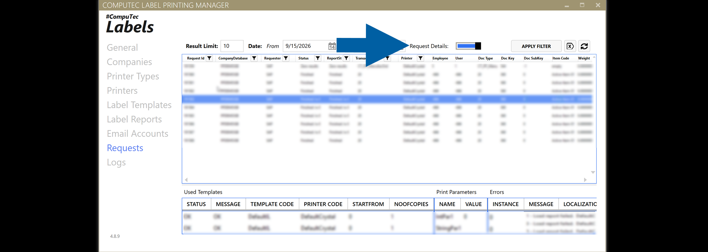

# Review the Requests

The **Requests** section in **CompuTec Labels** provides information about label requests and their processing.

Use this section to find a request and review the information associated with it.

## Before you start

A request must have been submitted to **CompuTec Labels** before you can review it in **Requests**.

## Review label requests

To review the requests, follow these steps:

1. Open **CompuTec Labels Printer Manager**.

2. Go to **Requests**.

    

3. Find the request that you want to review.

    To narrow down the displayed requests, you can:

    - Set the maximum number of displayed requests in **Result Limit**.
    - Select a date range in **Date**.
    - Use the filter icons in the column headers to filter individual columns.

    

4. Click **Apply Filter** to apply the selected filters.

    

    :::note[info]
    To remove the applied filters, click **Clear all filters**.

    

    :::

5. To display additional information about a request, enable **Request Details** and select a request.

    

   The details pane is displayed at the bottom of the **Requests** screen and contains information about used templates, print parameters, and errors.

    :::note[info]
    SAP Business One company credentials are not required to display request details.
    :::

## Result

You can review the request and the information recorded for it in **CompuTec Labels**.

If you need more information about request processing, review the related logs.

## Additional information

If you need to investigate how a request was processed, see **Troubleshoot request processing with logs**.

To permanently remove old requests and their related data from the **CTLABEL** database, use the **Request Cleanup Wizard**. For more information, see [**Clean up old requests in CompuTec Labels**](/docs/labels/setup/requests/cleanup-old-requests).
