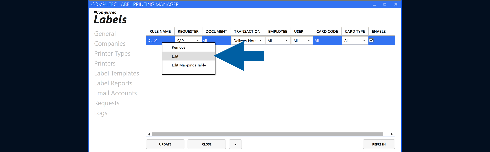
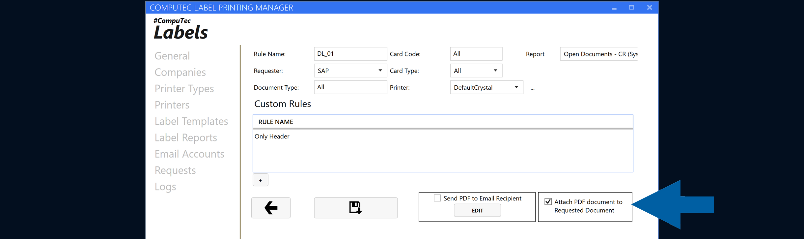

# Attach PDF Reports to Requested Documents

CompuTec Labels can attach a generated PDF report to the document associated with a request.

Use this option when you want to keep the generated report together with the corresponding document.

## Before you start

Before enabling PDF attachments:

- Configure the required report.
- Configure the rule that will process the request. [Read more](/docs/labels/using-computec-labels/reports/config-report-rules)

## Attach a PDF report to a requested document

To attach a PDF report to a document, follow these steps:

1. Open **CompuTec Labels Printing Manager**.

2. Go to **Companies**.

    

3. Right-click the company and select **Edit Report Rules**.

    

4. Add a new rule, or right-click an existing rule and select **Edit**.

    

5. Enable **Attach PDF document to Requested Document**.

    

6. Save the rule.

7. Done. Now you can process a request that meets the configured rule conditions.

## Result

CompuTec Labels generates the PDF during request processing and attaches it to the requested document.

## Additional information

Attaching a PDF to a document and sending a report by email are separate options.

You can enable both options when you want to attach the generated PDF to the requested document and send the report by email.

:::note[info]
For email configuration, see [**Send reports by email**](/docs/labels/using-computec-labels/reports/send-reports).
:::
