# Configure Report Rules

**Report Rules** in **CompuTec Labels** define how label requests are processed for specific scenarios.

You can use rule conditions to determine which report and printer are used and configure additional actions, such as sending the generated report by email or attaching a PDF to the requested document.

## Before you start

Before configuring a custom rule:

- Make sure the required report is available in CompuTec Labels.
- Identify the conditions that should determine when the rule applies.
- Configure any additional resources required by the rule, such as an email account.

## Configure a custom rule

To configure a custom rule, follow these steps:

1. Open **CompuTec Labels Printing Manager**.
2. Go to **Companies**.

    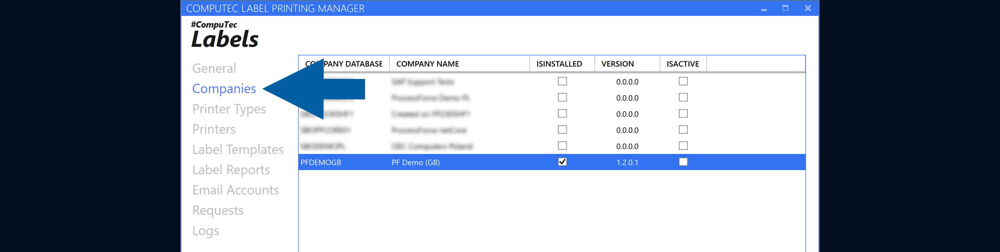

3. Right-click the company and select **Edit Report Rules**.

    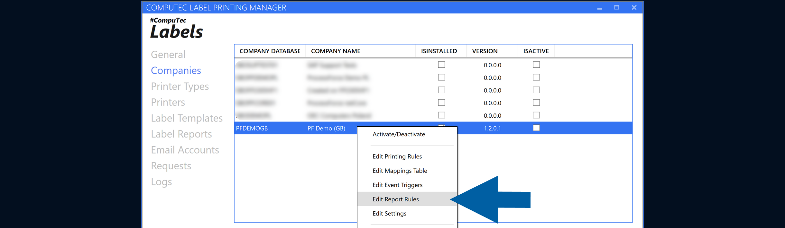

4. Click the **plus (+) icon** to create a new rule.

    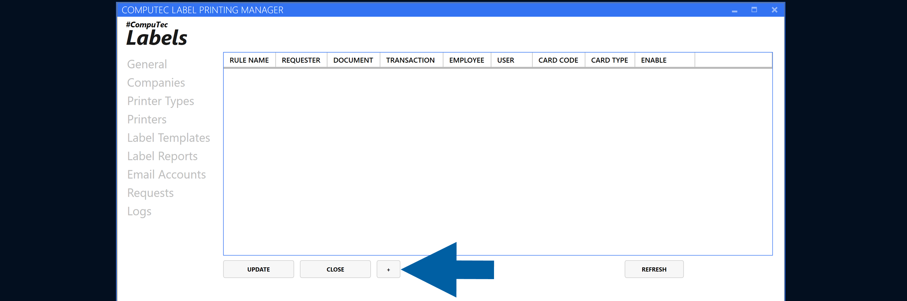

5. Enter the **Rule Name**.

    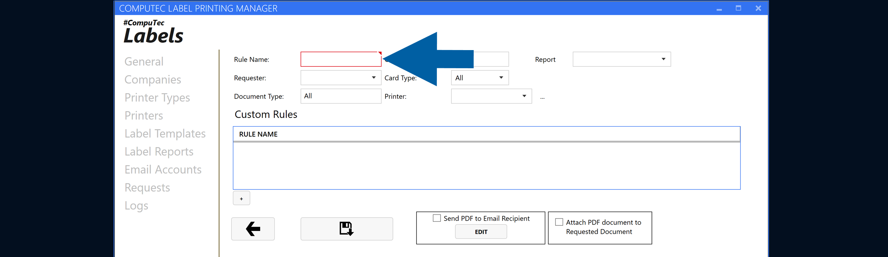

6. Select the Requester from the list.

    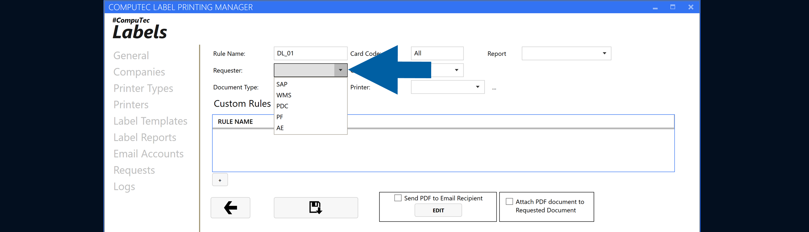

7. Select the required **Printer** if the report should be printed.

    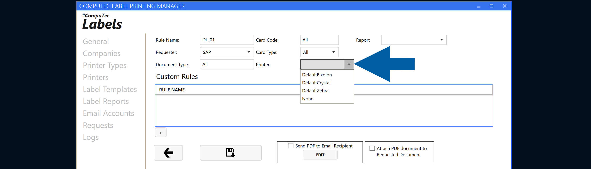

8. Select the Report to use. The available reports come from the SAP Business One report list.

    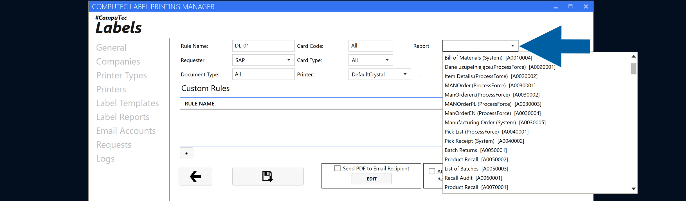

9. Configure additional conditions, such as **Card Code** or **Card Type**, if required.

10. To add a custom condition, click the **plus (+) icon** under **Custom Rules**.  

    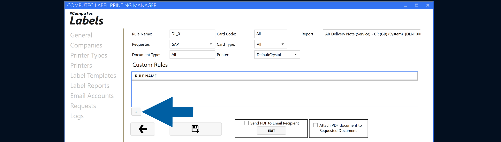

11. Enter a name for the custom condition and define its logic. Custom conditions support SQL, variables, and parameters.

    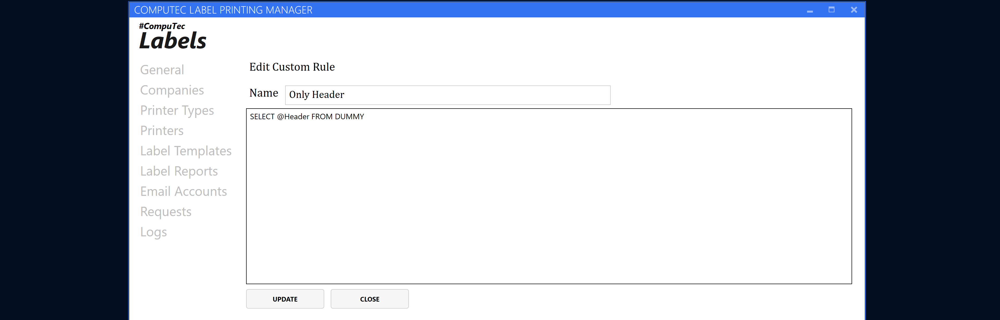

12. If required, enable **Send PDF to Email Recipient**, **Attach PDF document to Requested Document**, or both. [Read more](/docs/labels/using-computec-labels/reports/config-report-rules#configure-additional-actions)

    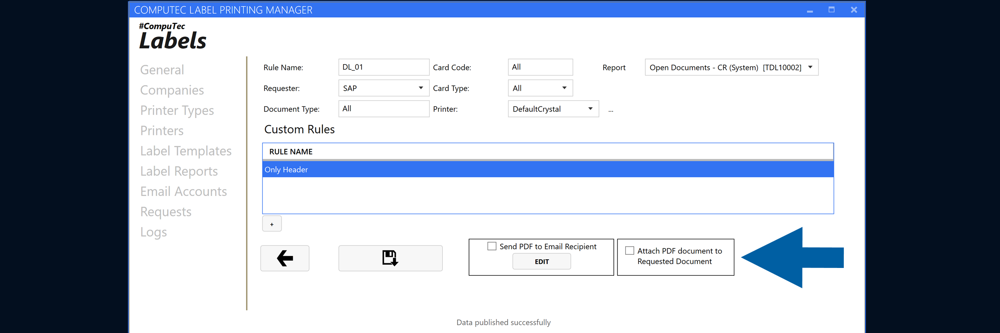

13. Save the rule.

    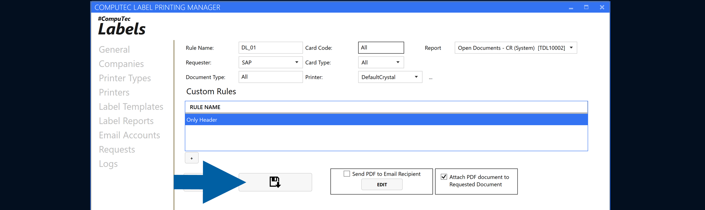

The rule from our example will let you print this report post-delivery automatically. The system will process it from the request list.

## Configure additional actions

Depending on your scenario, you can configure the rule to perform additional actions:

### Send the report by email

Enable **Send PDF to Email Recipien**t to send the generated report by email.

    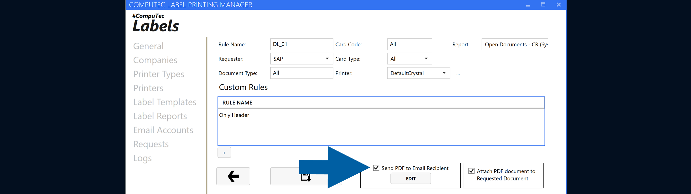

Click **EDIT** to configure the email account, recipients, subject, and message body.

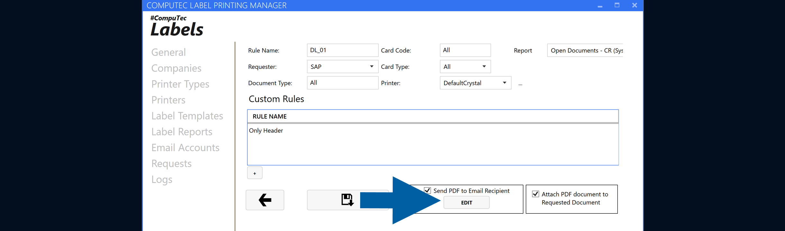

:::note[info]
For more information, see [**Send reports by email**](/docs/labels/using-computec-labels/reports/send-reports).
:::

### Attach the PDF to the requested document

Enable **Attach PDF document to Requested Document** to attach the generated PDF to the document associated with the request.

    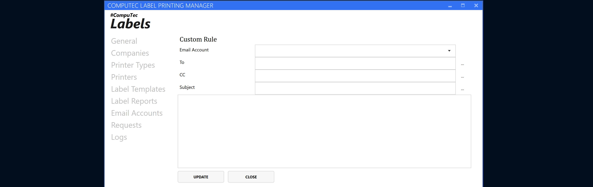

:::note[info]
For more information, see [**Attach PDF Reports to Requested Documents**](/docs/labels/using-computec-labels/reports/attach-reports-to-docs).
:::

## Result

The **Report Rule** is available for processing requests that meet its configured conditions.

You can review processed requests in **Requests** and use Logs when you need more information about request processing.

## Additional information

Review your rule conditions carefully to make sure the rule applies to the intended requests.
