# Send Reports by Email

**CompuTec Labels** can automatically send generated reports by email. You can configure the email account, recipients, subject, and message body, and use SQL queries to determine email recipients and content dynamically.

Emails can be sent to multiple recipients. Document parameters, such as `@DocEntry`, can be used in SQL queries to determine values for the **To**, **CC**, **Subject**, and **Body** fields.

The email body can also contain HTML content, including tables returned by SQL queries.

## Before you start

Before configuring email sending:

- Configure an email account in CompuTec Labels. Read more
- Make sure the email account can send messages successfully.

## Enable email sending

To enable email sending, follow these steps:

1. In **CompuTec Labels Printing Manager**, go to **Companies**.
2. Select the company that you want to configure and click **Edit Report Rules**.

    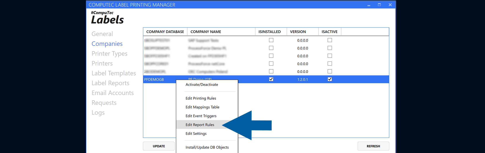

3. Select an existing rule and click **Edit**, or add a new rule. [Read more](/docs/labels/using-computec-labels/reports/config-report-rules)

    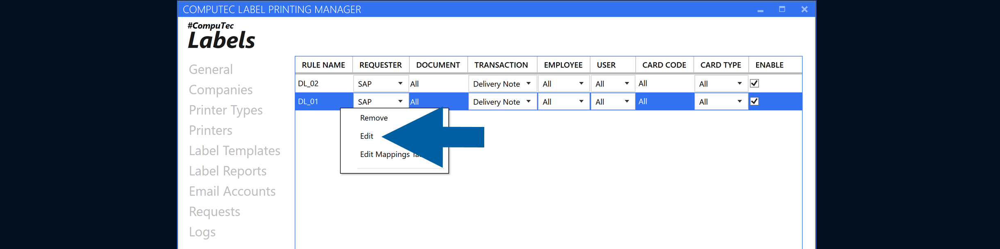

4. Enable **Send PDF to Email Recipient**.

    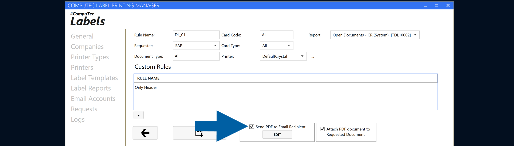

5. Click **Edit** to configure the email settings.

    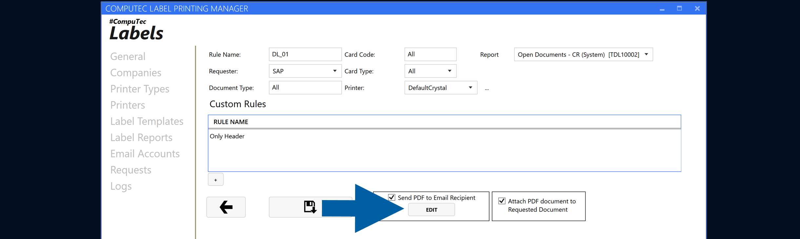

6. Select the email account that you want to use.

    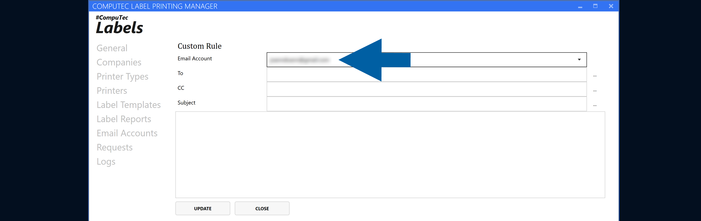

7. Configure the following fields:

    - **To** – Primary email recipients.  
    - **CC** – Additional email recipients.  
    - **Subject** – Email subject.  
    - **Body** – Email message content.

    :::info[Note]
        - The **To** and **CC** fields support multiple email addresses. You can enter the addresses manually or retrieve them using an SQL query. [Read more](/docs/labels/using-computec-labels/reports/send-reports#configure-multiple-recipients)
        - You can add HTML to the email body. [Read more](/docs/labels/using-computec-labels/reports/send-reports#add-html-to-the-email-body)
    :::

8. Click **Update** to save the configuration.

    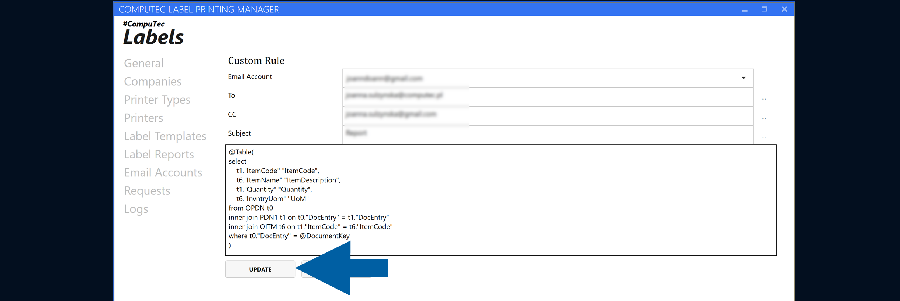

9. Click **Close**.

    

10. Click the **save icon** to save your configuration.

    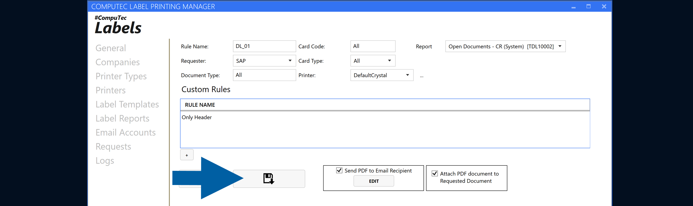

### Configure multiple recipients

The **To** and **CC** fields support multiple email addresses. You can enter the addresses manually or retrieve them using an SQL query.

#### Enter recipients manually

To specify multiple recipients manually, separate the email addresses with semicolons:

`e-mail-01@domain.com; e-mail-02@domain.com`

You can use this format in both the **To** and **CC** fields.

#### Retrieve recipients with an SQL query

You can also retrieve recipients using an SQL query:

1. Click the **three-dot icon** next to the chosen field.

    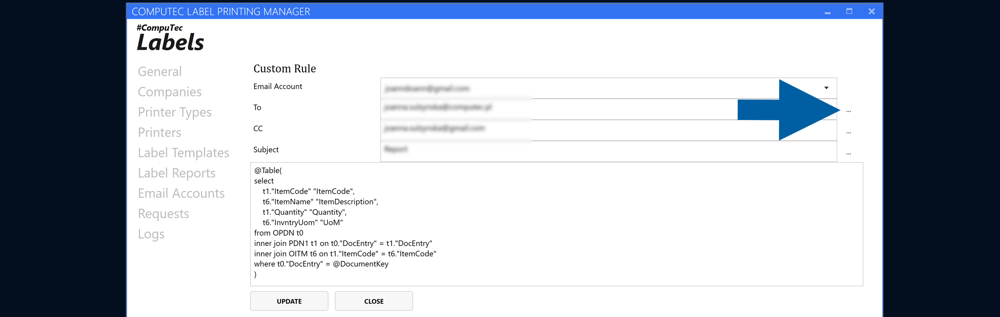

2. Enter an SQL query returning multiple email addresses as a single semicolon-separated value:

    ``SELECT 'e-mail-01@domain.com; e-mail-02@domain.com' FROM DUMMY``
3. Click **Update**.

    

:::note[info]  

Alternatively, the query can return each email address as a separate row:

```sql
SELECT 'e-mail-01@domain.com' FROM DUMMY 
UNION ALL 
SELECT 'e-mail-02@domain.com' FROM DUMMY 
UNION ALL 
SELECT "E_mails" FROM "@EMAIL_TABLE"
```

Both methods allow CompuTec Labels to send the email to multiple recipients.
:::

## Use document parameters

Use document parameters in SQL queries to determine email recipients and content dynamically.

For example, you can use the `@DocEntry` parameter to retrieve values related to the document being processed.

Parameters such as `@DocEntry` can be used in SQL queries for the following fields:

- **To**
- **CC**
- **Subject**
- **Body**

### Add a document parameter to an SQL query

To add a document parameter to an SQL query, follow these steps:

1. Click the **three-dot icon** to open the query editor for the required field, for example, **To**.

    

2. Enter your SQL query.
3. Use the required document parameter in the query, for example, `@DocEntry`.

    :::info[note]

    The available parameters depend on the SAP Business One object type being processed. You can check the queries and available parameters for each object type in the company settings.
    :::

### Check available parameters for an object type

To check the available parameters for an object type, follow these steps:

1. Go to **Companies**.  
2. Right-click the required company and select **Edit Settings**.

    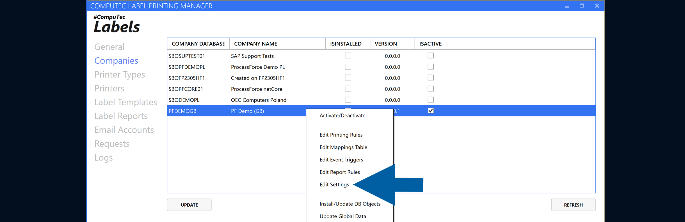

3. Find the required object type in the list.

    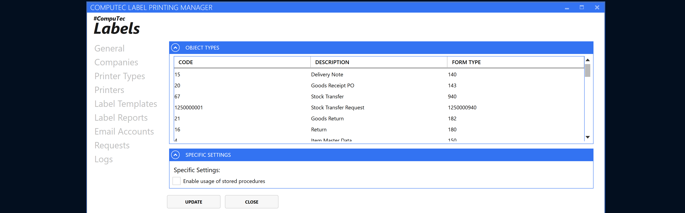

4. Right-click the object type and select **Edit Queries**.

    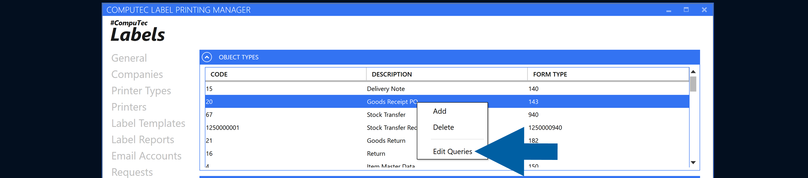

5. Review the available queries and parameters for the selected object type.

    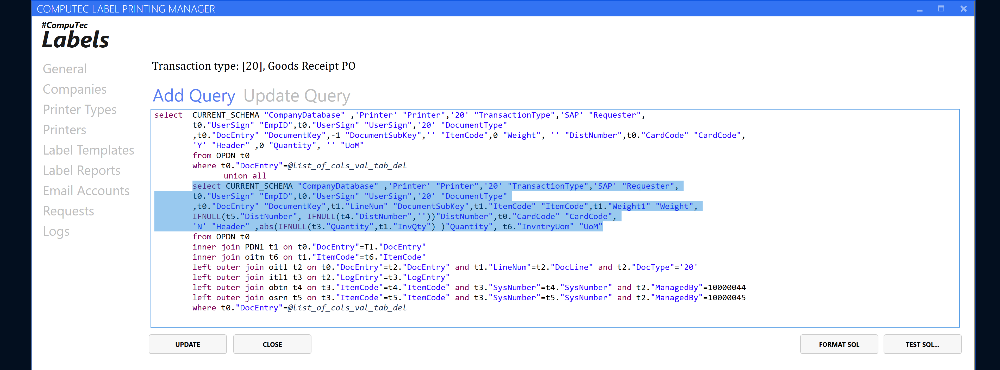

You can use the listed parameters when creating SQL queries for email recipients and content.

## Add HTML to the email body

The **Body** field supports HTML, allowing you to add formatted and structured content to the message.

SQL queries can also return HTML tables for the email body. You can use this to present document information in a structured format instead of plain text.

:::info[Note]
The content displayed in the email depends on the HTML and data returned by the SQL query.
:::

## Use case: Send emails when a Goods Receipt PO is posted

CompuTec Labels can automatically send an email when a **Goods Receipt PO** is posted with reference to one of the following source documents:

- **Purchase Order**  
- **A/P Reserve Invoice**  
- **Production Order**

The email is sent using the email account and report configured in the applicable CompuTec Labels rule.

## Result

When the configured rule conditions are met, CompuTec Labels generates the report and sends it by email.

Depending on the configuration, the email can:

- Include multiple recipients.
- Use recipients entered manually or returned by SQL queries.
- Use document parameters, such as `@DocEntry`, to generate dynamic recipients and content.
- Include HTML formatting and tables returned by SQL queries in the email body.

## Additional information

Email sending is configured as part of a CompuTec Labels rule.

If you also want to attach the generated PDF to the requested document, enable [**Attach PDF document to Requested Document**](/docs/labels/using-computec-labels/reports/attach-reports-to-docs).
