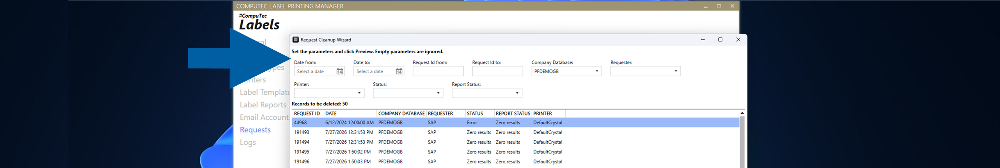
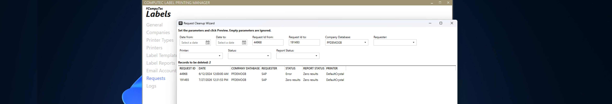

# Clean Up Old Requests

Use the **Request Cleanup Wizard** in **CompuTec Labels** to remove requests that you no longer need from the **CTLABEL** database.

Removing old requests can help reduce the size of the **CTLABEL** database. Before deleting the requests, you can filter and preview the records that will be removed. CompuTec Labels also creates a CSV file containing the deleted records.

## Before you start

Review which requests you want to remove before starting the cleanup.

:::warning[important]
**Request cleanup is irreversible**. The selected requests and their related data are **permanently deleted** from the **CTLABEL** database.
:::

## Clean up requests

1. In **CompuTec Labels Printing Manager**, go to **Requests**.

    

2. Right-click inside the area of the **Requests** window and select **Request Cleanup Wizard**.

    

3. In the **Request Cleanup Wizard**, define the filters for the requests that you want to remove.

    

    You can filter requests by:

        - **Date from**
        - **Date to**
        - **Request Id from**
        - **Request Id to**
        - **Company Database**
        - **Requester**
        - **Printer**
        - **Status**
        - **Report Status**

    You can leave fields empty if you do not want to use them as filters.

4. Click **Preview**.

    

5. The **Records to be deleted** section displays the requests that match the specified filters.

    

    :::info[Note]
    The preview displays a maximum of 2,000 records. If more than 2,000 requests match the filters, the cleanup operation still applies to all matching records.
    :::

6. Review the records and click **Next**.

    

7. Review the cleanup confirmation. The wizard displays the number of requests that will be permanently deleted.

8. Enter `CONFIRMED` in the confirmation field.

    

9. Click **CLEANUP**.

    

10. When the cleanup is complete, click **OK**.

    

## Result

The requests that match the specified filters are **permanently deleted** from the **CTLABEL** database.

Before deleting the records, **CompuTec Labels** saves the records that will be removed to a **CSV file** in the **logs folder**. For example: `C:\ProgramData\CompuTec\CT Label Printing\Logs\RequestCleanup_20260821_143748.csv`.

The confirmation message displays the **number of deleted requests** and the **location of the backup file**.

## Additional information

Use the filters in the **Request Cleanup Wizard** to limit the cleanup to requests that you no longer need.

Because the cleanup operation is **irreversible**, always review the records displayed in the preview before confirming the deletion.
