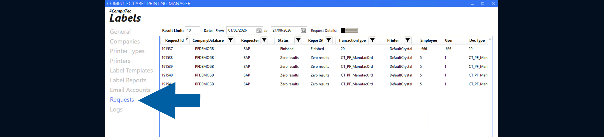
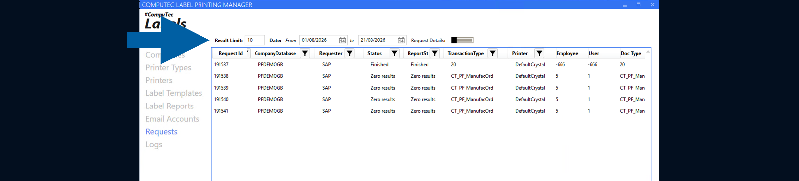

# Review the Requests

The **Requests** section in **CompuTec Labels** provides information about label requests and their processing.

Use this section to find a request and review the information associated with it.

## Before you start

A request must have been submitted to **CompuTec Labels** before you can review it in **Requests**.

## Review label requests

To review the requests, follow these steps:

1. Open **CompuTec Labels Printer Manager**.

2. Go to **Requests**.

    

3. Find the request that you want to review.  
    You can use the available filters to narrow down the displayed requests.

    

4. Review the information available for the request.

## Result

You can review the request and the information recorded for it in **CompuTec Labels**.

If you need more information about request processing, review the related logs.

## Additional information

If you need to investigate how a request was processed, see **Troubleshoot request processing with logs**.

To permanently remove old requests and their related data from the **CTLABEL** database, use the **Request Cleanup Wizard**. For more information, see [**Clean up old requests in CompuTec Labels**](/docs/labels/using-computec-labels/requests/cleanup-old-requests).
