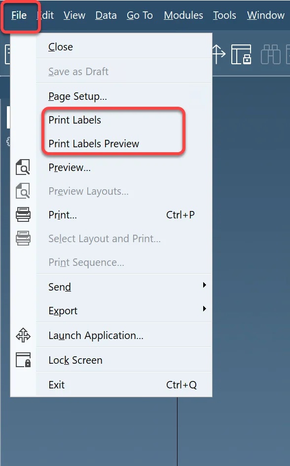
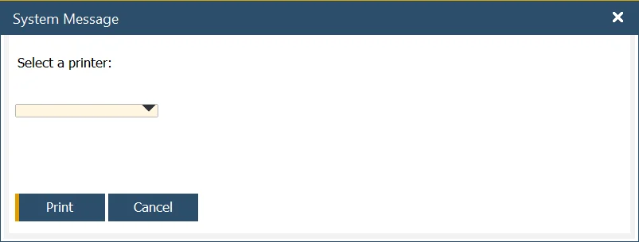
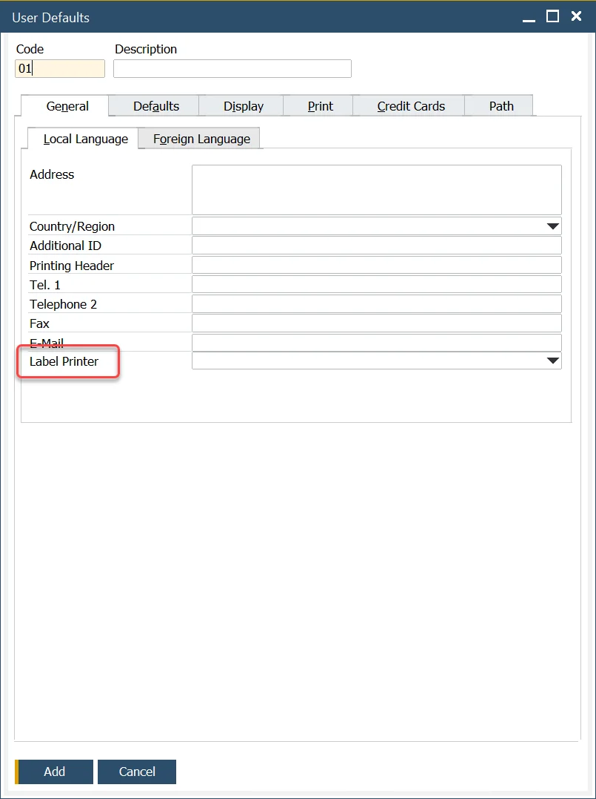
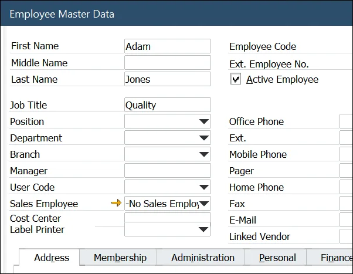

# Overview

Printing labels in the SAP add-on requires proper setup and configuration.

:::info
    Printing labels in the SAP add-on requires proper setup and configuration. Click [here](../../setup/computec-labels-sap-addon.md) to check how to do this.
:::

To enable printing, you must define object types that are eligible for this action. You can configure these settings by following the instructions [here](../../setup/configuration/company-installation-and-configuration.md). Only the objects marked in this configuration will trigger a print action.

- Summarizing, all objects checked as 'Add' in the event triggers view (CT_LP_ETRG table) in column SAP will print automatically on add an action (provided employee has access to it (see events triggers view))
- All objects checked as 'OnChange' in the event triggers view (CT_LP_ETRG table) in column SAP will print automatically on add/update action (provided the employee has access to it (see events triggers view)).
- All objects regardless of an action in the event triggers view (CT_LP_ETRG table), will be accessible for manual printing in the SAP add-on.

## Manual Printing

To manually print a document, follow these steps:

1. Open the document (ensure the object type has been defined for printing).
2. Navigate to File > Print Labels.

    

3. A new window will appear. Select the desired printer and click Print.

    

## Default Printers for Autonomic Printing

For automatic printing, a default printer must be assigned to the user or employee. To set up a default printer:

1. Navigate to SAP Business One: Administration > Setup > General > User Defaults.
2. Under the General tab, select a printer.
3. Assign the user code to match the corresponding code from the users_default page.

    

4. Ensure the employee’s master data is correctly configured.

---
