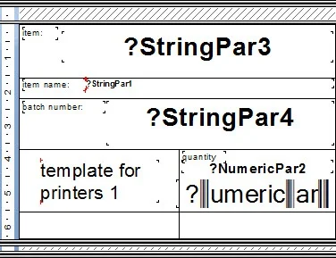
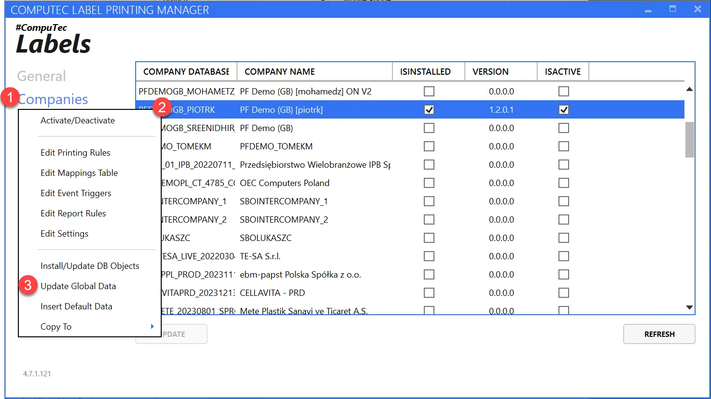
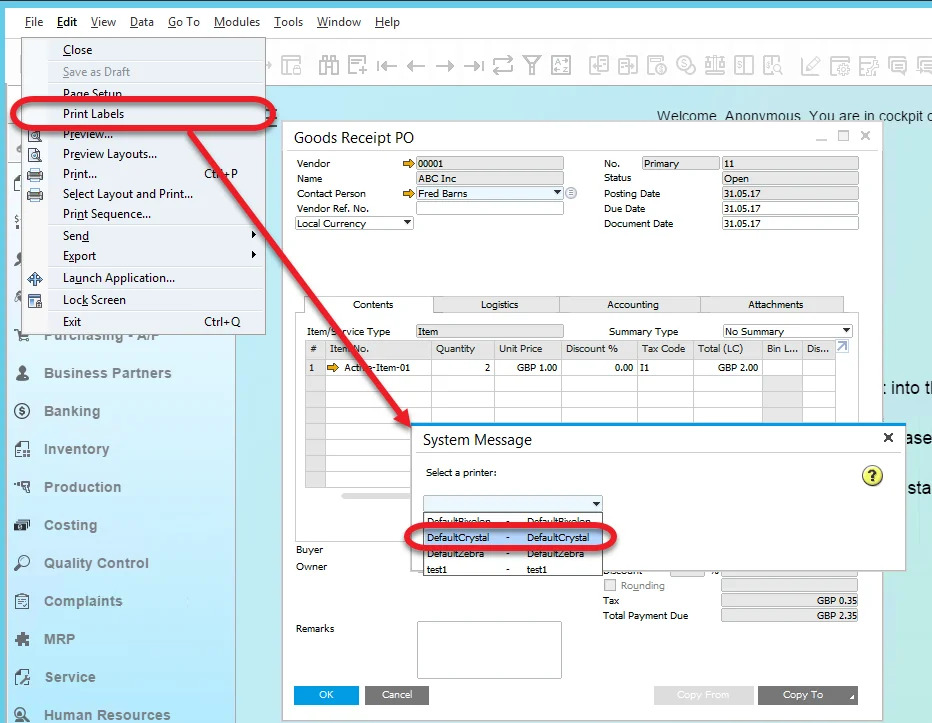
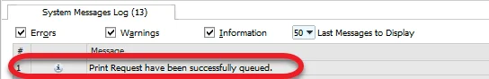
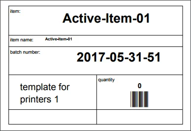

# Scenario 1: Goods Receipt PO Printed from SAP Business One

Printing a Goods Receipt Purchase Order (GRPO) in SAP Business One requires proper configuration of printer settings, templates, and mapping parameters. In this guide, we will walk through the step-by-step process to configure the system for printing GRPOs, ensuring that they are also saved as PDF files.

---

## How-to: Step-by-Step Configuration

### 1. Configure Printer

    SAP Business One supports saving labels as PDFs when using a **Crystal** printer type.

    **Sample Printer Configuration:**

    - Printer Code: test1
    - Printer Type: Crystal
    - Printer Name: test1
    - Localization: CT

    With the following parameters, define

    - SaveAsPdf: True
    - PhysicalName: Send to OneNote 16 (one of the printer's names available on this test server)
    - MaxCapacity: 75.

    ➡️ For more details, refer to the [Printer Configuration documentation](../../setup/configuration/general-configuration.md#printers).

### 2. Define Label Template

    To print GRPO labels, we need to define and assign a Label Template. The template used in this scenario is as follows:

    | TEMPLATE CODE | TEMPLATE NAME | TEMPLATE DESCRIPTION |
    |:-------------:|:-------------:|:--------------------:|
    | GRPO          | GRPO          | GRPO                 |

    ➡️ For more information, see [Printer Configuration](../../setup/configuration/general-configuration.md#printers).

### 3. Set Printing Rules

    The following rules apply to GRPO printing:

    - Requester: SAP
    - Transaction: Goods Receipt PO
    - Employee/User/ItemGroup/Warehouse: All
    - Unit of Measurement: not checked
    - Header: Not checked
    - Template: GRPO

### 4. Place Label Report

    Crystal Reports must be saved in the following directory:

    ```plaintext
    C:\ProgramData\CompuTec\CT Label Printing\Reports\
    ```

    >Note: (Use the installation-specific path if the default wasn't selected.)

    The Crystal Report file used in this scenario is as follows:

    

    Crystal Reports use parameters (e.g., StringPar, NumericPar) which are configured through Mapping.

### 5. Define Mapping Parameters

    Mapping rules define how data is assigned to specific variables within the label layout. The mappings for this scenario are:

    |    Name    |    Type   |             Value             |
    |:----------:|:---------:|:-----------------------------:|
    | StringPar3 | Parameter | Item Code (Item Code)         |
    | StringPar1 | Parameter | ItemName (ItemName)           |
    | StringPar4 | Sql       | SELECT @DistNumber FROM DUMMY |
    | NumberofCopies | Sql | SELECT 5 FROM DUMMY |

    ℹ️ NumberofCopies controls how many labels are printed. Make this dynamic by linking to a database field if needed.

    ➡️ More more about mappings: [Mapping Parameters Configuration](../../setup/configuration/company-installation-and-configuration.md#mapping-parameters-view).

### 6. Set Event Triggers

    Set up when the printing will occur using the Event Triggers View.

    Event Triggers set up used in this scenario:

    | Employee | Employee Department |    Object Type   |    SAP   |    PDC   |    WMS   |    ProcessForce    |
    |:--------:|:-------------------:|:----------------:|:--------:|:--------:|:--------:|:--------:|
    | All      | All                 | Goods Receipt PO | OnChange | NoAction | NoAction | NoAction |

    ➡️ Learn more about(../../setup/configuration/company-installation-and-configuration.md#event-triggers-view).

### 7. Update Global Data

    After configuring the settings, update the global data by navigating to Companies and selecting the Update Global Data option.

    

### 8. Assign Template to Printer

    To complete the setup, assign GRPO to a specific printer with the following configuration:

    | INFO |    NAME   | TEMPLATE CODE | PRINTER CODE |                                               FILE                                              |
    |:----:|:---------:|:-------------:|:------------:|:-----------------------------------------------------------------------------------------------:|
    | OK   | GRPOtest1 | GRPO          | test1        | C:\Program Files (x86)\CompuTec\CompuTec LabelPrinting\Reports\LabelPrintingAyCrystalLayout.rpt |

    ➡️ For assigning reports, refer to [Label Reports Configuration](../../setup/configuration/general-configuration.md#label-reports).

### 9. Print the Label

    Due to the `OnChange` trigger, the GRPO label will print automatically upon update.

    We can also print a label manually at any time. To print labels manually:

    1. Open SAP Business One.
    2. Navigate to File > Print Labels in the upper menu.
    3. Select Crystal printer from the drop-down list.
    4. Click Print.

        

    Upon printing, the following message appears:

    

    The label is printed and saved as a PDF in the default location: `Local Disk (C:)\ProgramData\CompuTec\CT Label Printing\Reports\Crystal`:

    

---
