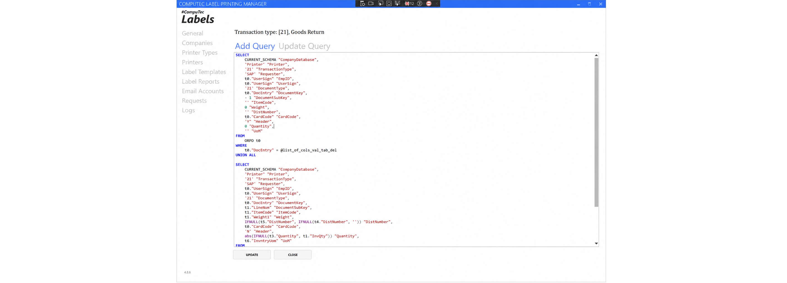
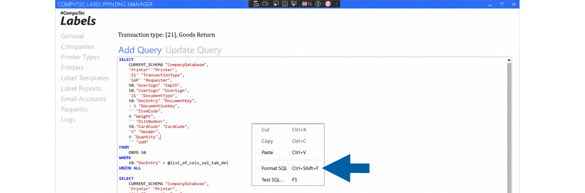
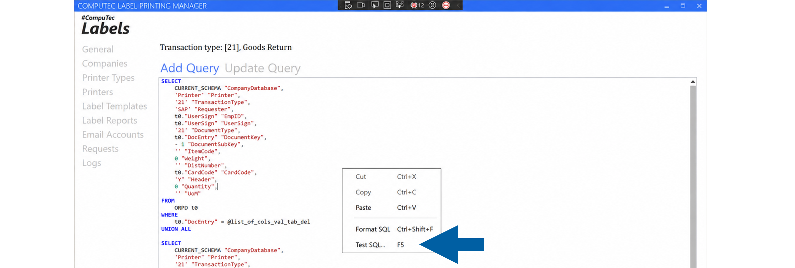
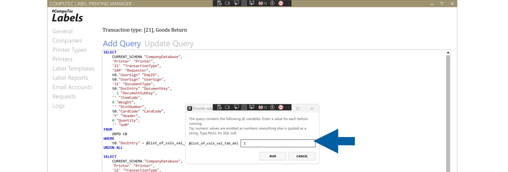
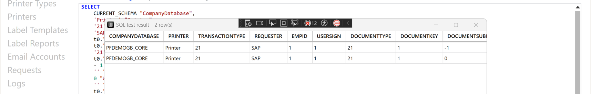
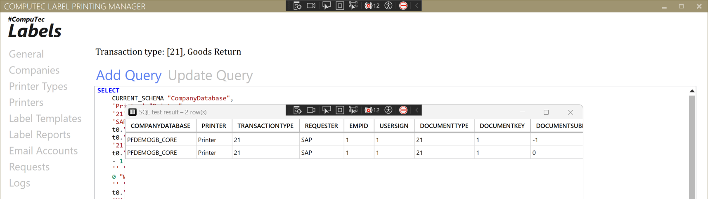

# Write and Test SQL Queries

The SQL editor in **Company Object Types** helps you create, format, and test SQL queries used to retrieve data for label printing.

Available on the **Add Query** and **Update Query** tabs, the editor includes syntax highlighting, automatic formatting, and the ability to test queries against the connected SAP Business One company database.

## Before you start

Before testing a query, ensure that:

- **CompuTec Labels** is connected to the correct **SAP Business One** company database.
- Your database user has permission to execute SQL queries.

:::warning[important]
Test only read-only queries, such as ``SELECT`` statements. Running queries that modify data may affect your **SAP Business One** database.
:::

## SQL syntax highlighting

The editor automatically highlights SQL syntax as you type, making queries easier to read and review.

The following SQL elements are highlighted:

| Element | Display |
| --- | --- |
| Keywords | Blue and bold |
| Functions | Purple |
| String values | Dark red |
| Comments | Green |
| Numbers | Teal |
| Operators | Gray |

Syntax highlighting is available on both the **Add Query** and **Update Query** tabs.



## Format a query

The **Format SQL** command automatically reorganizes your SQL query into a consistent, easy-to-read layout.

The formatter:

- Places major SQL clauses, such as ``SELECT``, ``FROM``, ``WHERE``, ``GROUP BY``, ``ORDER BY``, and ``HAVING``, on separate lines.
- Formats joins, including ``INNER JOIN``, ``LEFT JOIN``, ``RIGHT JOIN``, and ``CROSS JOIN``.
- Formats set operators, such as ``UNION``, ``UNION ALL``, ``INTERSECT``, and ``EXCEPT``.
- Places top-level comma-separated values on separate lines while keeping function arguments, such as ``IFNULL(a, b)``, together.
- Improves indentation throughout the query for better readability.

To format a query:

1. Open **Company Object Types**.
2. Select the required object type.
3. Open the **Add Query** or **Update Query** tab.
4. Right-click anywhere in the editor and select **Format SQL**, or press **Ctrl+Shift+F**.

    

## Test a query

The **Test SQL** feature allows you to execute a query against the currently connected SAP Business One company database before saving it.

Testing a query helps verify that:

- the query executes successfully,
- the syntax is valid,
- the query returns the expected results.

To test a query:

1. Open the **Add Query** or **Update Query** tab.
2. Enter or modify the SQL query.
3. Right-click the editor and select **Test SQL...**, or press **F5**.

    

4. If prompted, enter values for any query parameters.

    

5. Select **Run**.

6. When execution finishes, the query results are displayed in a read-only window.

    

## Test queries with parameters

If the query contains parameters that begin with ``@``, **CompuTec Labels** automatically detects them and prompts you to enter a value for each parameter before the query is executed.

For example:

```sql
SELECT
    T0."ItemCode",
    T0."ItemName"
FROM OITM T0
WHERE T0."ItemCode" = @ItemCode
```

When you run the query, enter the required value for ``@ItemCode`` and select **Run**.

The editor automatically prepares the entered values before executing the query:

- Numeric values are treated as numbers.
- ``NULL`` is treated as an SQL ``NULL`` value.
- Text values are enclosed in single quotation marks automatically.

SQL system variables that begin with ``@@`` are ignored and are not treated as user-entered parameters.

## View query results

After the query finishes, the results are displayed in a separate read-only window.

The results window shows:

- all returned records,
- the number of rows,
- the number of columns.



Use the results to verify that the query returns the expected data before saving it.

## Result

The SQL editor helps you write, format, and validate SQL queries more efficiently. By testing queries before saving them, you can identify syntax issues, verify parameter values, and confirm that the query returns the expected results.
