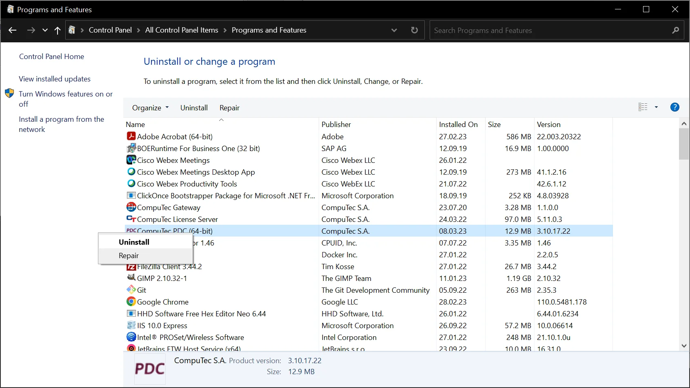

# Application Upgrade

This document outlines the steps necessary to upgrade the CompuTec PDC application to a newer version.

:::info
   As of the releases **3.10.6.1** (associated with CompuTec ProcessForce version 10.0 Release 6) and **3.93.15.1** (corresponding to CompuTec ProcessForce version 9.3 PL14 Release 2), **CompuTec PDC is now provided exclusively as an CompuTec AppEngine plugin**. Upgrading to the latest version ensures you benefit from improved functionality, performance enhancements, and compatibility with newer releases.

   For detailed guidance, refer to:
      - [CompuTec AppEngine Plugin Configuration Manual](https://learn.computec.one/docs/pdc/pdc-plugin/computec-pdc-plugin)
      - [CompuTec AppEngine Plugin Upgrade Manual](https://learn.computec.one/docs/appengine/plugins-user-guide/computec-pdc-plugin#upgrade-of-the-application).

:::

## Steps to Upgrade CompuTec PDC

To upgrade CompuTec PDC to a newer version, perform the following steps:

1. **Uninstall the Current Version**: to begin the upgrade, uninstall the existing CompuTec PDC application on your system. Follow these steps in Windows:
   - Navigate to Control Panel > All Control Panel Items > Programs and Features.
   - Locate CompuTec PDC (64-bit), right-click on it, and select "Uninstall".

      
2. **Obtain the Latest Installer**: download the latest version of the CompuTec PDC installer file. You can find the updated installer [this link](https://learn.computec.one/docs/pdc/administrator-guide/installation/first-installation).
3. **Install the New Version**: once you've obtained the latest installer, follow the installation instructions provided [this link](https://learn.computec.one/docs/pdc/administrator-guide/installation/first-installation).

   Make sure to fulfill all system [requirements](https://learn.computec.one/docs/pdc/administrator-guide/installation/requirements) before proceeding with the installation.

---
