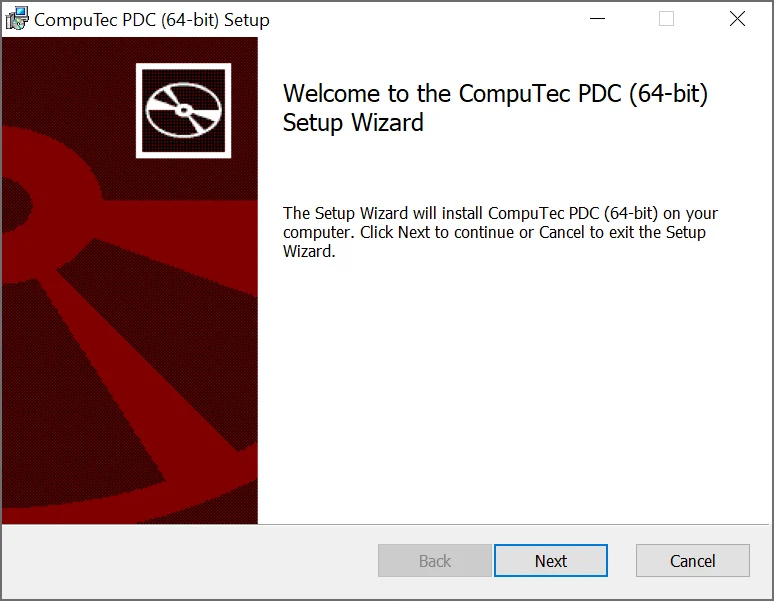
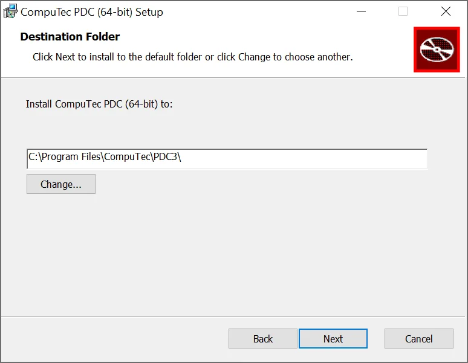
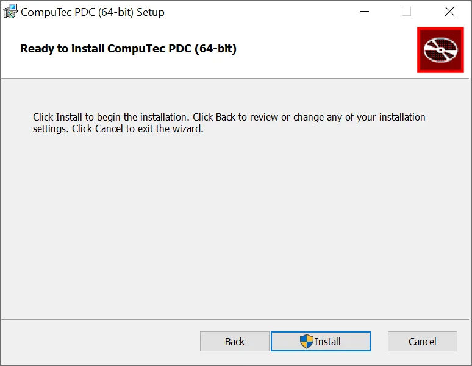
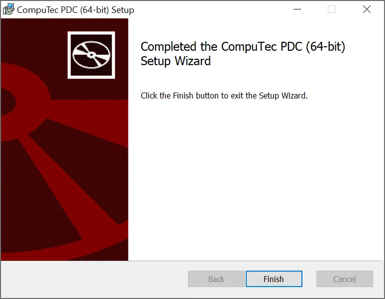

# First Installation

This guide provides a detailed, step-by-step process for installing the CompuTec PDC application. The installation procedure outlined here is for the initial setup of the application. If you need guidance on upgrading the application to a newer version, please refer to the [upgrade documentation](./application-upgrade.md).

---

:::info
    Starting with the releases **3.10.6.1** (associated with CompuTec ProcessForce version 10.0 Release 6 (R6)) and **3.93.15.1** (corresponding to CompuTec ProcessForce version 9.3 PL14 Release 2 (R2)), **CompuTec PDC is exclusively available as an CompuTec AppEngine plugin**.

    Follow the [CompuTec AppEngine plugin configuration manual](https://learn.computec.one/docs/pdc/pdc-plugin/computec-pdc-plugin) to ensure that the installation process is carried out correctly and that the application is set up for use in your system.
:::

:::warning
    Be sure to fulfill the requirements described in [this guide](https://learn.computec.one/docs/pdc/administrator-guide/installation/requirements) before starting the installation process.
:::

1. **Download the Installation File**: begin by downloading the CompuTec PDC [installation file](https://learn.computec.one/docs/appengine/plugins-user-guide/computec-pdc-plugin). Once downloaded, run the file to begin the installation process.
2. **Start the Installation**: in the window that appears, click the "Next" button after reading the message about the installation preparations.

    
3. **Choose the Installation Path**: a new window will prompt you to select an installation destination path. The default path is "C:\Program Files\CompuTec\PDC3". If you wish to change the location, click the "Change..." button to browse for another folder. After selecting the desired path, click "Next" to continue.
  
    
4. **Begin the Installation**: a new window will appear. Click the "Install" button to start the installation process.
  
    
5. **Finish the Installation**: once the installation is complete, a message will appear. Click the "Finish" button to exit the installer.
  
    
6. **Start the Application**: the CompuTec PDC service is now installed and ready to run. You can launch the application by clicking the shortcut created in the Windows program list.

:::info
    Remember that the application needs to be [set up](https://learn.computec.one/docs/pdc/administrator-guide/setting-up-the-application/overview) correctly after the installation.
:::
