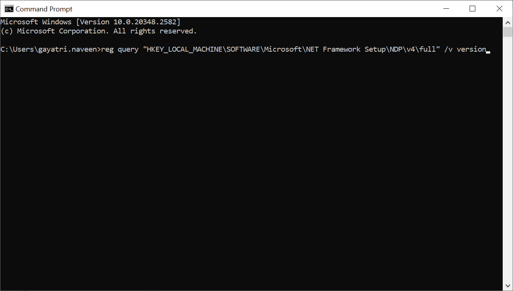
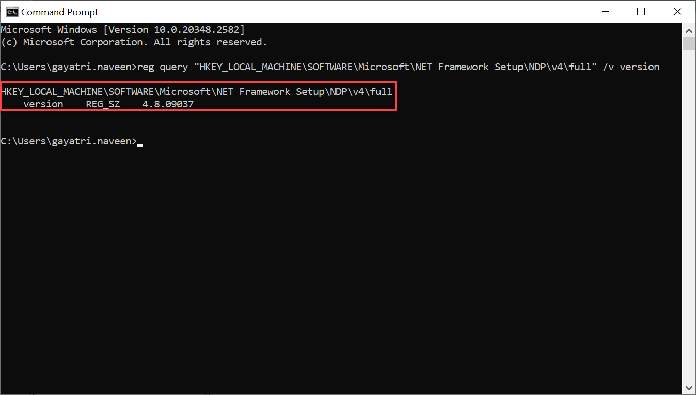
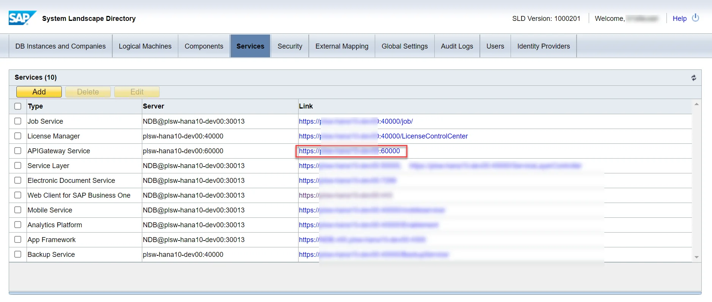
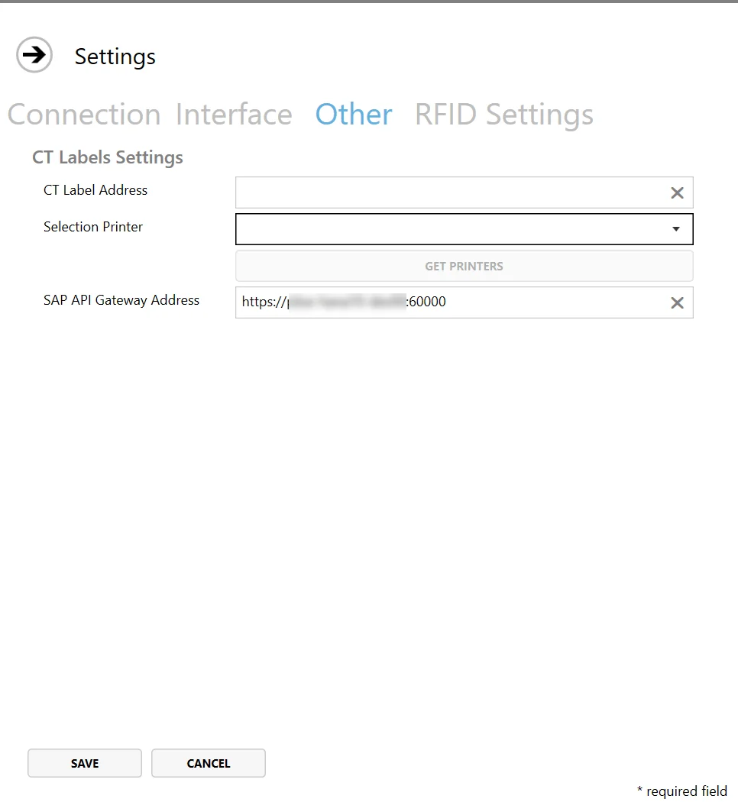

# Requirements

To ensure CompuTec PDC functions correctly, a properly configured system environment is essential. Ensuring compatibility with these prerequisites is vital for seamless integration and performance. This guide outlines the prerequisites and steps required to install and run CompuTec PDC effectively.

---

:::note
    CompuTec PDC requires .NET Framework to work correctly. The minimum version of the .NET Framework supported by CompuTec PDC is **4.7.1**.
:::

## .Net Framework

To verify the installed .NET Framework version:

1. Open Command Prompt.
2. Run the following command:

    ```bat
    reg query "HKEY_LOCAL_MACHINE\SOFTWARE\Microsoft\NET Framework Setup\NDP\v4\full" /v version
    ```

      

3. Press Enter. The result will display the installed .NET Framework version.

    

For optimal performance, it is recommended to install the latest .NET Framework version. You can update the framework via Windows Update or download the necessary files directly from the Microsoft website:

- [Microsoft .NET Framework 4.7 (Web Installer)](https://support.microsoft.com/en-au/topic/the-net-framework-4-7-web-installer-for-windows-54cca588-519d-5e78-ea54-2ce5bd84a2ab)
- [Microsoft .NET Framework 4.7 (Web Installer)](https://support.microsoft.com/en-us/topic/the-net-framework-4-7-offline-installer-for-windows-f32bcb33-5f94-57ce-6120-62c9526a91f2)

:::info
CompuTec PDC requires a minimum version of SAP Business One, as specified for each CompuTec PDC version. You can find this information on the Download page under the column [Database / ProcessForce API Related Version](https://learn.computec.one/docs/pdc/releases/download#for-100).

It is necessary to install same versions (32-bit or 64-bit) of the following components:

- SAP Business One DI API
- SAP Crystal Reports runtime engine
- CompuTec ProcessForce API
- CompuTec PDC

For optimal performance, the 64-bit version is recommended.

>**Note**: CompuTec PDC does not require the SAP Business One client.
:::

## Pre-installation Steps

Before installing CompuTec PDC, the following components must be installed:

1. Install [CompuTec AppEngine](/docs/appengine/2.0/administrators-guide/requirements), [CompuTec ProcessForce plugin](https://learn.computec.one/docs/appengine/2.0/releases/plugins/processforce/download), and [CompuTec PDC plugin](https://learn.computec.one/docs/appengine/2.0/releases/plugins/pdc/download) in corresponding versions.

2. Install SAP Crystal Reports runtime engine for .NET Framework for either the 32-bit or 64-bit version, depending on your system architecture. You can install it from SAP Business One installation package -> `Client\CRRuntime or Client.x64\CRRuntime`. It is required if users wish to open Crystal Reports directly from the application.

3. Install the 32-bit or 64-bit version of CompuTec ProcessForce API, based on your system. You can access the same from [here](/docs/processforce/releases/download#computec-processforce-api)

## 2.10.20.1: Crystal Reports

From version 2.10.20.1, CompuTec PDC supports the new Crystal Reports mechanism. You can find more information [here](https://help.sap.com/docs/SAP_BUSINESS_ONE_VERSION_FOR_SAP_HANA/686100cb1bc34346b2bc6642685bab43/b1bbebd32ff940c786c76315a8dfa270.html).

Starting with this version, you need to perform the following preparation to support Crystal Reports:

- Install the SAP APIGateway Service within the System Landscape Directory (SLD) configuration.

  
- Define the required address in [CompuTec PDC Settings](../setting-up-the-application/overview.md#computec-labels-settings).

  

## CompuTec Labels

If you use CompuTec Labels alongside CompuTec PDC, ensure a connection is established between the CompuTec PDC terminal and the server hosting CompuTec Labels.

---
