# Overview

Here, you can find information on the application requirements and setup.

---

## Requirements

To use, CompuTec PDC application requires the following:

- An SAP Business One user must be defined, with at least an Indirect Access User license.
- ProcessForce license must be assigned to the SAP Business One user,
- Employee Master Data must be defined for a specific employee, including CompuTec PDC information.

    :::info Path
        Main Menu → Human Resources → Employee Master Data
    :::

    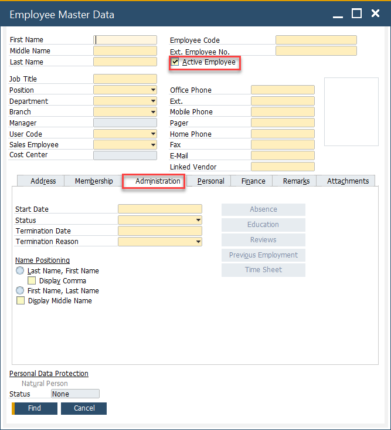
- The active Employee checkbox has to be checked to use this Employee in CompuTec PDC.
- PDC Login and Password must be defined.
- Management Board checkbox – checking it is optional; it allows access to the [Manager Board](../../user-guide/management-board.md) and [Weight Management Board](../../user-guide/customization/optional-functions/weight-scale-module/weight-management-board.md) within the CompuTec PDC application,
- PDC Form Settings Enabled – checking it is optional; it gives access to [Form Settings](../../user-guide/customization/overview.md#form-settings) for CompuTec PDC for a specific employee. This allows choosing columns to be displayed in specific PDC forms and their order.

    <details>
        <summary>Click here to find out more</summary>
        <div>
            Example of Form Settings for Operation Properties:
            
        </div>
    </details>
- Labour Code – choosing Resource (only of Labour type) according to which specific employee work time is counted, e.g., there is a Resource called Press Operator with a specified code. Here you can assign the code to a particular employee. An Employee with a Labour Code can be [assigned to a Task](../../user-guide/task-activities/overview.md).
- PDC Settings – a set of individual CompuTec PDC and ProcessForce settings that can be assigned to a specific Employee or a CompuTec PDC installation. Click [here](./pdc-settings/overview.md) to find out more,
- PDC RFID UI – an RFID identification code for logging in using RFID devices is assigned to a specific Employee. Click [here](./rfid.md) to find out more.
- PDC Barcode – a barcode is assigned to an Employee, used for logging in (if barcode scanning devices are used)
- Is Enabled Move to other Resource – this checkbox determines if this employee can move a Task to an [Alternative Resource](/docs/processforce/user-guide/scheduling/gantt-chart/alternative-resources) on registering time or downtime on a Task.
- Is Technician – a user with this checkbox checked has access to all not closed Downtime documents assigned to them and can modify Downtime Reason and close Downtime documents assigned to them,
- Is DownTime Supervisor – a user with this checkbox checked has the same privileges as a Technician but for all Downtime documents in the system. Additionally, the supervisor can reassign any Downtime document to a different Technician.

## Setting up the PDC application

After running the application, click the first icon on the top menu and choose "Settings":

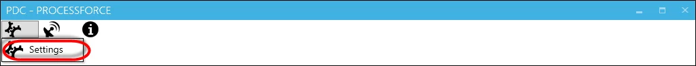

The Settings tab is divided into three sections:

### Connection

:::caution
    For a description of the configuration for the AppEngine plugin version, click [here](/docs/appengine/plugins-user-guide/computec-pdc-plugin).
:::

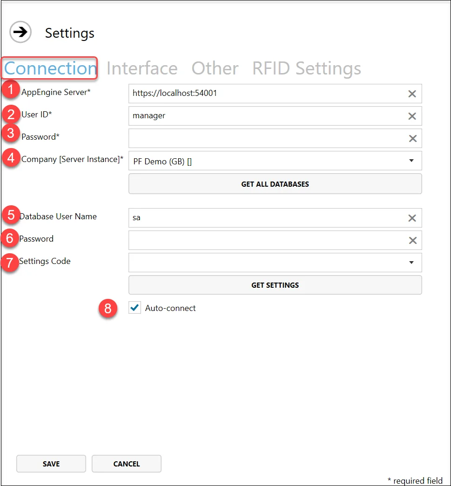

Here you have to enter the information needed for connection to SAP Business One.

Enter the required data in a new window.

1. Type in the AppEngine server address. It enables connection to AppEngine. It consists of a server IP address or machine name (or simply 'localhost' – if CompuTec PDC and CT Engine are installed on the same machine) and a port. By default, the 8080 port is used (the port can be changed if needed. Click [here](../weight-scales-integration/computec-gateway-manager.md) to check how to do this).
2. Type in SAP Business One user ID of a chosen database. The user has to have at least an Indirect Access SAP B1 license assigned and a ProcessForce license.
3. Type in SAP Business One password of a chosen database.
4. When you type in the server address, the list of available companies (databases) fills itself automatically. Choose a required company from the drop-down list (click the Get all databases button to refresh the list of companies).
5. Type in the database username and password (needed only to open a preview of Bill of Materials and Manufacturing Orders in Crystal Report form). If these data are not set up, the application asks for authentication to open a preview. [Here](../setting-up-the-application/sap-hana-user-other-than-system.md) you can check how to set up a database user other than SYSTEM.
6. <!-- TODO: Figure out what to do with it -->
7. You can choose [predefined settings](./pdc-settings/overview.md) from a drop-down list. The Get Settings button fills up the drop-down list with values from the related database.
8. After filling in all settings fields and clicking Save on every next run, the application will automatically connect with the given data when this check box is checked.

### Interface

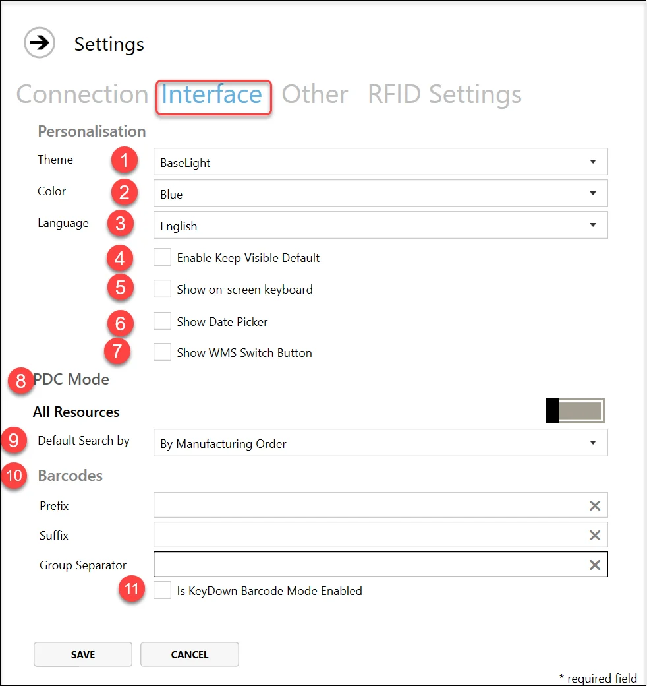

1. Theme – you can choose a light or dark color set for the application.
2. Color – you can choose from a list of various colors for the application (the documentation screenshots were taken with the Blue setting).
3. Language – you can choose the language of the application interface. Currently, English, Polish, and French.
4. Enable Keep Visible Default – when this option is checked, the [Quick Receipt](../../user-guide/customization/optional-functions/quick-receipt.md) form is open after a Receipt, e.g., if a user wants to receipt something more without reopening a form.
5. Show on-screen keyboard – when this checkbox is selected, an on-screen keyboard appears after clicking on any field where data can be entered. The on-screen keyboard can be minimized or closed and will reappear when clicking on another data entry field. This feature is particularly useful for touchscreen devices, such as tablets.
6. Show Date Picker – click [here](../../administrator-guide/setting-up-the-application/pdc-settings/overview.md).
7. Show WMS Switch Button – if you are using the [CompuTec WMS](/docs/wms/) application, you can check Show WMS Switch Button. This will display the button in CompuTec PDC, allowing switching between two applications. A default path will be chosen. If CompuTec WMS is installed on another path, you can choose it by clicking the button next to the path field.
8. PDC Mode – specific / all Resource indicator – this option is assigned to a specific device. It is possible to determine whether a specific employee can add a Task on any Resource from a database or just one specified for the device. When choosing one Resource, a new field will be displayed. It is required to fill it with a Resource name.
9. Default Search by – you can choose default task search by Manufacturing Order or Resource (this setting is set up individually for a specific terminal).
10. Barcodes – you can define your prefixes, suffixes, and group separators for barcodes here.
11. Is KeyDown Barcode Mode Enabled – a barcode scanner-related option. Determines whether CompuTec PDC uses KeyDown Barcode Mode signs receiving. This option is used on older devices, e.g., tablets with Windows systems.

### Other

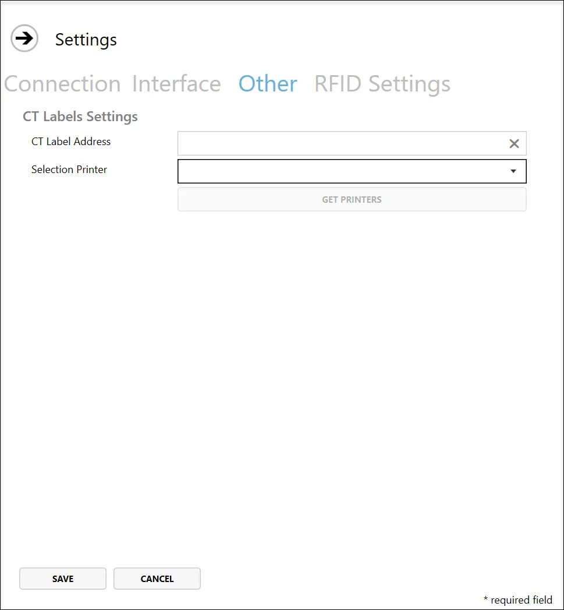

#### CT Labels Settings

CT Label Address

Selection Printer - select a printer defied in CompuTec Labels

SAP API Gateway Address - this setting is required for Crystal Report. [Click here for more details](https://help.sap.com/docs/SAP_BUSINESS_ONE_VERSION_FOR_SAP_HANA/686100cb1bc34346b2bc6642685bab43/b1bbebd32ff940c786c76315a8dfa270.html).

Please note job service has to be enabled:
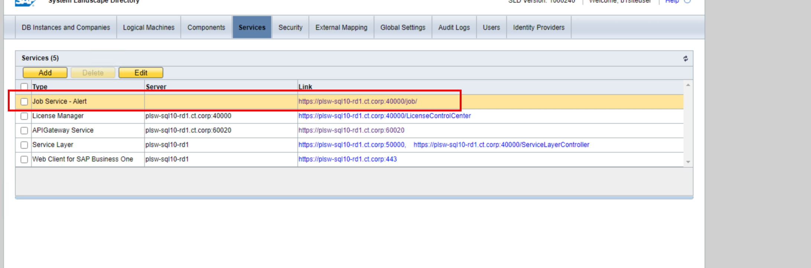
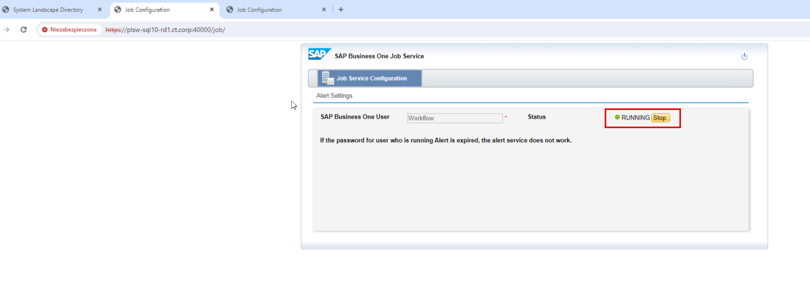

### RFID Settings

Click [here](./rfid.md) to find out more about RFID settings.

### Connecting

1. Click the Save button after setting up all the required settings. This saves typed-in data and displays the log-in form.
2. Click Connect in the upper menu.
3. Now, you can log in using CompuTec PDC login and CompuTec PDC password in the Login and Password fields, respectively. The connection status is communicated in the lower part of the screen.

   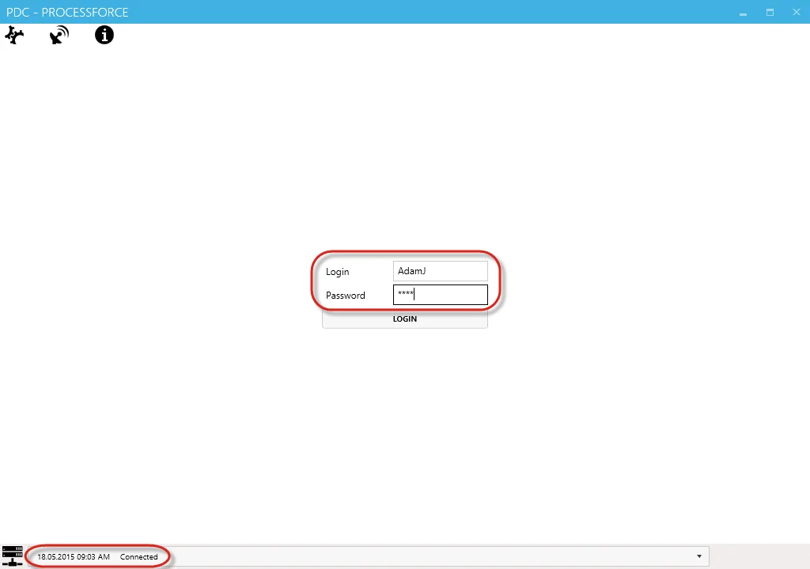
4. The name of the user defined in Employee Master Data will be displayed in the right-down corner of the form after logging in:

   
5. Service is up and ready to work with. On the lower part of the screen, the function buttons are displayed (from left to right):

    - Adding a new task
    - Display Management Board
    - Switch to CompuTec WMS
    - Log out

## ProcessForce Settings

In SAP Business One with ProcessForce installed, you can find CompuTec PDC Settings:

SAP Business One → Administration → System Initialization → General Settings → ProcessForce tab → PDC tab:

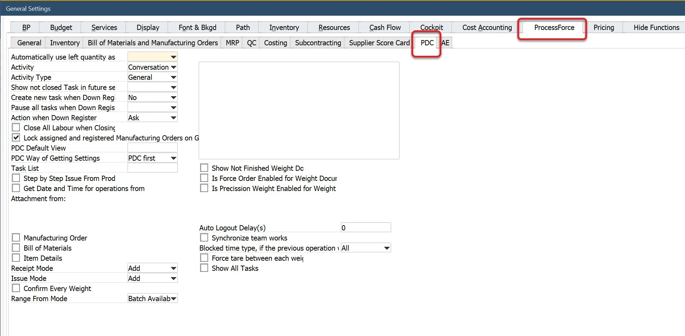

- **Automatically use left quantity as picked** – This option pertains to Production Issue and Receipt within the application, allowing for the automatic assignment of planned quantities for Pick Order, Pick Receipt, both, or neither. If not configured for automatic use, the quantity will default to zero.
- **Activity** – activity (a standard SAP B1 option) can be created from the PDC level. Here you can determine the kind of activity that will be assigned to it automatically on creation from the PDC level.
- **Activity Type** – here, you can determine the activity type that will be automatically assigned to it on creation from the PDC level.
- **Show not closed Task in future section** – when this option is checked and the "Close Task" checkbox on the Confirmation Panel is unchecked, the Task tile remains on the main panel after registering a document.

    <details>
        <summary>Click here to find out more</summary>
        <div>
            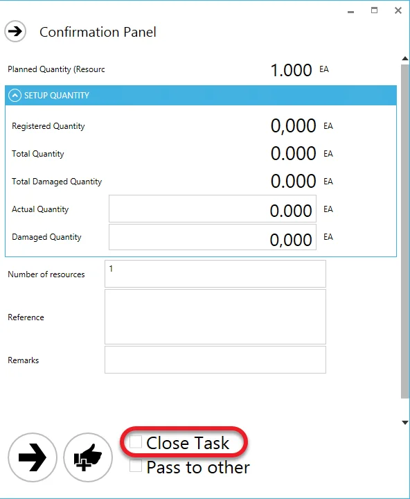
        </div>
    </details>
- **Create a new task when Down Register** – set to 'Yes': a new Time Booking is created and a new tile with a Task in the main window. Set to 'No': action will be determined by Action when Down Registration option (see below).
- **Pause all tasks when Down Register** – it is possible to define whether all tasks are paused on Downtime registration (in case more than one employee works on the resource).
- **Action when Down Register** options:

  - **Ask** – upon registering Down Time, the user will be asked to decide whether to register Time Booking or register just Quantity.
  - **Create Time Booking** – upon registering Down Time, Time Booking will be created.
  - **Only Quantity Registration** – upon registering Down Time, only Quantity will be registered.
- **Close All Labour when Closing Task** – this option determines whether Labour connected to the task is automatically finished on closing the task.
- **Lock assigned and registered Manufacturing Orders on the Gantt chart** – this option determines whether assigned and registered Manufacturing Orders can be rescheduled on the Gantt chart.
- **PDC Default View** – predefined default SQL view needed for personalization options.

For example, **PDC Default View** = PDCVIEW for custom SQL View:

    ```sql title="MySQL Example"
    Create View [dbo].[PDCVIEW]
    as
    Select "DocEntry" ,"U_LineNum", U_RscCode+' | '+ U_RscType as "Description" from [@CT_PF_MOR16]
    GO
    ```

    ```sql title="HANA Example"
    Create View "PDCVIEW"
    as
    Select "DocEntry" ,"U_LineNum", "U_RscCode", "U_RscType" as "Description" from "@CT_PF_MOR16"
    ```

    How to use a View in PDC:

    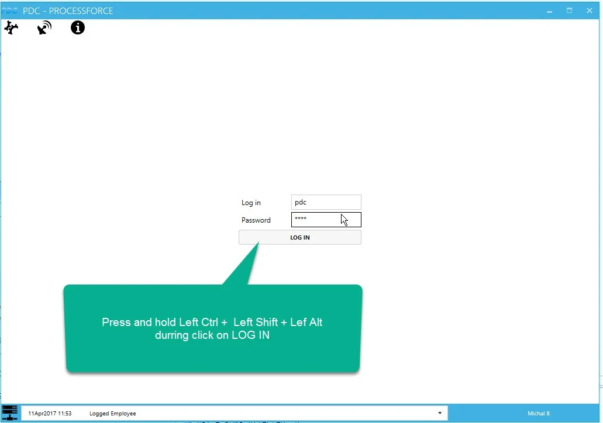

    

    

- **PDC Way of Getting Settings** – a settings template (check the section below for more information) can be assigned to an employee or an installation of CompuTec PDC. Here, you can decide whether a settings template is taken from an installation or employee settings first.
- **Task List** – with this option, it is possible to customize columns by adding Task By Resource using a database query (created in SAP Business One Query Generator).
- **Step-by-Step Issue From Production** – enabling this option determines whether data entry for an issue from production (including Item, Batch, Localization, and Quantity) is done step-by-step, with one form for each type of data (progressing from one form to the next), or all in a single dialog box.
- **Get Date and Time for Operations from Database Server** – defines whether the date and time are taken from a database server or a terminal, on which CompuTec PDC is installed. The purpose of the function is that in many cases, SAP Business One is installed on one server and CompuTec PDC on another machine, e.g., a mobile device or industrial PC. Date and time can be set up differently on two machines, causing inconsistencies in Time Bookings recorded through CompuTec PDC.
- **Attachments from** – determines attachments from which related documents are available by choosing the Attachments option on a Task panel.
- **Receipt mode**:

  - Add (Default) – regular Receipt from production
  - Add and Open Issue – create a Receipt from production and open Issue to production form.
- **Issue mode**:

  - Add (Default) – regular Issue to production.
  - Add and Open Receipt – create an Issue to production and open the Receipt from the production window.
- **Confirm every weighing**:

  - No (Default) – standard,
  - Yes – between each weighing, the user sees a confirm message:

  
- **Range from Mode**:

  - Batch available (default) – a range from a parameter in the weight scale cannot be higher than the Batch available quantity (1 in the picture); for example, in the below image, you won't be able to select the weight scale if Range From is 1000 KG.
  - Planned Item Quantity – the range from the parameter in the weight scale cannot be higher than the Planned quantity (2 in the picture); for example, in the below image, you won't be able to select the weight scale if the Range From is 110 KG.
  - Remaining Quantity – the range from the parameter in the weight scale cannot be higher than the Remaining quantity (3 in the picture); for example, in the below image, you won't be able to select the weight scale if Range From is 100 KG.

  
- **Show Not Finished Weight Documents** – if this option is checked, on another logging in of a user, a window with not finished weight documents will be displayed:

  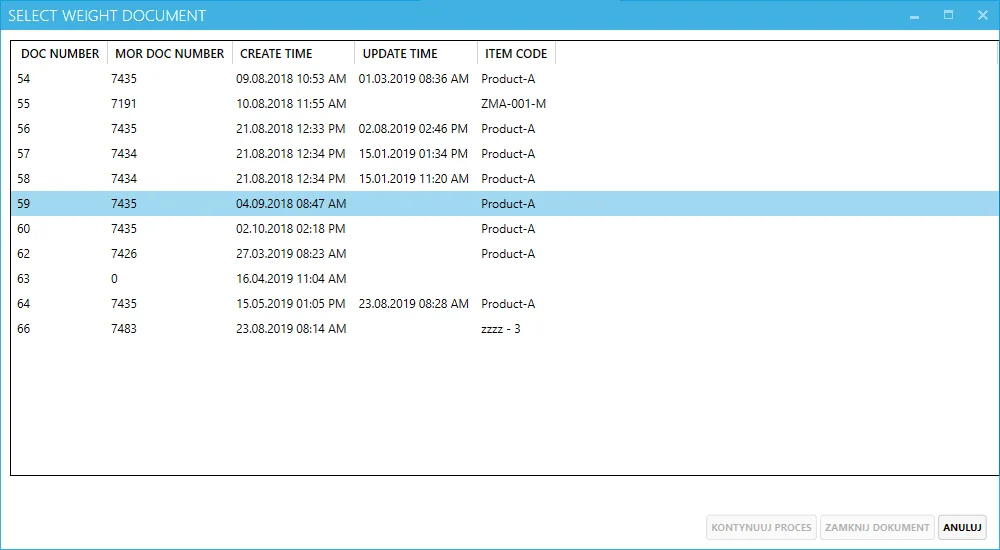

  From here, the user can resume work on a specific document, close a document, or close this window (after closing the window, it is still possible to reach weight documents through [Weight Management Board](../../user-guide/customization/optional-functions/weight-scale-module/weight-management-board.md)).
- **Is Force Order Enabled for Weight Documents** – if this option is checked, the application force order of weighing is based on the order set in [Operation Bind](/docs/processforce/user-guide/formulations-and-bill-of-materials/production-process/overview#operation-bind) for a related Manufacturing Order.
- **Is Precision Weight Enabled for Weight Documents** – if this option is saved, you cannot issue on [Weight Document](../../user-guide/customization/optional-functions/weight-scale-module/overview.md) more than the related Planned Quantity (within a weight scale precision range).
- **Auto Logout Delay(s)** – a number of seconds of inactivity after which the application automatically logs out a currently logged-in user (if it is set to '0', the option is inactive).
- **Synchronize team works** – [Team Log](../../user-guide/task-activities/overview.md) related option. If this option is checked, Team Leader's starting time on a Task starts for all related Employees. Also, closing a Task (booking time), do the same for all related employees.
- **Blocked time type, if the previous operation was not closed** – (values: 'All,' 'Run') if 'All' is chosen, it is impossible to start an Operation if a previous one on this Manufacturing Order is not finished. If the option is set to 'Run,' it is possible to start 'Set up' time on an Operation even when the previous Operation is set to 'Run.'
- **Force tare between each weighing**– if the option is checked, it is required to click 'Tare' on each weighing (find out more about the [Weighing Module](../../user-guide/customization/optional-functions/weight-scale-module/overview.md)).
- **Show all Tasks** – this allows access to all of the user's Tasks on all Resources despite using the [Resource Code](./pdc-settings/overview.md#pdc-settings-templates) option. The user cannot add any new Task to Resources other than assigned.
