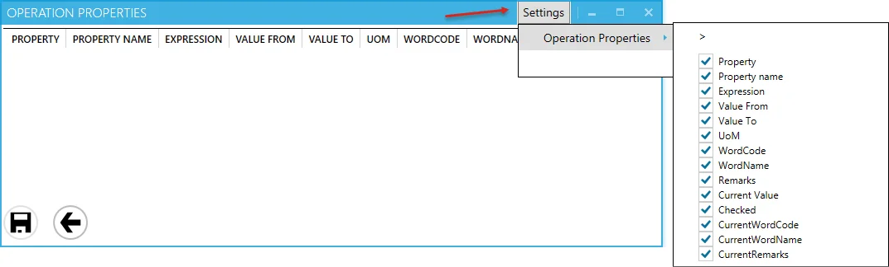
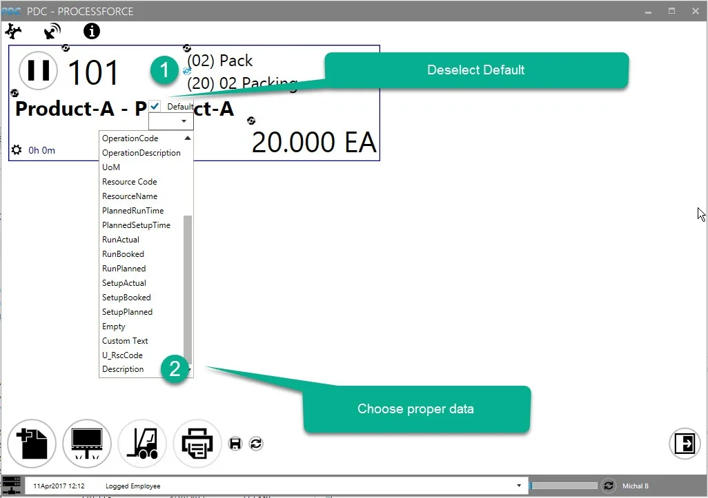
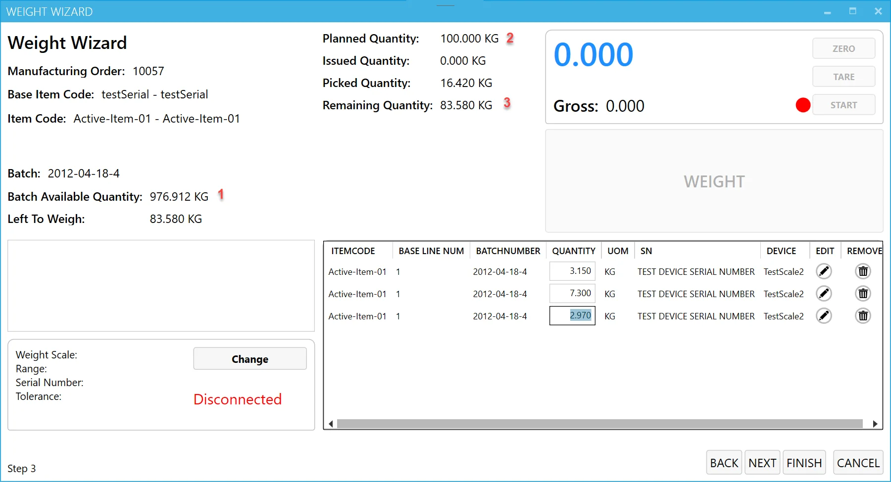

# Overview

The document outlines the setup and configuration process for the CompuTec PDC application, specifically designed for integration with SAP Business One. Below is a summary of key points.

---

## Requirements

To use the CompuTec PDC application, the following requirements must be met:

- An SAP Business One user must be defined with at least an Indirect Access User license.
- A ProcessForce license must be assigned to the SAP Business One user,
- Employee Master Data must be defined for a specific employee, including CompuTec PDC information.

To access Employee Master Data, navigate to:

:::info Path
Main Menu → Human Resources → Employee Master Data
:::


- **Active Employee Checkbox**: the "Active Employee" checkbox must be checked to use the employee in CompuTec PDC.
- **Credentials**: PDC Login and Password must be defined.
- **Management Board**: the "Management Board" checkbox is optional; when checked, it grants access to the [Manager Board](../../user-guide/management-board.md) and [Weight Management Board](../../user-guide/customization/optional-functions/weight-scale-module/weight-management-board.md) within CompuTec PDC.
- **PDC Form Settings Enabled**: the "PDC Form Settings Enabled" checkbox is optional; when checked, it provides access to [Form Settings](../../user-guide/customization/overview.md#form-settings) for the employee, allowing the customization of columns and their order in PDC forms. Below is an example of Form Settings for Operation Properties:

  
- **Labour Code**: assign a Labour-type Resource (e.g., Press Operator) to track an employee’s work time. An Employee with a Labour Code can be [assigned to a Task](../../user-guide/task-activities/overview.md#adding-a-new-task).
- **PDC Settings**: a set of individual CompuTec PDC and ProcessForce settings that can be assigned to a specific Employee or CompuTec PDC installation. Click [here](rfid.md) to learn more.
- **PDC RFID UI**: an RFID identification code is assigned to an employee for logging in using RFID devices. Click here to learn more.
- **PDC Barcode**: a barcode is assigned to the employee for login (if barcode scanning devices are used).
- **Is Enabled Move to Other Resource**: this checkbox determines if the employee can move a Task to an [Alternative Resource](https://learn.computec.one/docs/processforce/user-guide/scheduling/gantt-chart/alternative-resources) during time or downtime registration on a Task.
- **Is Technician**: a user with this checkbox checked can access and modify all unclosed Downtime documents assigned to them, including changing the Downtime Reason and closing the documents.
- **Is DownTime Supervisor**: a user with this checkbox checked has the same privileges as a Technician but for all Downtime documents in the system. The supervisor can also reassign any Downtime document to a different Technician.

## Setting up CompuTec PDC Application

After launching the application, click the first icon in the top menu and select "Settings". The Settings tab is organised into three sections:


### Connection

The Connection section allows you to configure the necessary settings to connect CompuTec PDC with SAP Business One and other related services.

:::caution
    For a detailed description of the configuration for the AppEngine plugin version, click [here](/docs/appengine/plugins-user-guide/computec-pdc-plugin).
:::


In this section, enter the necessary information to establish a connection with SAP Business One.

Fill in the required details in the provided window:

1. Enter the AppEngine server address to connect to AppEngine. This address includes the server IP or machine name (or simply 'localhost' if CompuTec PDC and CT Engine are installed on the same machine) and the port number. By default, port 8080 is used, but it can be changed if needed. Click [here](../weight-scales-integration/computec-gateway-manager.md) for instructions on how to do this.
2. Enter the SAP Business One user ID for the selected database. The user must have at least an Indirect Access SAP B1 license and a ProcessForce license.
3. Enter the SAP Business One password for the selected database.
4. After entering the server address, the list of available companies (databases) will automatically populate. Select the required company from the drop-down list (click the Get All Databases button to refresh the list).
5. Enter the database username (required only to view the Bill of Materials and Manufacturing Orders in the Crystal Report preview). If this information is not configured, the application will prompt for authentication to open the preview. Click [here](./sap-hana-database.md) for instructions on setting up a database user other than SYSTEM.
6. Enter the database password (required only to view the Bill of Materials and Manufacturing Orders in the Crystal Report preview). If this information is not configured, the application will prompt for authentication to open the preview.  Click [here](./sap-hana-database.md) for instructions on setting up a database user other than SYSTEM.
7. You can select [predefined settings](./pdc-settings/overview.md) from the drop-down list. Clicking the "Get" Settings button will populate the list with values from the related database.
8. After completing all the settings and clicking Save, the application will automatically connect using the provided data on subsequent runs when the checkbox is selected.

### Interface

The Interface section allows you to customize the appearance and functionality of the CompuTec PDC application, including themes, language, barcode settings, and more.


1. **Theme**: choose between a light or dark color scheme for the application.
2. **Color**: select from a range of color options for the application (the screenshots in the documentation were taken using the Blue setting).
3. **Language**: choose the language for the application interface. Available languages include English, Polish, and French.
4. **Enable Keep Visible Default**: when this option is checked, the [Quick Receipt](../../user-guide/customization/optional-functions/quick-receipt.md) form remains open after a receipt, allowing users to quickly process additional receipts without reopening the form.
5. **Show on-screen keyboard**: when checked, an on-screen keyboard will appear upon clicking any data entry field. The keyboard can be minimized or closed and will reappear when another data entry field is selected. This feature is particularly useful for touchscreen devices, such as tablets.
6. **Show Date Picker**: this option allows to set amount of time in minutes (e.g., 67 minutes) instead of date and time on time registration. Click [here](../../administrator-guide/setting-up-the-application/pdc-settings/overview.md).
7. **Show WMS Switch Button**: If using the [CompuTec WMS](/docs/wms/) application, enable this option to display a switch button in CompuTec PDC, allowing you to toggle between the two applications. The default path will be selected, but you can choose a different path if CompuTec WMS is installed elsewhere by clicking the button next to the path field.
8. **PDC Mode**: specific / all Resource indicator – This option controls whether an employee can add tasks to any resource from the database or just a specific resource assigned to the device. If a specific resource is chosen, a new field will appear to specify the resource name.
9. **Default Search by**: Set the default task search method to either Manufacturing Order or Resource (this setting is configured individually for each terminal).
10. **Barcodes**: define your prefix, suffix, and group separators for barcodes here.
11. **Is KeyDown Barcode Mode Enabled**: this option determines whether CompuTec PDC uses KeyDown Barcode Mode for scanning. It is intended for use with older devices, such as tablets running Windows systems.

### Other


#### CT Labels Settings

CT Label Address - Specify the address for CT labels.

Selection Printer - Choose a printer defined in CompuTec Labels.

SAP API Gateway Address - This setting is necessary for Crystal Reports. Click [here](https://help.sap.com/docs/SAP_BUSINESS_ONE_VERSION_FOR_SAP_HANA/686100cb1bc34346b2bc6642685bab43/b1bbebd32ff940c786c76315a8dfa270.html)for more details.

Please note job service has to be enabled:
  
  

### RFID Settings

Click [here](./rfid.md) to find out more about RFID settings.

### Connecting

1. After configuring all required settings, click the Save button. This will save the entered data and display the login form.

2. Click Connect in the upper menu.
  

3. Enter your CompuTec PDC login and password in the Login and Password fields, respectively. The connection status will be shown at the bottom of the screen.

   
4. Once logged in, the user name defined in the Employee Master Data will appear in the bottom right corner of the form:

   
5. The service is now ready for use. The function buttons are displayed at the bottom of the screen (from left to right):

    - Adding a new task
    - Display Management Board
    - Switch to CompuTec WMS
    - Log out

## ProcessForce Settings

In SAP Business One with ProcessForce installed, you can find CompuTec PDC Settings:

:::info Path
SAP Business One → Administration → System Initialization → General Settings → ProcessForce tab → PDC tab
:::


- **Automatically use left quantity as picked**: this option applies to Production Issue and Receipt within the application, enabling the automatic assignment of planned quantities for Pick Order, Pick Receipt, both, or neither. If not configured for automatic use, the quantity will default to zero.
- **Activity**: a standard SAP Business One feature that can be created from the CompuTec PDC level. Here, you can specify the type of activity that will be automatically assigned upon creation from the CompuTec PDC level.
- **Activity Type**: this setting allows you to define the activity type that will be automatically assigned upon creation from the CompuTec PDC level.here, you can determine the activity type that will be automatically assigned to it on creation from the CompuTec PDC level.
- **Show not closed Task in future section**: when this option is enabled and the "Close Task" checkbox on the Confirmation Panel is unchecked, the task tile will remain on the main panel after registering a document.

  
- **Create a new task when Down Register**:
  - set to 'Yes': A new time booking is created, and a new task tile appears in the main window.
  - Set to 'No': The action will be determined by Action when Down Registration option (see below).
- **Pause all tasks when Down Register**: defines whether all tasks are paused during downtime registration, especially when multiple employees are working on the resource.
- **Action when Down Register** options:

  - **Ask**: when downtime is registered, the user will be prompted to decide whether to register a time booking or just the quantity.
  - **Create Time Booking**: a time booking will be created upon registering downtime.
  - **Only Quantity Registration**: only the quantity will be registered upon downtime registration.
- **Close All Labour when Closing Task**: this option defines whether the labor associated with the task is automatically marked as completed when the task is closed.
- **Lock assigned and registered Manufacturing Orders on the Gantt chart**: this option determines whether assigned and registered manufacturing orders can be rescheduled on the Gantt chart.
- **PDC Default View**: a predefined default SQL view required for personalization options.

  For example, **PDC Default View** = PDCVIEW for custom SQL View:

      ```sql title="MySQL Example"
      Create View [dbo].[PDCVIEW]
      as
      Select "DocEntry" ,"U_LineNum", U_RscCode+' | '+ U_RscType as "Description" from [@CT_PF_MOR16]
      GO
      ```

      ```sql title="HANA Example"
      Create View "PDCVIEW"
      as
      Select "DocEntry" ,"U_LineNum", "U_RscCode", "U_RscType" as "Description" from "@CT_PF_MOR16"
      ```

      **How to use a View in PDC**:

        

        

        

- **PDC Way of Getting Settings** – A settings template (detailed below) can be assigned to either an employee or an installation of CompuTec PDC. This option allows you to choose whether the settings template is prioritized from the installation or employee settings.
- **Task List** – This option allows customization of columns by adding "Task by Resource" through a database query, created using SAP Business One's Query Generator.
- **Step-by-Step Issue From Production** – Enabling this option determines whether data entry for an issue from production (including Item, Batch, Localization, and Quantity) occurs step-by-step, with each type of data entered on a separate form, or if all data is entered in a single dialog box.
- **Get Date and Time for Operations from Database Server** – Specifies whether the date and time are retrieved from the database server or from the terminal where CompuTec PDC is installed. This is particularly useful when SAP Business One is hosted on a server separate from CompuTec PDC, such as a mobile device or industrial PC, where time discrepancies between the two systems could cause inconsistencies in time bookings recorded through CompuTec PDC.
- **Attachments from** – Specifies the source of attachments available through the Attachments option in the Task panel for related documents.
- **Receipt mode**:

  - Add (Default) – Regular Receipt from production
  - Add and Open Issue – Creates a Receipt from production and open Issue to production form.
- **Issue mode**:

  - Add (Default) – Standard Issue to production.
  - Add and Open Receipt – create an Issue to production and opens the Receipt from production window.
- **Confirm every weighing**:

  - No (Default) – Standard process without confirmation messages.
  - Yes – Displays a confirmation message after each weighing:

    
- **Range from Mode**:

  - **Batch available (default)**: the range specified in the weight scale parameter cannot exceed the available batch quantity (as shown in 1 in the image). For example, if the Range From is 1000 KG, the weight scale cannot be selected.
  - **Planned Item Quantity**: the range specified in the weight scale parameter cannot exceed the planned quantity (as shown in 2 in the image). For instance, if the Range From is 110 KG, the weight scale cannot be selected.
  - **Remaining Quantity**: the range specified in the weight scale parameter cannot exceed the remaining quantity (as shown in 3 in the image). For example, if the Range From is 100 KG, the weight scale cannot be selected.

    

- **Show Not Finished Weight Documents**: if this option is selected, upon the next login by a user, a window displaying unfinished weight documents will appear:

  

  From this interface, users can resume work on specific documents, close them, or access them later via the [Weight Management Board](../../user-guide/customization/optional-functions/weight-scale-module/weight-management-board.md).

- **Is Force Order Enabled for Weight Documents**: if enabled, this option enforces weighing in the sequence defined in [Operation Bind](/docs/processforce/user-guide/formulations-and-bill-of-materials/production-process/overview#operation-bind) for a related Manufacturing Order.
- **Is Precision Weight Enabled for Weight Documents**: when activated, it ensures that you cannot issue more [weight](../../user-guide/customization/optional-functions/weight-scale-module/overview.md) than the Planned Quantity (within the weight scale precision range).
- **Auto Logout Delay(s)**: define the number of seconds of inactivity before the system automatically logs out the user. A value of '0' disables this feature.
- **Synchronize team works**: this is a [Team Log](../../user-guide/task-activities/overview.md) related option. This option syncs task times among team members. For example, when a Team Leader starts a task, the start time is applied to all related employees. Similarly, closing the task (booking time) synchronizes for the entire team.
- **Blocked time type, if the previous operation was not closed**: choose between 'All' and 'Run':
  -'All' -  Prevents starting a new operation unless the previous one is completed.
  -'Run' - Allows starting 'Set Up' time even if the previous operation is still running.
- **Force tare between each weighing**: when checked, Requires users to click 'Tare' before each weighing to ensure accuracy. Find out more about the [Weighing Module](../../user-guide/customization/optional-functions/weight-scale-module/overview.md).
- **Show all Tasks**: this allows access to all of the users' Tasks on all Resources despite using the [Resource Code](./pdc-settings/overview.md#pdc-settings-templates) option. The user cannot add any new Task to Resources other than assigned.

---
