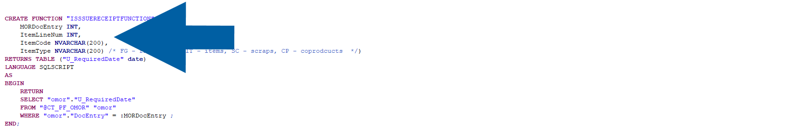
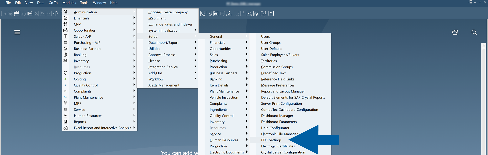
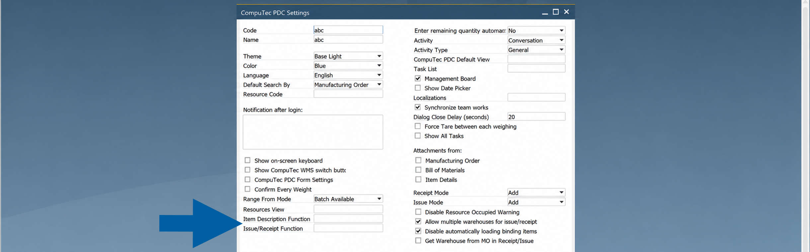
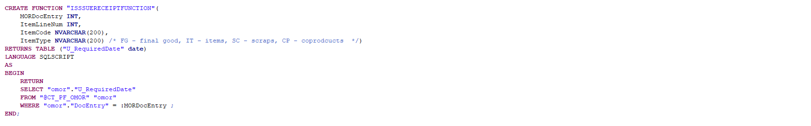
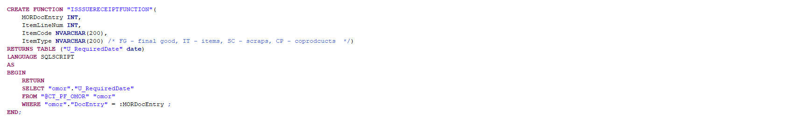

# Display User-Defined Fields (UDFs) in PDC

**CompuTec Production Data Capture (PDC)** can display additional item information stored in **SAP Business One User-Defined Fields (UDFs)**. This information is available in item selection windows and in the **Issue to Production** and **Receipt from Production** screens, allowing operators to identify items more easily without opening the item master data.

The information displayed in **CompuTec PDC** is retrieved from **SQL functions** that you configure in the **CompuTec PDC Settings** in **SAP Business One**.

## Before You Start

Before configuring this feature, ensure that:

- The required SQL functions have been created in the company database.  
- The SQL functions return the **User-Defined Fields (UDFs)** or other item information that you want to display.  
- You have permission to modify **CompuTec PDC Settings** in **SAP Business One**.
- Your SQL functions use the **required fixed parameter list** expected by CompuTec PDC. The **Issue/Receipt Function** receives the ``MORDocEntry``, ``ItemLineNum``, ``ItemCode``, and ``ItemType``, and your SQL function must define exactly these parameters.

    

## Configure UDF Display

To configure the UDF display in PDC, follow these steps:

1. In **SAP Business One**, go to **Administration** > **Setup** > **General** > **PDC Settings**.  

    

2. Open the **CompuTec PDC settings profile** that you want to modify.  

3. Configure one or both of the following fields:  

    - **Item Description Function**: Specifies the SQL view used to display additional information in **Item Selection** windows.  
    - **Issue/Receipt Function**: Specifies the SQL view used to display additional information in the **Issue to Production** and **Receipt from Production** screens.

    

4. Save your changes.  

## Display UDFs in Item Selection

When **Item Description Function** is configured, **CompuTec PDC** displays the information returned by the selected SQL view in item selection windows.

:::note[Example]

    
:::

This allows operators to view additional item information, such as **User-Defined Fields (UDFs)**, while searching for or selecting an item.

## Display UDFs in Issue and Receipt Screens

When Issue/Receipt Function is configured, CompuTec PDC displays additional information for items in the Issue to Production and Receipt from Production screens.

:::note[Example]

    
:::

The additional information can be displayed for:

- **Finished Goods**  
- **Raw Materials**  
- **Scrap**  
- **Co-products**  

After the configuration is complete, operators can view additional **User-Defined Fields** directly in **CompuTec PDC**. This reduces the need to open item master data and provides quick access to the information required during production.

    

## Notes

- **Item Description View** and **Issue/Receipt Functions** are configured independently.  
- If a field is left empty, **CompuTec PDC** displays only the standard item information.  
- The information displayed depends on the SQL view assigned to each setting.
- The parameters passed to each SQL function are fixed and cannot be changed. When creating a custom SQL function, it must use the required parameter list expected by CompuTec PDC.
