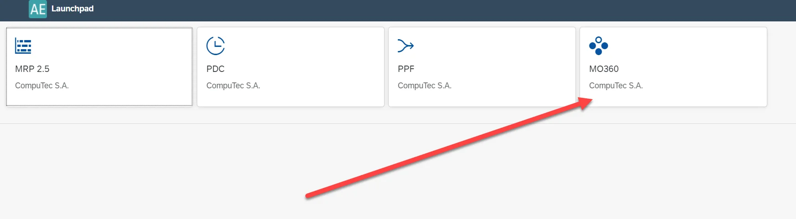
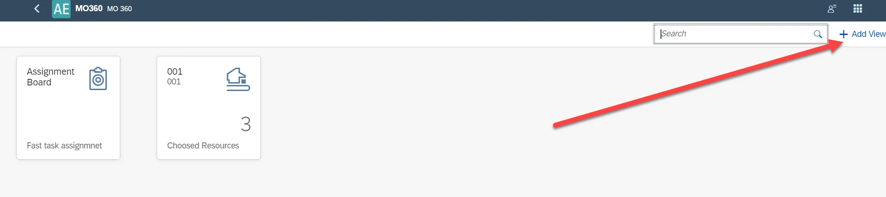
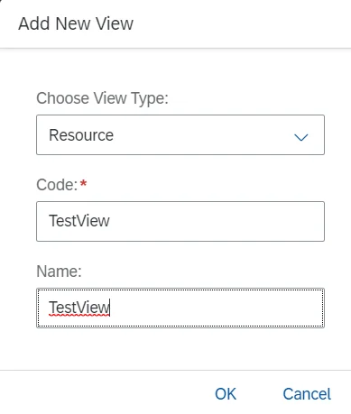
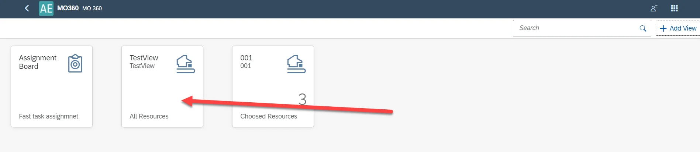
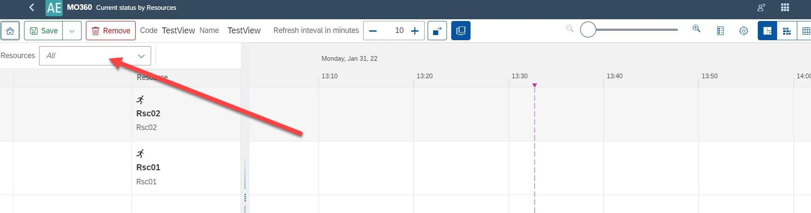

# Resources View

The Resources View feature allows users to filter tasks based on multiple resources. This provides a more organized and efficient way to manage and view tasks specific to different resources within the system.

---

## Requirements

To use this feature, you need the AppEngine's MO360 plugin. For more details on AppEngine and the plugin installation process, click [here](/docs/appengine/plugins-user-guide/manufacturing-order-360/plugin-installation-and-configuration).

**Minimal related versions**:

- ProcessForce: 9.30 PL14 R10 or 10.0 RL14,
- AppEngine: 2.10.3.1, 2.93.3.1 or 2.10.5.1, 2.93.5.1,
- MO360 - latest version.

## Usage

To define a view with multiple resources in AppEngine MO360, follow these steps:

1. Navigate to AppEngine, then access MO360 to create a new view for multiple resources.

    

2. Click on "Add View "to create a new view.

    

3. Define the view details.

    

4. The newly created view will now be displayed in the main MO360 view.

    

5. Open the view and select the "All" option for resources.

    

After defining the view in MO360, you can assign it in the [PDC Settings](./overview.md). Once assigned, users in CompuTec PDC will only have access to tasks for the selected resources (e.g., Rsc01, Rsc02, and Rsc03).

---
