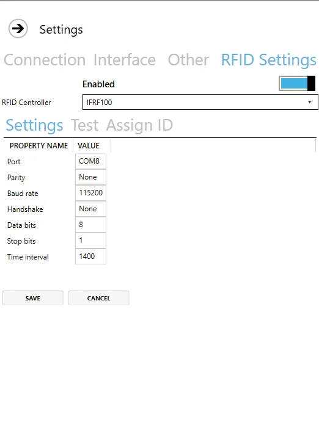
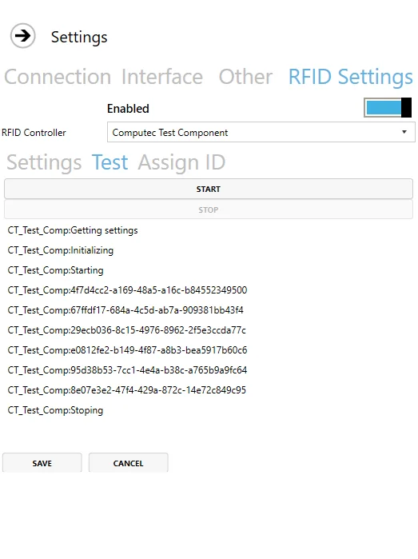
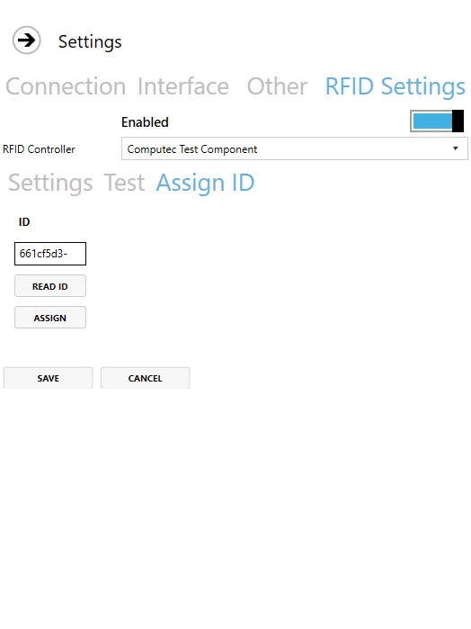
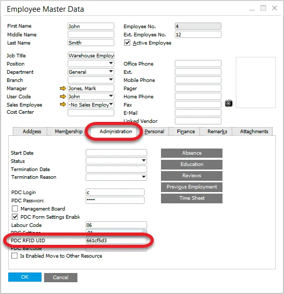

# RFID

Here, you can check how to set up logging in by using RFID cards.

RFID is a way of using radio waves to send data that identifies a specific object. For example, the employee can log in or log out to a system or an application by putting a card with identification data on a dedicated reader.

It is possible to set up CompuTec PDC for using RFID identification to log in or log out of the application.

---

## RFID Settings

### Settings

Enable – choose whether you want to use an RFID module or not.

RFID Controller – a list of defined controllers.

Time interval – a period after which a reader reads an identification. It is set up to 1400 (1,4 seconds) by default.

### Test

Here, you can test if the selected controller is configured properly: after clicking Start, the controller attempts to read identification at intervals set up in Settings > Time Interval. If the controller is configured correctly, there will be information for every identification read.

### Assign ID

Click Read ID and place the RFID card on the reader. The field will be filled up with data assigned to the RFID Card:

Click Assign, log in and choose an Employee you want to assign to the card. It can be used if the ID is not assigned to any Employee.

Click Save – a user is assigned to an RFID identifier and making them ready to use.

#### Employee Master Data

Assigned ID is stored in SAP B1 Employee Master Data:

:::info Path
    Human Resources → Employee Master Data
:::

If the ID is known, it can be assigned to an employee from the SAP B1 level by entering it into the PDC RFID UID field.

## Usage

When the module is configured properly, we can use an RFID identifier (such as a card) to log in by placing it near the RFID reader on the login screen. This action automatically logs in a specific employee without requiring manual entry of login credentials.

Inserting the card again triggers a logout. Inserting another employee's RFID card while logged in initiates a re-login process for that employee.
