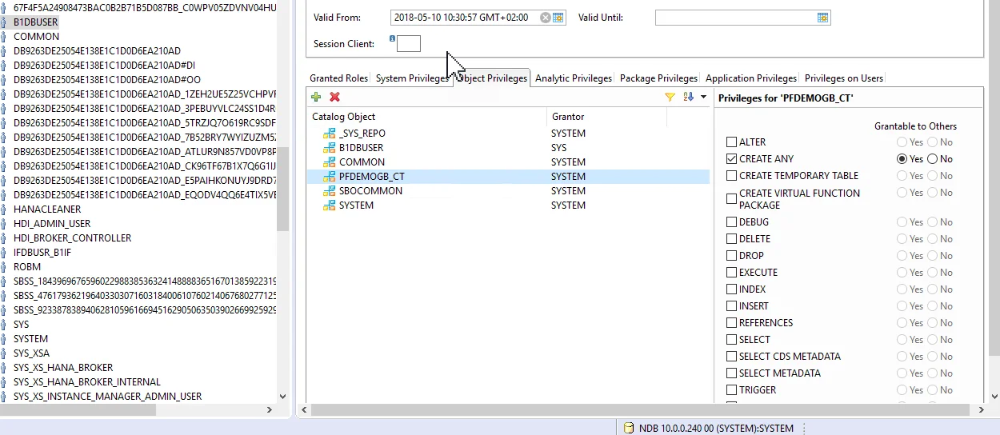
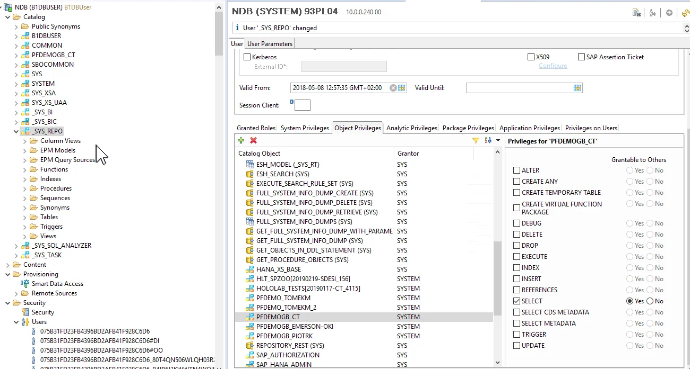

# SAP HANA Database

When working with SAP HANA databases, it's often preferable to use a database user other than the default SYSTEM user. This approach helps maintain security by restricting access to only the necessary privileges, rather than granting full administrative control as the SYSTEM user inherently does. This guide outlines the requirements and steps needed to set up an alternative database user for operations such as running Crystal Reports through CompuTec PDC.

---

The following requirements, as described in [SAP Business One note no. 2302616 - Validation - SAP HANA database user privileges](https://connect.computec.pl/download/attachments/233506987/2302616_E_20190607.pdf?version=1&modificationDate=1649077528287&api=v2) have to be met:

```text
Roles:

    PUBLIC
    CONTENT_ADMIN
    AFLPM_CREATOR_ERASER_EXECUTE

System privileges:

    CREATE SCHEMA (grantable)
    USER ADMIN (grantable)
    ROLE ADMIN (grantable)
    CATALOG READ (grantable)
    IMPORT
    EXPORT
    INIFILE ADMIN
    LOG ADMIN
    >Note: Note: These system privileges are essential if the database user is used for the migration wizard to move company databases from Microsoft SQL Server to the SAP HANA server.

SQL object privileges:

    SYSTEM schema: CREATE ANY, SELECT
    _SYS_REPO schema: SELECT, EXECUTE, DELETE (all grantable)


The SBOCOMMON schema is established during the installation of the SAP Business One Server, while the COMMON schema is created during the installation of the analytics platform. If different SAP HANA users are employed to install these components, it is crucial to carefully assign the necessary object privileges accordingly.

    SBOCOMMON schema: SELECT, INSERT, DELETE, UPDATE, EXECUTE (all grantable)
    COMMON schema: SELECT, INSERT, DELETE, UPDATE, EXECUTE (all grantable)
```

Furthermore, the required schema must be assigned to the user with the appropriate privileges. In the following example, the user is B1DBUSER, and the required schema is PFDEMOGB_CT.





---
