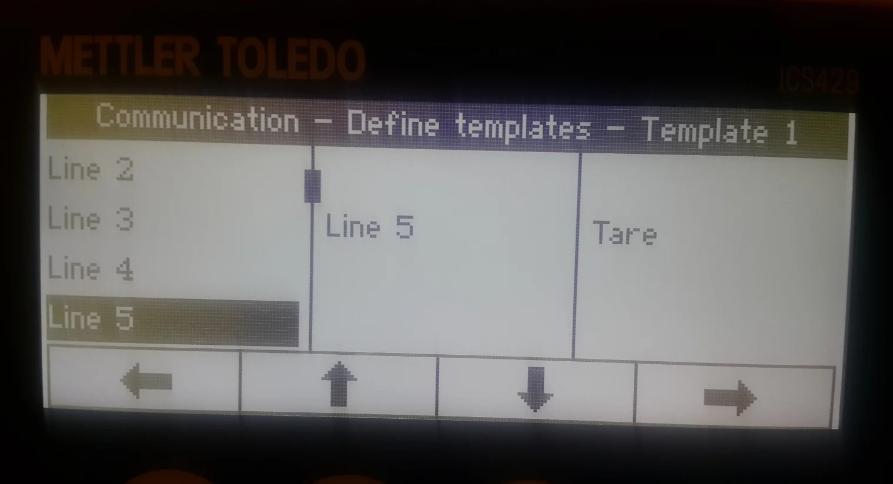
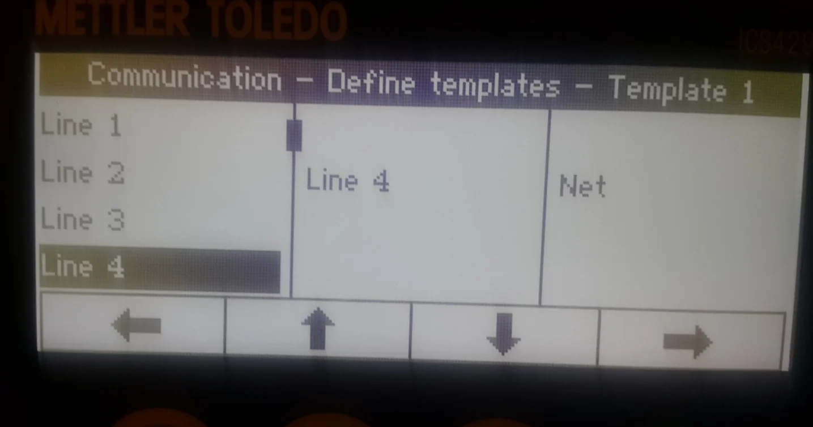
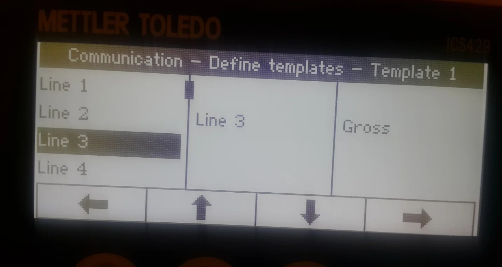
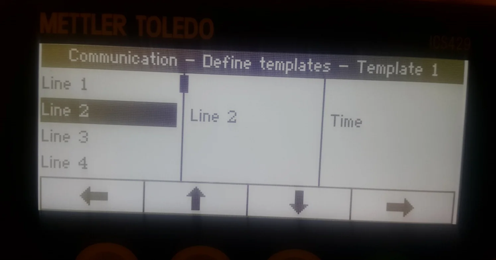
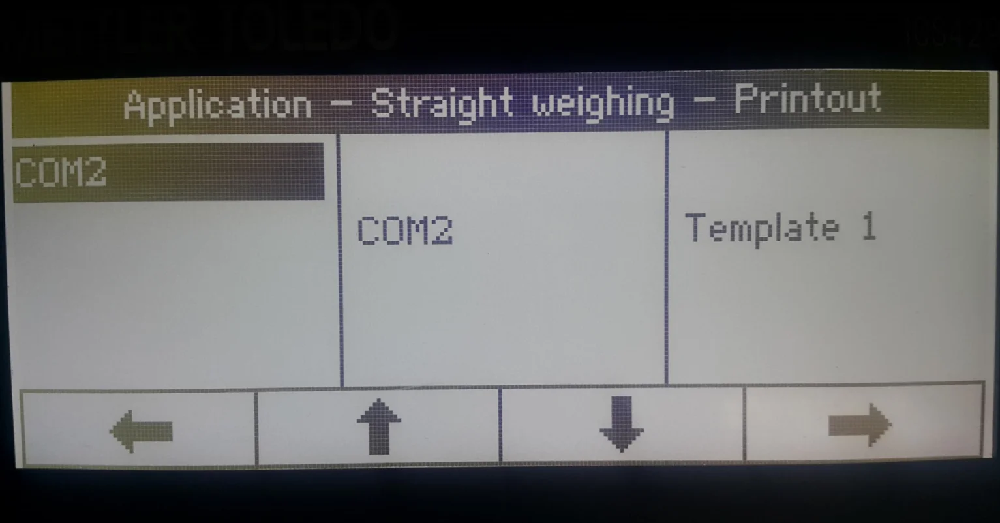
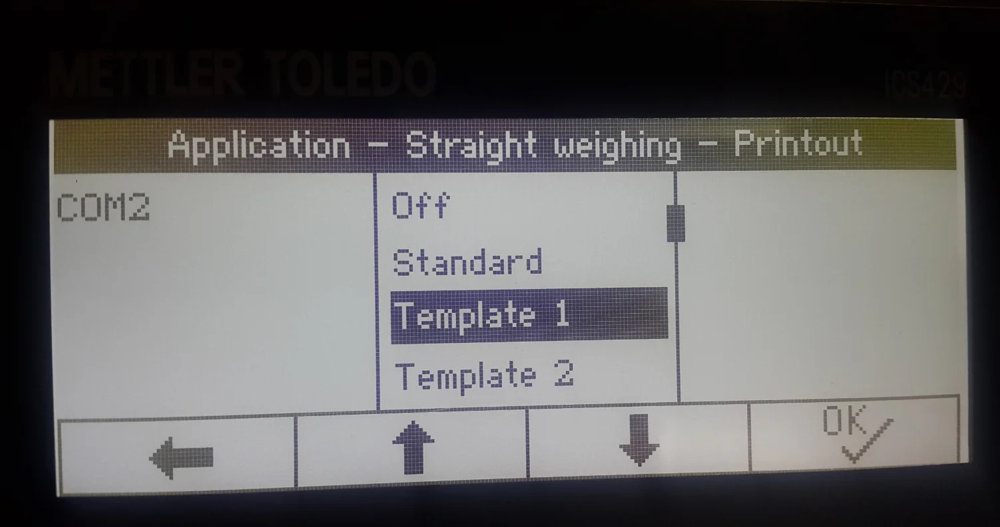
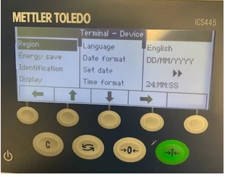

# Mettler Toledo

## Introduction

Creating a template and assigning it to the weight scale is essential for proper configuration. Next, you must choose a work mode for the scales and assign the Template to the scale work mode.

:::note
    This section was created based on the MettlerToledoICS429 model configuration.
:::

## Defining a Template

- Go to the Communication option in the main menu.
- Choose the Define Template option.
- Choose Template 1 and set up what will be pointed/sent by the weight scale. Set up the following details:

  Line 1: Date

  Line 2: Time

  Line 3: Gross

  Line 4: Net

  Line 5: Tare

  Line 6: SNo. Terminal.

  

  

  

  

  

  

## Choosing Mode for Weight Scales

    - Go to the Communication option in the main menu
    - choose COM2
    - choose Mode
    - choose Continuous print.

## Assigning the Defined Template to the Weight Scales

    - Choose the Application option from the menu
    - Choose Straight weighing option
    - Choose Printout
    - Choose COM2
    - Choose COM2 again
    - Choose the Template name of the Template that was defined in the first step ('Template 1' in this example)
    - Click OK to save the changes.

## Set Date and Time Format

Now, the weight scale is correctly configured and is ready to work with CompuTec Gateway and CompuTec PDC.
