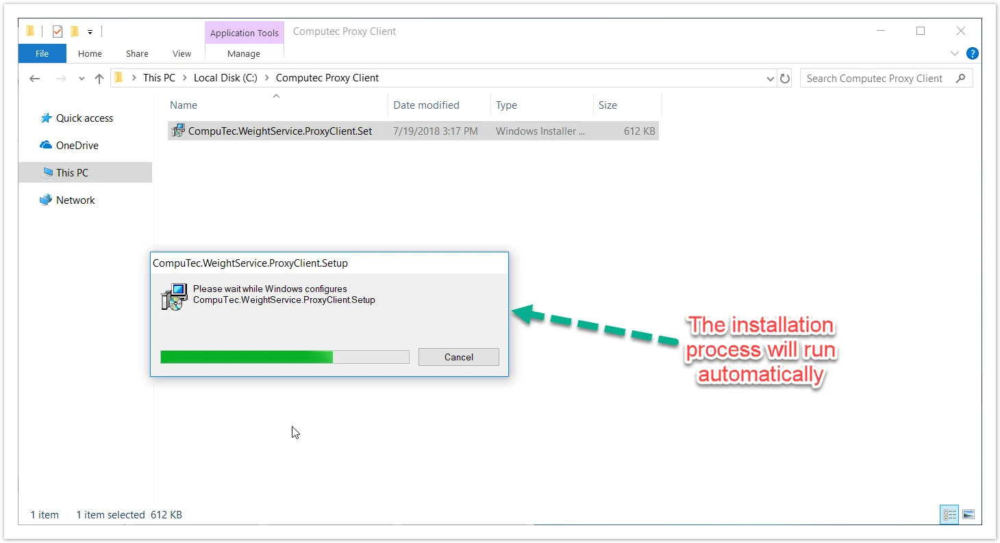
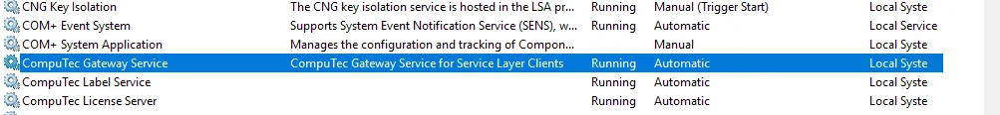

# CompuTec Gateway Service Installation

The CompuTec Gateway Service acts as a bridge between CompuTec PDC and connected devices, enabling seamless data exchange. This guide provides step-by-step instructions for installing and setting up the service.

---

## Prerequisites

Before installing the CompuTec Gateway Service, ensure the following requirements are met:

- Configure your firewall to make the 8080 port available
- .Net Framework 4.7.1 is required
- CompuTec AppEngine is required

## Installation

1. To install CompuTec Gateway Service, download and run its installation file. For version 1.2.0.14 version, you can download it [here](https://learn.computec.one/docs/labels/releases/download#computec-gateway).
2. Once the installation is complete, the Gateway Service service will start automatically.

    
3. Verify that the CompuTec Gateway Service has started successfully and is connected to the Service Layer.

    
4. Proceed to the [Weight Configuration Manager](./computec-gateway-manager.md) to complete the setup.

---
