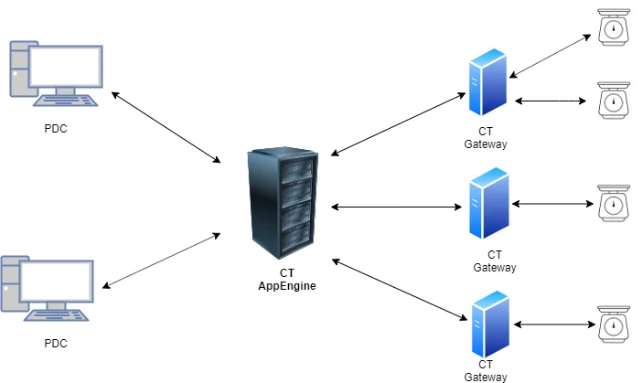

# Overview

In this section, you can check how to configure a connection between CompuTec PDC and weighing devices.

---

## Weight Scales Connection Architecture

## Configuration Steps

1. [CompuTec Gateway Service Installation](./gateway-service-installation.md)
2. [CompuTec Gateway Manager](./computec-gateway-manager.md)
3. [Example Weighing Devices Configuration](./example-scale-configuration/mettler-toledo.md)
4. [Working with Scales](./working-with-scales.md)
