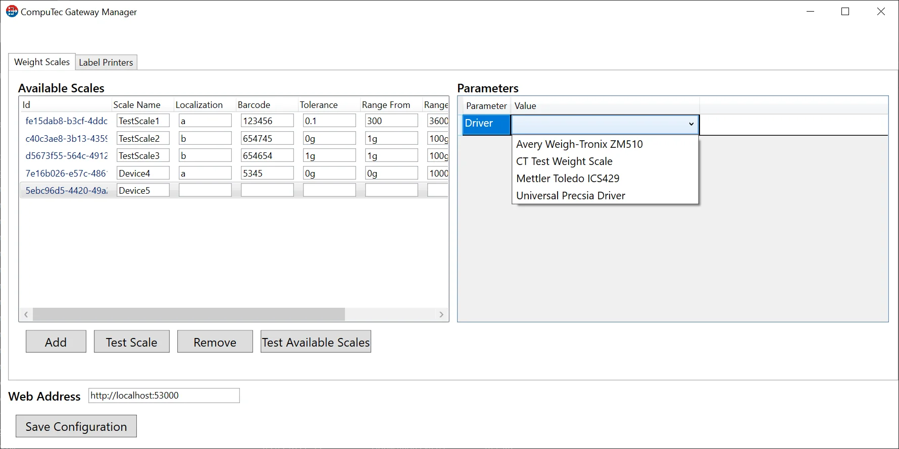
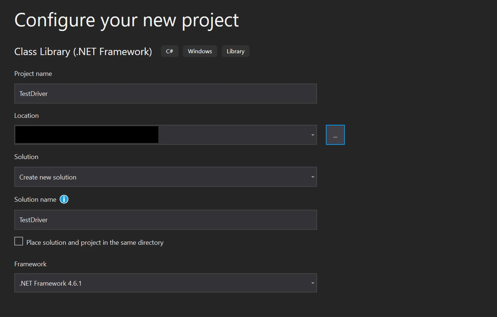
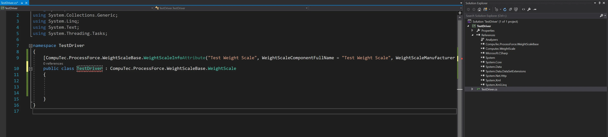
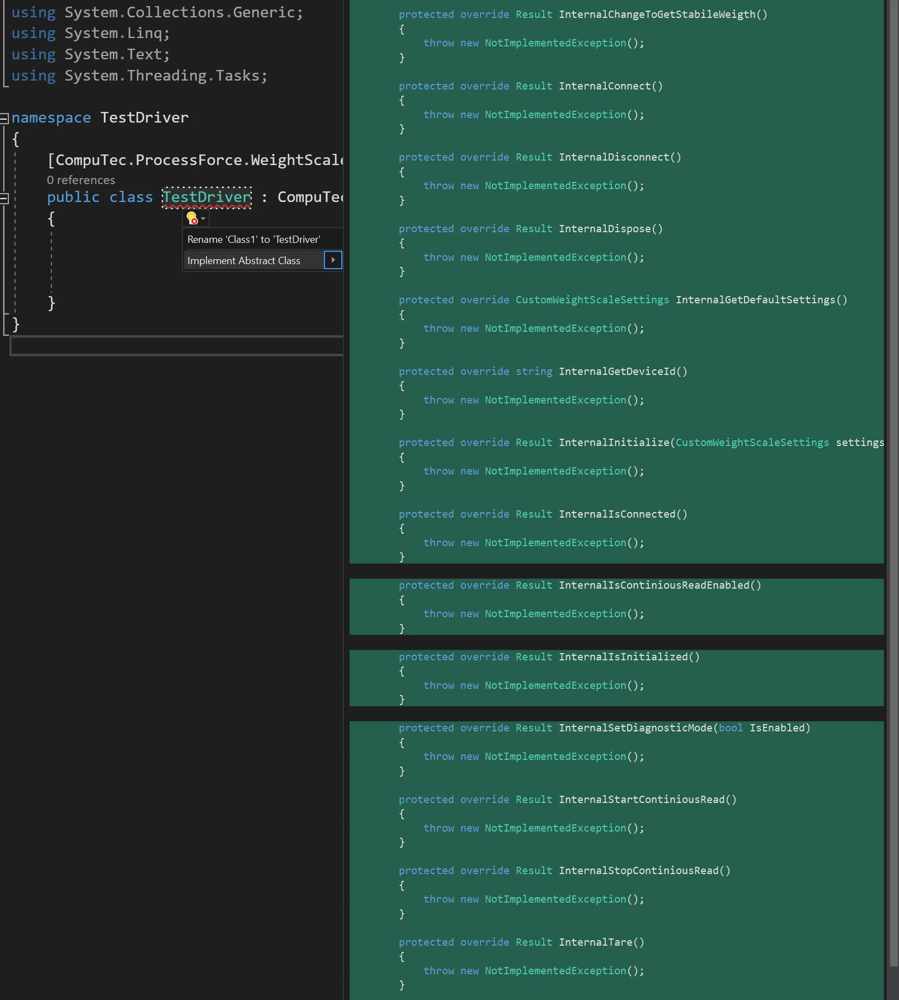
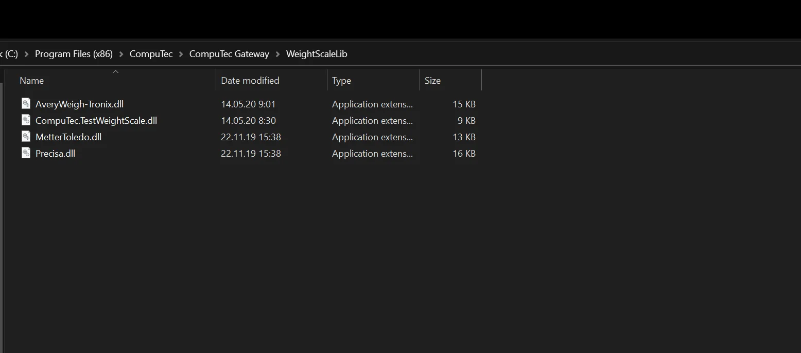

# Weighting Device Drivers

Here, you can find information on weighting device drivers: the ones available by default, and tips on creating your own.

## Currently Supported Devices

Precisa:

- XB320M
- 480S/BK1200D
- XB120A

Mettler Toledo:

- ICS429

Avery Weigh-Tronix

- ZM510

The devices are available to choose from the CompuTec Gateway Manager:



'CT Test Weight Scale' is a test driver that generates random weighting data for test purposes.

## Custom Driver Creation and Usage

You can develop a driver for a device that is not included in the available devices list from the previous point.

:::note
    If the required device is not listed in the previous paragraph and you are unable or unwilling to create a driver, the CompuTec team can develop it for you for a fee. To request this service, please submit a support ticket at [CompuTec Support](https://support.computec.pl).
:::

### A Driver Creation

The following example is created using Microsoft Visual Studio.

1. Create a project:

    
2. Add dependencies to the provided libraries:

    - [Computec.WeightScale.dll](https://download.computec.one/software/pdc/libraries/CompuTec.WeightScale.dll)
    - [CompuTec.ProcessForce.WeightScaleBase.dll](https://download.computec.one/software/pdc/libraries/CompuTec.ProcessForce.WeightScaleBase.dll)
3. Prepare a class of the drive:

    
4. Implement the methods and update them in accordance with the device requirements:

    

You can review the class in the example driver (CT Test Weight Scale).

<details>
<summary>TestDevice.cs Source Code</summary>
<div>

```cs
using CompuTec.ProcessForce.WeightScaleBase;
using System.Collections.Generic;
using System.Timers;
using System;
using System.Linq;

namespace Computec.TestWeightScale
{
    [CompuTec.ProcessForce.WeightScaleBase.WeightScaleInfoAttribute("Test Weight Scale", WeightScaleComponentFullName = "CT Test Weight Scale", WeightScaleManufacturer = "CompuTec S.A.")]
    public class TestDevice : CompuTec.ProcessForce.WeightScaleBase.WeightScale
    {
        public ReadModeEnum Mode { get; private set; } = ReadModeEnum.None;
        public override event WeightReaded DataReaded;
        public bool IsConnected = false;
        public bool IsInitialize = false;
        private readonly Random random = new Random();
        Timer timer;
        private bool IsDiagnosticMode = false;
        private double valueFrom = 0;
        private double valueTo = 100;
        private double tareValue = 0;

        protected override Result InternalChangeToGetStabileWeigth()
        {
            return new Result();
        }

        protected override Result InternalConnect()
        {
            IsConnected = true;
            return new Result();
        }

        protected override Result InternalDisconnect()
        {
            IsConnected = false;
            IsInitialize = false;
            return new Result();
        }

        protected override Result InternalDispose()
        {
            IsConnected = false;
            IsInitialize = false;
            return new Result();
        }

        protected override CustomWeightScaleSettings InternalGetDefaultSettings()
        {
            var settings = new CustomWeightScaleSettings();
            settings.Parameters.Add(new CustomWeightScaleSetting() { Name = "Value from", Scope = SettingScope.Machine, Value = "0" });
            settings.Parameters.Add(new CustomWeightScaleSetting() { Name = "Value to", Scope = SettingScope.Machine, Value = "100" });
            settings.Parameters.Add(new CustomWeightScaleSetting() { Name = "Tare value", Scope = SettingScope.Machine, Value = "0" });
            return settings;
        }

        protected override string InternalGetDeviceId()
        {
            return "TEST CT Weight Scale";
        }


        protected override Result InternalInitialize(CustomWeightScaleSettings settings)
        {
            base.ChangeSettings(settings);
            double.TryParse(settings.Parameters.FirstOrDefault(p => p.Name == "Value from").Value, out valueFrom);
            double.TryParse(settings.Parameters.FirstOrDefault(p => p.Name == "Value to").Value, out valueTo);
            double.TryParse(settings.Parameters.FirstOrDefault(p => p.Name == "Tare value").Value, out tareValue);
            IsInitialize = true;
            timer = new Timer();
            timer.Interval = 1000;
            return new Result();

        }

        protected override Result InternalIsConnected()
        {
            if (IsConnected)
                return new Result();
            else
                return new Result() { Errors = new List<Error>() { new Error("Not Connected Error in Test Device") } };
        }

        protected override Result InternalIsContiniousReadEnabled()
        {
            if (Mode == ReadModeEnum.Continous)
                return new Result();
            else
                return new Result() { Errors = new List<Error>() { new Error("Continous Read Error in Test Device") } };
        }

        protected override Result InternalIsInitialized()
        {
            if (IsInitialize)
                return new Result();
            else
                return new Result() { Errors = new List<Error>() { new Error("Not Connected Error in Test Device") } };
        }

        protected override Result InternalStartContiniousRead()
        {
            Mode = ReadModeEnum.Continous;
            timer.Elapsed += Timer_Elapsed;
            timer.Start();
            return new Result();
        }

        private void Timer_Elapsed(object sender, ElapsedEventArgs e)
        {
            var next = random.NextDouble();
            WeightEvArgs tempArg = new WeightEvArgs();
            if (!IsDiagnosticMode)
            {
                tempArg.NetWeight = Math.Round((next * valueTo) + valueFrom, 2);
                tempArg.GrossWeight = tempArg.NetWeight + tareValue;
                tempArg.TarWeight = tareValue;
                tempArg.UoM = "KG";
                tempArg.TimeSignature = DateTime.Now;
                tempArg.SerialNo = "TEST DEVICE SERIAL NUMBER";
            }
            else
            {
                tempArg.SerialNo = (next * 100).ToString();
            }

            DataReaded?.Invoke(this, tempArg);
        }

        protected override Result InternalStopContiniousRead()
        {
            Mode = ReadModeEnum.None;
            timer.Stop();
            timer.Elapsed -= Timer_Elapsed;
            return new Result();
        }

        protected override Result InternalTare()
        {
            return new Result();
        }

        protected override Result InternalZero()
        {
            return new Result();
        }

        protected override Result InternalSetDiagnosticMode(bool IsEnabled)
        {
            IsDiagnosticMode = IsEnabled;
            return new Result();
        }

        public enum ReadModeEnum
        {
            Continous, SingleRead, None
        }
    }
}
```

</div>
</details>

### Usage

After creating the driver, place it in the following directory (the default installation directory):



Now, the driver should appear in the list within CompuTec Gateway Manager (refer to the top screenshot on this page).

---
