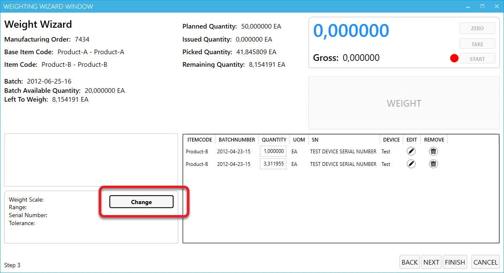

# Working with Scales

Once the configuration is complete, the connected weighing devices will be available for use within the Weight Scale module in CompuTec PDC.

For detailed instructions on how to operate the CompuTec PDC Weighing Module, click [here](../../user-guide/customization/optional-functions/weight-scale-module/overview.md).

---
