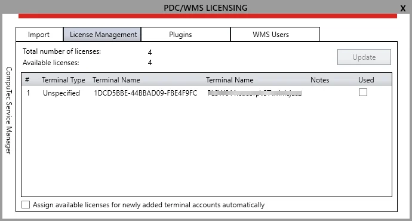

# Overview

This document provides step-by-step instructions on how to license the CompuTec PDC (Professional Data Center) application. Proper licensing is essential for the legal use of the application, ensuring that the software functions correctly and securely. Below are the instructions to guide you through the licensing process.

---

:::caution
    A terminal on which CompuTec PDC is installed requires a connection to a server on which CompuTec License Server is Installed.
:::

## Licensing Steps

1. **Launch CompuTec Service Manager** - Open the CompuTec Service Manager from the Windows program list. An icon will appear in the system tray. Click on it to access the application.

    :::info
        CompuTec Service Manager is included with the CompuTec License Server. You can download the latest version from CompuTec ProcessForce Downloads page.
    :::
2. **Start the CompuTec License Server** - The CompuTec License Server service is typically set to run automatically upon installation. If it is not running, select the service from the drop-down list and click the "Start" button.

    
3. **Open theLicensing Window** - Click on the CompuTec PDC/WMS Licensing button to open the licensing configuration window.
4. **Request License File** - To obtain a license file, send the following details to CompuTec support as described on the [the CompuTec PDC license request page](./computec-pdc-license-request.md):

    - **Full Server Name**: this is automatically displayed after the successful installation of the application and indicates the specific machine on which the application is installed.
    - **Terminal License Key**: this key is generated automatically based on the internal system information.

        
5. **Import the License File** - Once you have received the license file, navigate to the License file location field, enter or browse to the path of the license file provided by CompuTec support.
6. **Load License** - Click the "Import" button to load the license from the file.
7. **Confirm License Import** - One of the following communications will appear:

    - **License imported successfully**: the license has been loaded from an appropriate file.
    - **License is not invalid**: an invalid license file was loaded.
8. **View License Details** - Once the license is successfully imported, information about the remaining validity of the license will be displayed.
9. **Test the License** - Run CompuTec PDC and attempt to log in. If the license is applied correctly, you may see the message "Not Connected No License Assigned".
10. **Reload Licensing Window** - Reload the CompuTec PDC/WMS LICENSING window. A new terminal should now be visible under the License Management tab.

    
11. **License Information** - Two values are communicated on this tab:

    - **Total number of licenses**: the total number of licenses loaded from the license file.
    - **Available licenses**: the number of licenses that are not yet assigned to any terminals.
12. **Assign the License** - Select a desired terminal from the list, check the checkbox to assign a license to it, and click "Update". Once the license is assigned, the number of available licenses will decrease by one.

    
13. **License** - The license is now successfully assigned to the terminal and it can begin functioning.
14. **View Terminal ID** - You can view the terminal ID in the About CompuTec PDC window, which can be accessed by clicking the information icon on the login panel:

    

---
