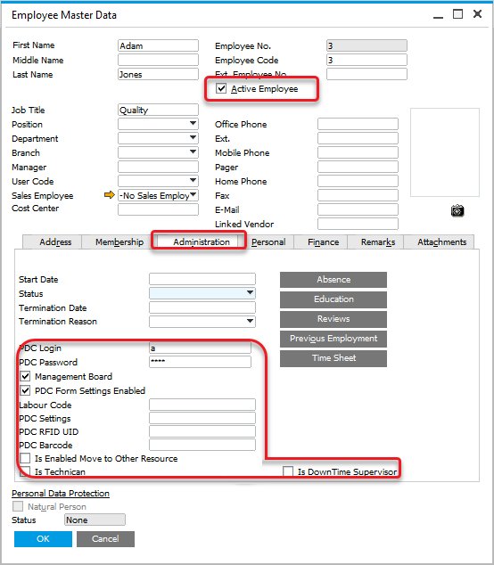
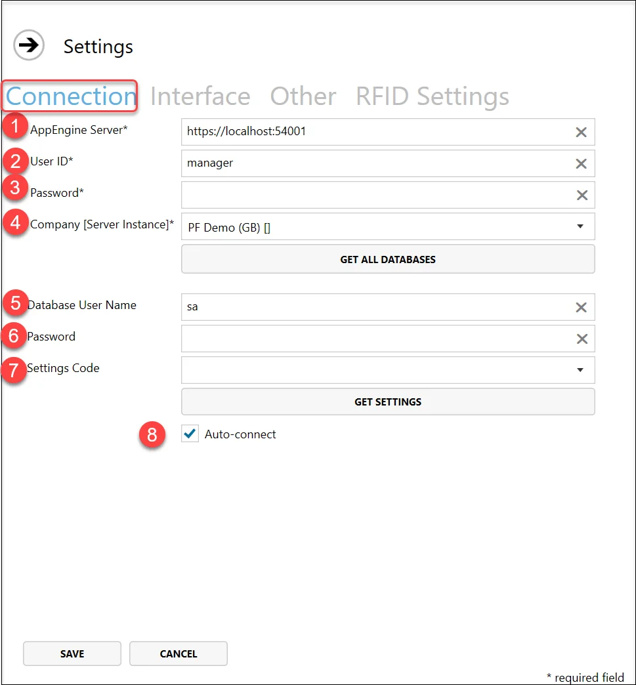
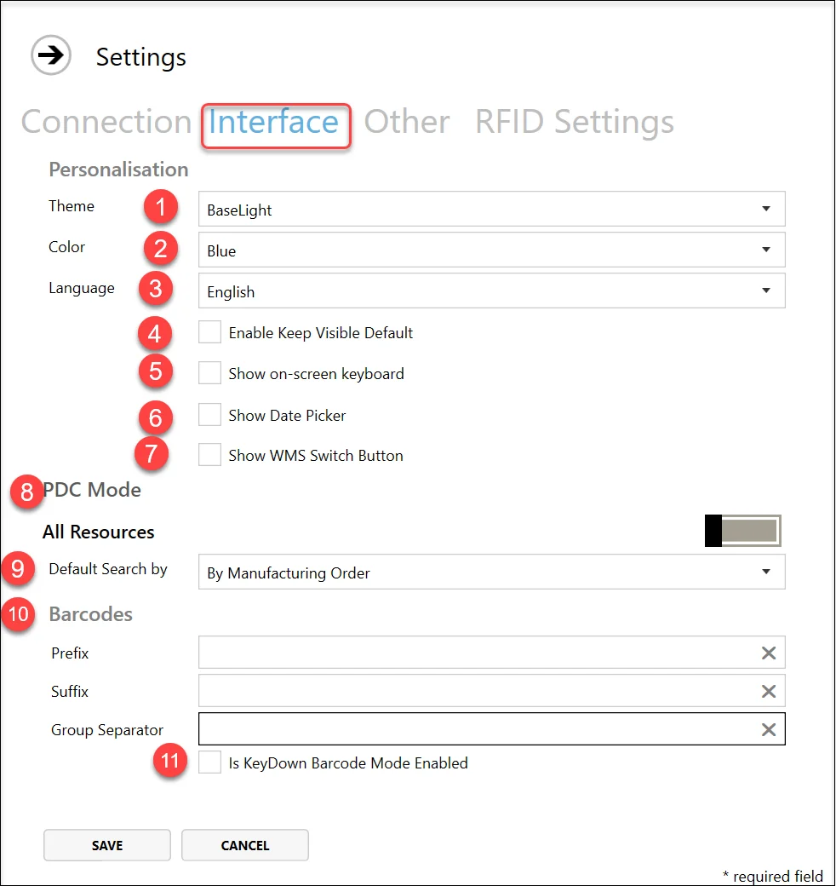
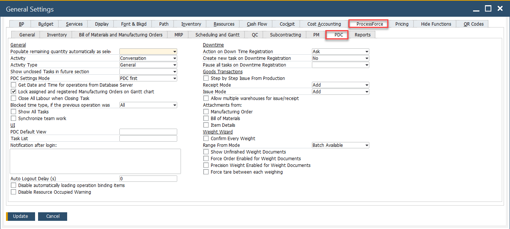
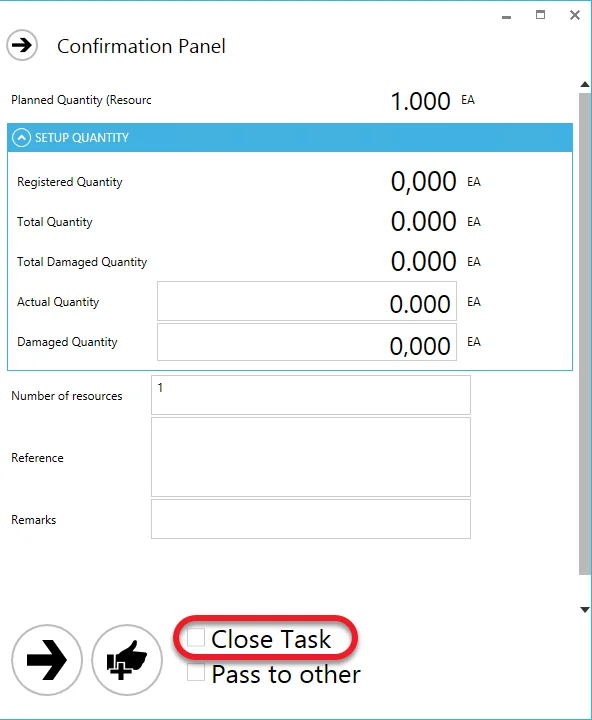
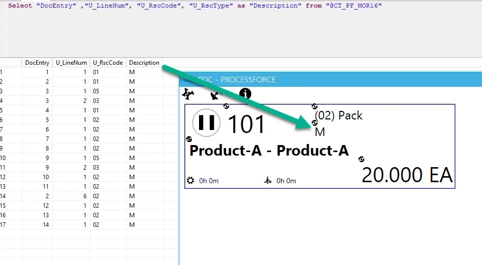
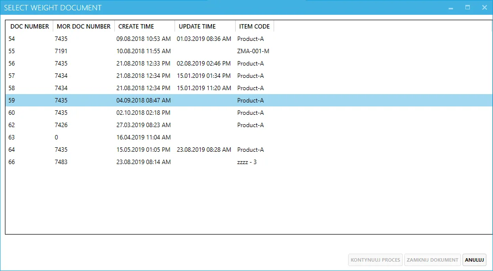

# Overview

The document outlines the setup and configuration process for the CompuTec PDC application, specifically designed for integration with SAP Business One. Below is a summary of key points.

---

## Requirements

To use the CompuTec PDC application, the following requirements must be met:

- An SAP Business One user must be defined with at least an Indirect Access User license.
- CompuTec ProcessForce license must be assigned to the SAP Business One user,
- Employee Master Data must be defined for a specific employee, including CompuTec PDC information.

To access Employee Master Data, navigate to:

:::info Path
Main Menu → Human Resources → Employee Master Data
:::



- **Active Employee Checkbox**: the "Active Employee" checkbox must be checked to use the employee in CompuTec PDC.
- **Credentials**: CompuTec PDC Login and Password must be defined.
- **Management Board**: the "Management Board" checkbox is optional; when checked, it grants access to the [Manager Board](../../user-guide/management-board.md) and [Weight Management Board](../../user-guide/customization/optional-functions/weight-scale-module/weight-management-board.md) within CompuTec PDC.
- **PDC Form Settings Enabled**: the "PDC Form Settings Enabled" checkbox is optional; when checked, it provides access to [Form Settings](../../user-guide/customization/overview.md#form-settings) for the employee, allowing the customization of columns and their order in PDC forms. Below is an example of Form Settings for Operation Properties:

  
- **Labour Code**: assign a Labour-type Resource (e.g., Press Operator) to track an employee’s work time. An Employee with a Labour Code can be [assigned to a Task](../../user-guide/task-activities/overview.md#adding-a-new-task).
- **PDC Settings**: a set of individual CompuTec PDC and CompuTec ProcessForce settings that can be assigned to a specific Employee or CompuTec PDC installation. Click [here](rfid.md) to learn more.
- **PDC RFID UI**: an RFID identification code is assigned to an employee for logging in using RFID devices. Click here to learn more.
- **PDC Barcode**: a barcode is assigned to the employee for login (if barcode scanning devices are used).
- **Is Enabled Move to Other Resource**: this checkbox determines if the employee can move a Task to an [Alternative Resource](https://learn.computec.one/docs/processforce/user-guide/scheduling/gantt-chart/alternative-resources) during time or downtime registration on a Task.
- **Is Technician**: a user with this checkbox checked can access and modify all unclosed Downtime documents assigned to them, including changing the Downtime Reason and closing the documents.
- **Is DownTime Supervisor**: a user with this checkbox checked has the same privileges as a Technician but for all Downtime documents in the system. The supervisor can also reassign any Downtime document to a different Technician.

## Setting up CompuTec PDC Application

After launching the application, click the first icon in the top menu and select "Settings". The Settings tab is organized into three sections:


### Connection

The Connection section allows you to configure the necessary settings to connect CompuTec PDC with SAP Business One and other related services.

:::caution
    For a detailed description of the configuration for the CompuTec AppEngine plugin version, click [here](/docs/appengine/plugins-user-guide/computec-pdc-plugin).
:::



In this section, enter the necessary information to establish a connection with SAP Business One.

Fill in the required details in the provided window:

1. Enter the CompuTec AppEngine server address to connect to CompuTec AppEngine. This address includes the server IP or machine name (or simply 'localhost' if CompuTec PDC and CT Engine are installed on the same machine) and the port number. By default, port 8080 is used, but it can be changed if needed. Click [here](../weight-scales-integration/computec-gateway-manager.md) for instructions on how to do this.
2. Enter the SAP Business One user ID for the selected database. The user must have at least an Indirect Access SAP Business One license and CompuTec ProcessForce license.
3. Enter the SAP Business One password for the selected database.
4. After entering the server address, the list of available companies (databases) will automatically populate. Select the required company from the drop-down list (click the Get All Databases button to refresh the list).
5. Enter the database username (required only to view the Bill of Materials and Manufacturing Orders in the Crystal Report preview). If this information is not configured, the application will prompt for authentication to open the preview. Click [here](./sap-hana-database.md) for instructions on setting up a database user other than SYSTEM.
6. Enter the database password (required only to view the Bill of Materials and Manufacturing Orders in the Crystal Report preview). If this information is not configured, the application will prompt for authentication to open the preview.  Click [here](./sap-hana-database.md) for instructions on setting up a database user other than SYSTEM.
7. You can select [predefined settings](./pdc-settings/overview.md) from the drop-down list. Clicking the "Get" Settings button will populate the list with values from the related database.
8. After completing all the settings and clicking Save, the application will automatically connect using the provided data on subsequent runs when the checkbox is selected.

### Interface

The Interface section allows you to customize the appearance and functionality of the CompuTec PDC application, including themes, language, barcode settings, and more.



1. **Theme**: choose between a light or dark color scheme for the application.
2. **Color**: select from a range of color options for the application (the screenshots in the documentation were taken using the Blue setting).
3. **Language**: choose the language for the application interface. Available languages include English, Polish, and French.
4. **Enable Keep Visible Default**: when this option is checked, the [Quick Receipt](../../user-guide/customization/optional-functions/quick-receipt.md) form remains open after a receipt, allowing users to quickly process additional receipts without reopening the form.
5. **Show on-screen keyboard**: when checked, an on-screen keyboard will appear upon clicking any data entry field. The keyboard can be minimized or closed and will reappear when another data entry field is selected. This feature is particularly useful for touchscreen devices, such as tablets.
6. **Show Date Picker**: this option allows to set amount of time in minutes (e.g., 67 minutes) instead of date and time on time registration. Click [here](../../administrators-guide/setting-up-the-application/pdc-settings/overview.md).
7. **Show WMS Switch Button**: If using the [CompuTec WMS](/docs/wms/) application, enable this option to display a switch button in CompuTec PDC, allowing you to toggle between the two applications. The default path will be selected, but you can choose a different path if CompuTec WMS is installed elsewhere by clicking the button next to the path field.
8. **PDC Mode**: specific / all Resource indicator – This option controls whether an employee can add tasks to any resource from the database or just a specific resource assigned to the device. If a specific resource is chosen, a new field will appear to specify the resource name.
9. **Default Search by**: Set the default task search method to either Manufacturing Order or Resource (this setting is configured individually for each terminal).
10. **Barcodes**: define your prefix, suffix, and group separators for barcodes here.
11. **Is KeyDown Barcode Mode Enabled**: this option determines whether CompuTec PDC uses KeyDown Barcode Mode for scanning. It is intended for use with older devices, such as tablets running Windows systems.

### Other


#### CompuTec Labels Settings

CT Label Address - Specify the address for CT labels.

Selection Printer - Choose a printer defined in CompuTec Labels.

SAP API Gateway Address - This setting is necessary for Crystal Reports. Click [here](https://help.sap.com/docs/SAP_BUSINESS_ONE_VERSION_FOR_SAP_HANA/686100cb1bc34346b2bc6642685bab43/b1bbebd32ff940c786c76315a8dfa270.html)for more details.

Please note job service has to be enabled:
  
  

### RFID Settings

Click [here](./rfid.md) to find out more about RFID settings.

### Connecting

1. After configuring all required settings, click the Save button. This will save the entered data and display the login form.

2. Click Connect in the upper menu.
  

3. Enter your CompuTec PDC login and password in the Login and Password fields, respectively. The connection status will be shown at the bottom of the screen.

   
4. Once logged in, the user name defined in the Employee Master Data will appear in the bottom right corner of the form:

   
5. The service is now ready for use. The function buttons are displayed at the bottom of the screen (from left to right):

    - Adding a new task
    - Display Management Board
    - Switch to CompuTec WMS
    - Log out

## CompuTec ProcessForce Settings

In SAP Business One with CompuTec ProcessForce installed, you can find CompuTec PDC Settings:

:::info Path
SAP Business One → Administration → System Initialization → General Settings → ProcessForce tab → PDC tab
:::



### Key Settings

Below is a detailed breakdown of the key settings available in this tab.

1. **General**

    - **Populate remaining quantity automatically as selected activity**: This option applies to Production Issue and Production Receipt processes, allowing the system to automatically assign planned quantities for Pick Order, Pick Receipt, both, or neither. If automatic assignment is not configured, the quantity will default to zero.
    - **Activity**: A standard SAP Business One feature that can be initiated directly from the CompuTec PDC interface. This setting lets you define whether an activity should be automatically created during relevant actions within PDC.
    - **Activity Type**: Specifies the type of activity that will be automatically assigned when an activity is created from the CompuTec PDC level.
    - **Show unclosed Tasks in future section**: When this option is enabled, and the "Close Task" checkbox on the Confirmation Panel is left unchecked, the task tile will remain visible on the main panel after the document is registered.

        
    - **PDC Settings Mode**: A predefined default SQL view required for personalization options.
    - **Get Date and Time for operations from Database Server**: Ensures date and time entries are synchronized using the database server’s clock to avoid time zone discrepancies.
    - **Lock assigned and registered Manufacturing Orders on Gantt chart**: Prevents changes to orders already scheduled and assigned, preserving planning integrity.
    - **Close All Labour when Closing Task**: Automatically closes all related labor entries when the task is marked as completed.
    - **Blocked time type, if the previous operation was**: Allows you to define blocked time logic based on the status of prior operations (e.g., All, Failed, or Skipped).
    - **Show All Tasks**:Displays all tasks regardless of user-specific filters or assignments.
    - **Synchronize team work**: Enables time and data synchronization across team members working on the same task.

2. **UI**

    - **PDC Default View / Task List**:a predefined default SQL view required for personalization options.

        For example, **PDC Default View** = PDCVIEW for custom SQL View:

        ```sql title="MySQL Example"
        Create View [dbo].[PDCVIEW]
        as
        Select "DocEntry" ,"U_LineNum", U_RscCode+' | '+ U_RscType as "Description" from [@CT_PF_MOR16]
        GO
        ```

        ```sql title="HANA Example"
        Create View "PDCVIEW"
        as
        Select "DocEntry" ,"U_LineNum", "U_RscCode", "U_RscType" as "Description" from "@CT_PF_MOR16"
        ```

        **How to use a View in PDC**:

          

          

          

    - **Notification after login**:Display custom messages to users upon logging into the PDC terminal – useful for shift updates or instructions.
    - **Auto Logout Delay(s)**: Specifies the time (in seconds) of user inactivity after which the system automatically logs out for security purposes.
    - **Disable automatically loading operation binding items**: Disables preloading of operation-related items, reducing initial loading time if not needed.
    - **Disable Resource Occupied Warning**: Suppresses alerts that indicate the selected resource is currently occupied.

3. **Downtime**

      - **Action on Down Time Registration**: Defines what the system should do when downtime is logged (e.g., Ask, Skip, or Force End Task).
          - **Ask**: When downtime is registered, the user will be prompted to choose between creating a time booking or registering only the quantity.
          - **Create Time Booking**: Automatically creates a time booking when downtime is recorded.
          - **Only Quantity Registration**: Only the quantity is recorded when downtime is registered, without creating a time booking.
      - **Create new task on Downtime Registration**: Automatically generates a new task entry when downtime is registered.
      - **Pause all tasks on Downtime Registration**: Determines whether all active tasks should be paused when downtime is registered, particularly in scenarios where multiple employees are working on the same resource.

4. **Goods Transactions**

    - **Step by Step Issue From Production**: When enabled, this option controls the data entry method for issuing from production. It defines whether information such as Item, Batch, Localization, and Quantity is entered step-by-step across separate forms, or all at once in a single dialog window.
    - **Receipt Mode / Issue Mode**: Defines default modes (e.g., Add) for issuing and receiving goods.
        - Receipt mode:

          - Add (Default): Regular Receipt from production
          - Add and Open Issue: Creates a Receipt from production and open Issue to production form.

        - Issue mode:

          - Add (Default) – Standard Issue to production.
          - Add and Open Receipt – create an Issue to production and opens the Receipt from production window.
    - **Allow multiple warehouses for issue/receipt**:Enables goods movement transactions across different warehouse locations.
    - **Attachments from**: Specifies the source of attachments (Manufacturing Order, Bill of Materials, Item Details) available through the Attachments option in the Task panel for related documents.

5. **Weight Wizard**

    - **Confirm Every Weight**: Forces confirmation of each weighing transaction for precision.
          - No (Default): Standard process without confirmation messages.
          - Yes: Displays a confirmation message after each weighing:

            
    - **Range From Mode**:
          - **Batch Available (Default)**: The "Range From" value in the weight scale settings must not exceed the available batch quantity (as indicated by point 1 in the image). For example, if the batch has only 1000 KG available and "Range From" is set to 1000 KG or more, the weight scale cannot be selected.
          - **Planned Item Quantity**: The "Range From" value must not be greater than the planned item quantity (see point 2 in the image). For instance, if the planned quantity is 110 KG and "Range From" is set to 110 KG or higher, the weight scale option becomes unavailable.
          - **Remaining Quantity**: The "Range From" setting must not exceed the remaining quantity (as shown in point 3 in the image). For example, if only 100 KG remain and "Range From" is 100 KG or above, the weight scale cannot be used.

            
    - **Show Unfinished Weight Documents**: When this option is selected, users will see a window displaying any unfinished weight documents upon their next login.

        

      From this window, they can choose to resume work on a document, close it, or access it later through the [Weight Management Board](../../user-guide/customization/optional-functions/weight-scale-module/weight-management-board.md).
    - **Force Order Enabled for Weight Documents**: When enabled, this option enforces the weighing process to follow the sequence specified in the [Operation Bind](/docs/processforce/user-guide/formulations-and-bill-of-materials/production-process/overview#operation-bind) of the corresponding Manufacturing Order.
    - **Precision Weight Enabled for Weight Documents**: When enabled, it prevents issuing a weight that exceeds the Planned Quantity, accounting for the defined [weight scale](../../user-guide/customization/optional-functions/weight-scale-module/overview.md) precision range.
    - **Force tare between each weighing**:When enabled, users must click 'Tare' before each weighing to maintain measurement accuracy. Learn more in the [Weighing Module](../../user-guide/customization/optional-functions/weight-scale-module/overview.md).

---
