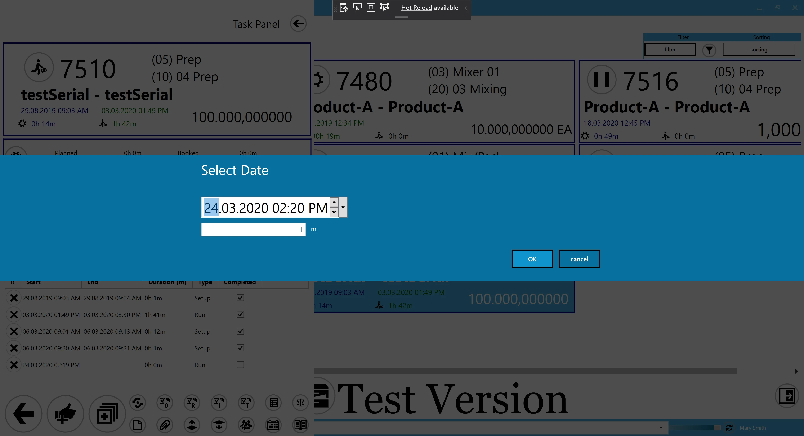

# Overview

This section provides comprehensive information on PDC Settings, outlining the options available for configuration and how these settings can be assigned to either specific employees or CompuTec PDC installations. Proper management of these settings ensures that the system operates according to the organization’s unique requirements, improving efficiency and user experience.

---

## General Settings

You can define the settings to be taken from CompuTec PDC installation (assign just to it) or predefined settings templates (assign to a specific Employee) [CompuTec PDC installation](overview.md) (assign just to it), or from predefined settings templates (assign to a particular Employee). The way of getting the settings can be set up in [CompuTec ProcessForce settings](../overview.md#processforce-settings) (PDC Way of Getting Settings field).

## PDC Settings templates

:::info Path
    Administration → Setup → General → PDC Settings
:::

Here, you can define and save a set of settings that can be assigned to either a specific employee or an installation of CompuTec PDC. For instructions on how to do this, proceed to the next section.

Most options are available either at the [CompuTec ProcessForce](../overview.md#processforce-settings) or [PDC-level](../overview.md) level settings.

The following options are specific to the PDC Settings form:

- **Resource Code**: when filled in, users assigned to these PDC Settings will only be able to view tasks related to the specified resource.
- **Notification after login**: the text entered here will be displayed in a form after the user logs in to the application.
- **Show Date Picker**: this option allows you to set a duration in minutes (e.g., 67 minutes) for time registration instead of a specific date and time:

  
- **Localizations**: this is a weighting module-related option. Only devices from the localizations listed here will appear in the [Weighting Wizard](../../weight-scales-integration/working-with-scales.md). The weighting device, along with its localization, can be configured in [CompuTec Gateway Manager](../../weight-scales-integration/computec-gateway-manager.md). If this field is left blank, all devices will be available.
- **Resources view**: the purpose of this function is to filter tasks by multiple Resources. Click [here](./resources-view.md) to find out more.
- **Delay of closing dialogs(s)**: here, you can specify the time (in seconds) for displaying dialog windows.

## Assigning PDC Settings Templates

A template can be assigned to a specific Employee.

:::info Path
    Human Resources → Employee Master Data
:::

Click "Choose" from the List icon to select one of the predefined PDC Settings.

---
