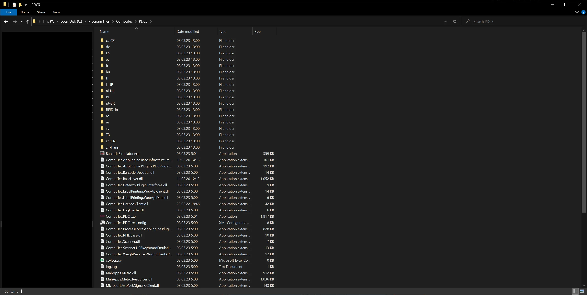

# FAQs

The frequently Asked Questions section helps deal with minor problems while operating CompuTec PDC.

---

Many exceptions thrown by CompuTec PDC are caused by incorrect installation or configuration. Please check the following page first: [CompuTec PDC Plugin](/docs/appengine/plugins-user-guide/computec-pdc-plugin).

Here, you can also find a solution for the following issues:

## Can't log into company, no error shown

More details are in the log.log file, stored in the application directory.

Adding this file when reporting the issue to CompuTec Support is also helpful.

## CompuTec ProcessForce Database Version not supported

### <i>**Update database or reinstall API**</i>

Please ensure that the installed CompuTec ProcessForce API is in the same version as on the database.

## Current user lacks CompuTec ProcessForce license

- Check if a user has CompuTec ProcessForce license assigned.
- Check if a username in CompuTec PDC settings is the same as it is set up in SAP Business One. Upper and lower case letters are relevant.

## Databases unavailable at Settings level

If you are using the application with the HANA database type, ensure that you meet the requirements described in the "Working in the HANA Environment" section.

---
