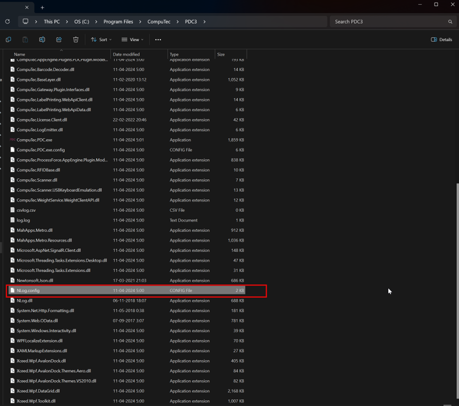
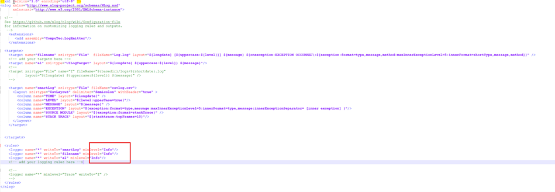
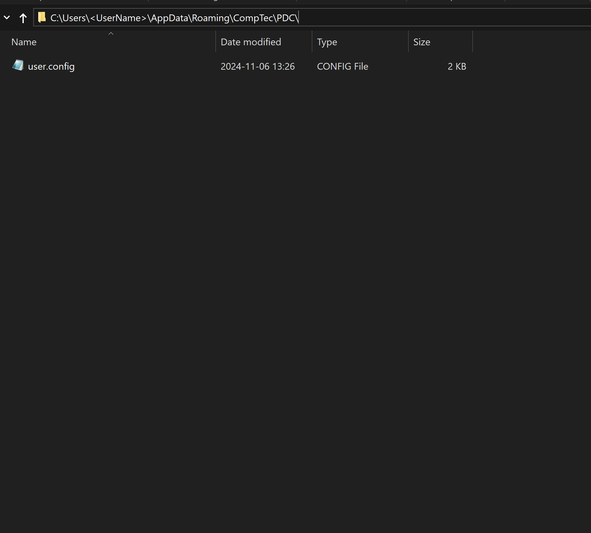
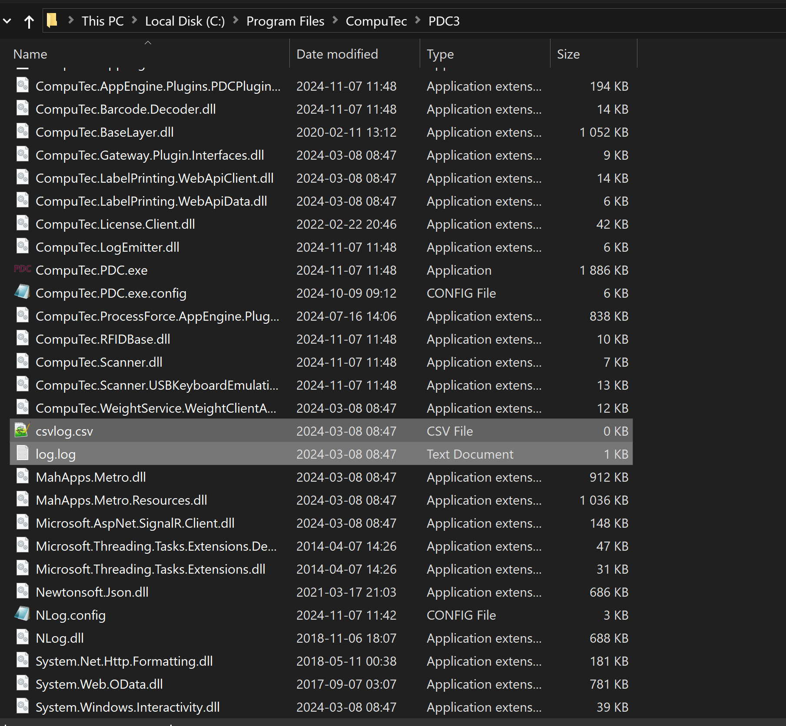
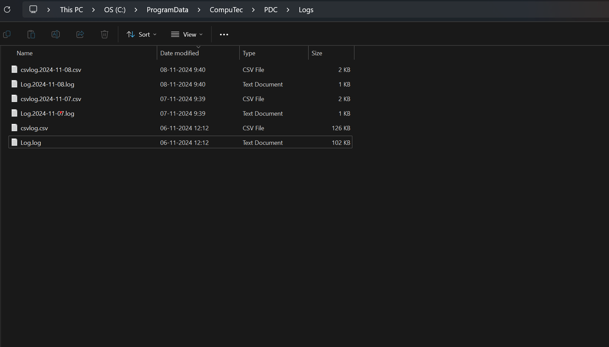

# Log Files

To change the NLog logging level in PDC, follow these steps:

- Find the NLog.config file in the PDC installation path.

    
- Use any text editor to open the NLog.config file.
- Locate the logging level property in the file.
- Change the logging level from "Info" to "Trace" or any other desired level. By default, it is set to "Info".

    

:::info note
Starting from version **3.10.24.1**, the **config file location** for CompuTec PDC has been updated. Previously, the config file was stored in the program files, but the new version organizes configuration files in a more user-specific directory.

    
click here to find the path

    

    
    

    

If you are updating from an older version, please make sure to refer to the new config file path.
:::

**Logs from the PDC are collected in these files**:

    

:::info note
Starting from version **3.10.24.1**, the **log file location** for CompuTec PDC has been updated.
    

    
click here to find the path

    

    
    

    

If you are updating from an older version, please make sure to refer to the new log file path.
:::
