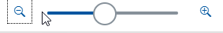
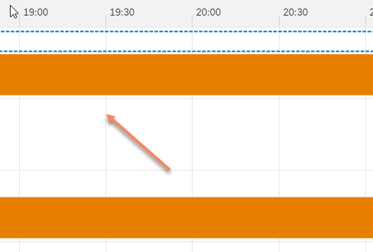
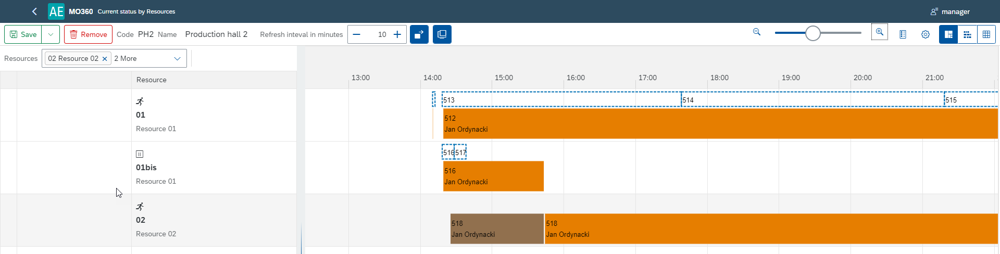
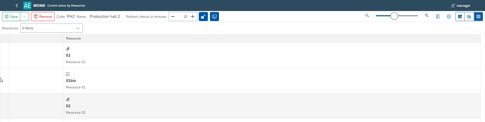
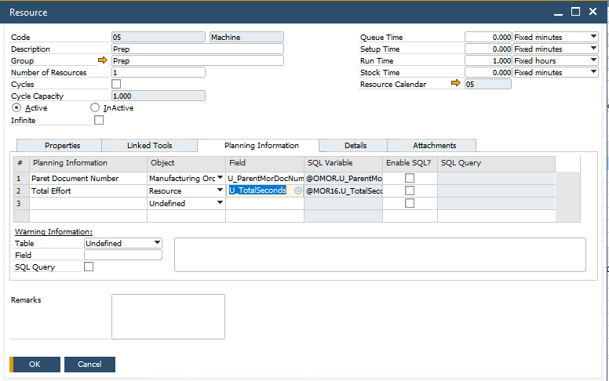

# Current Task Flow vs. Gantt Chart

Managing manufacturing operations effectively requires tools that provide real-time insights, flexibility, and control. This guide outlines the key functionalities available in CompuTec's scenario definition interface, designed to optimize resource allocation, monitor progress, and enhance operational efficiency. From adding views to customizing data displays, these features empower users to streamline production processes and make informed decisions. Here, you can find information on scenario definition.

---

## Add New View

The "Add New View" function allows users to define scenarios by filtering elements displayed on the Gantt chart. This feature enables targeted visualizations, such as segmenting resources by departments or machine types, for a clearer focus on specific operations.

View [this video](https://www.youtube.com/watch?v=bGoJjbKHGg4) to know more about "Adding a New View".

## Change Scope Tabs

Customize the graph display to suit operational needs. Key options include:

    - **Refresh interval in minutes** – Set the frequency (in minutes) for updating manufacturing order progress.

        

    - **Display details** – Click on a Task to view its details. Possibility to check details broken down into:

        

    - **Show quick view** – the ability to view the details of the operation of a given Manufacturing Order. Hover over tasks to instantly view operational details.
    
        

    - **Zoom** – Adjust the level (increase or decrease) of the detail in displayed results.

        

    - **List Legend** – Identify colors and characters representing various statuses.
    
        

    - **Settings** - 
        -  **Indicate Current Time** – show current time on view

            

        - **Show Cursor Line** – shows the time of a place on the graph pointed by a cursor:

            

        - **Show Divider Lines** – shows a time division grid:
        
            

        - **Show Ad Hoc Lines** – shows the relationship between a planned and an actual Task:

            

        - **Synchronize Time Scroll** – the graph returns to the current date after a specified interval in minutes.

- **Display** 

        - **Table and chart**:

            

        - **Chart**:

            
        
        - **Table**:

            

        Click [here](https://www.youtube.com/watch?v=ohvXXmDyj5E) to know more.

## Display Details

### Work-in-progress

The side panel shows details of a Task flow on a Resource. The data is presented in real time, showing the current Set up Time or Run time.

### Manufacturing Order

    - **Manufacturing Order details** - Includes details such as Number, Item Code, Revision, Planned and Actual Quantity, Required Date

        

### Operation

    - **Operation details** -  Includes details such as code, name, sequence, and status. (Code, Name, Sequence, Status)

        

### Resource

    - **Resource details** - Includes details such as code, name, and type.
    - **Time details** - Provides start and end times for all time categories.

        

### Additional information

    - Additional information from a Resource

        

        

### Production Process Flow

    - Below is the graphical representation of the manufacturing process for a Manufacturing Order

        

---
CompuTec's scenario definition interface is a comprehensive tool for visualizing, managing, and optimizing manufacturing operations. Its versatile features—ranging from tailored views to real-time monitoring - equip users with the insights needed to maintain efficiency and agility in production processes.
