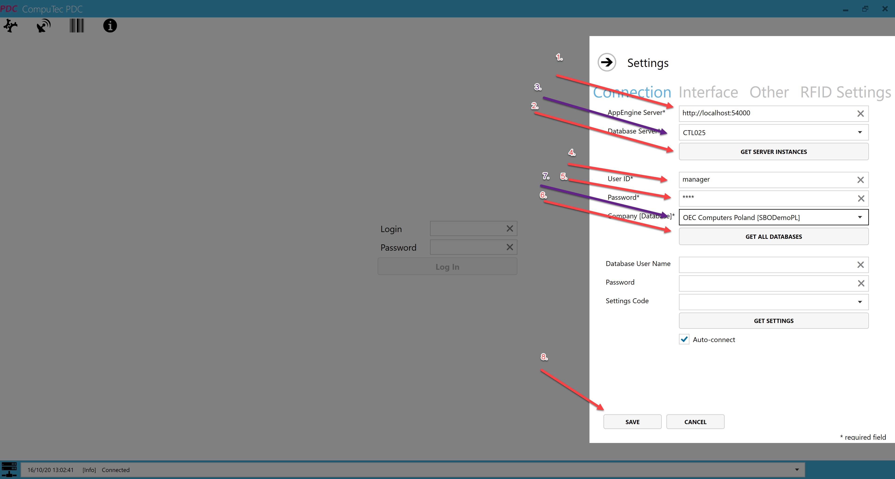

# Overview

The **CompuTec PDC Plugin** provides **Production Data Capture** functionality through **CompuTec AppEngine**. It offers a faster and more convenient way for production operators to perform shop floor activities using a web-based interface.

The plugin supports production activities such as recording time, working with **Manufacturing Orders** and operations, and accessing relevant production, item, and resource information.

The plugin works together with **ProcessForce Time Bookings** to provide production data directly from the shop floor.

:::info[note]
This guide provides comprehensive instructions on working with the **CompuTec PDC Plugin** and **CompuTec AppEngine**. It complements the main **CompuTec PDC** application manual, which is available after clicking [this link](/docs/pdc/).
:::

## Before you start

Before installing the CompuTec PDC Plugin, make sure that:

- **CompuTec ProcessForce** is installed and configured. [Read more](/docs/processforce/administrator-guide/installation/first-installation/extension)
- **CompuTec License Server** is installed and configured. [Read more](/docs/processforce/administrator-guide/licensing/license-server/computec-license-server-installation)
- Your environment meets the **CompuTec PDC** requirements. [Read more](/docs/pdc/administrator-guide/installation/requirements/)
- **CompuTec AppEngine** is installed and configured. [Read more](/docs/appengine/administrators-guide/configuration-and-administration/installation)
- **CompuTec ProcessForce API** is installed on the same server as **CompuTec AppEngine**.

:::caution
The **CompuTec PDC Plugin** is compatible only with the **64-bit** version of **CompuTec PDC**.
:::

## Install and configure the CompuTec PDC Plugin

### Step 1: Install the required components

To use the **CompuTec PDC Plugin**, install the following components:

- [**CompuTec PDC Plugin**](/docs/appengine/plugins-user-guide/install-plugin)
- [**CompuTec ProcessForce Plugin**](/docs/processforce/administrator-guide/installation/first-installation/extension)
- [**CompuTec ProcessForce API**](/docs/processforce/releases/download#computec-processforce-api) (on the same server as CompuTec AppEngine)
- [**CompuTec PDC**](/docs/pdc/administrator-guide/installation/first-installation/)

:::note[info]
Install the required plugins through the **CompuTec AppEngine Administration Panel**. [Read more](/docs/appengine/plugins-user-guide/install-plugin)
:::

:::caution[important]
**CompuTec ProcessForce API** needs to be installed on the same server as **CompuTec AppEngine**.
:::

### Step 2: Configure the PDC connection

After the required plugins are installed, configure **CompuTec PDC** to connect to **CompuTec AppEngine**.

1. In the **CompuTec AppEngine Administration Panel**, make sure that the required **SAP Business One** company is available and active.
2. Open **CompuTec PDC**.

3. Open **Settings**.

4. Enter the **CompuTec AppEngine** server address.

    The default address for a local installation is:

    `https://localhost:54000`

5. Complete the connection settings in the required order.

6. Some fields are populated automatically after the connection information is entered. Select the required values from the available lists where applicable.

    :::info[note]
    Filling in the fields marked with the red arrows automatically fills in the fields marked with the purple arrows (then, choose one option from the drop-down list).

    
    :::

7. Click **Save**.

## Update the CompuTec PDC Plugin

When a newer version of the plugin is available, update it through the **CompuTec AppEngine Administration Panel**.

For instructions, see [Update a Plugin](/docs/appengine/plugins-user-guide/update-plugin).

After updating the plugin, make sure that the installed CompuTec PDC application and any required ProcessForce API components are compatible with the new version.

If a newer PDC application version is required, install the corresponding version before continuing to use CompuTec PDC.
