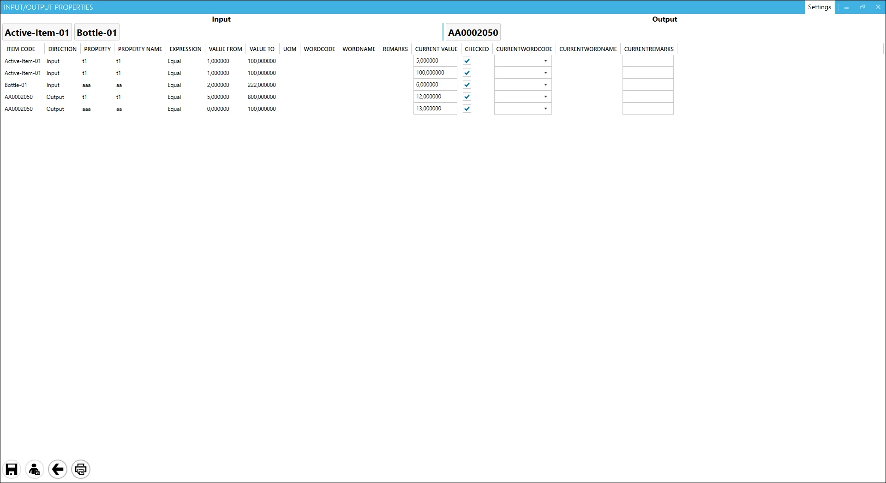

# Input/Output Properties

The Input/Output Properties feature allows users to view and manage the data saved in CompuTec ProcessForce form, specifically within the Manufacturing Order Operation Bind > Properties tab. This functionality not only enables users to check the current saved information but also offers the ability to compare actual values with those that have been previously saved, providing an efficient way to track changes and updates.

---
