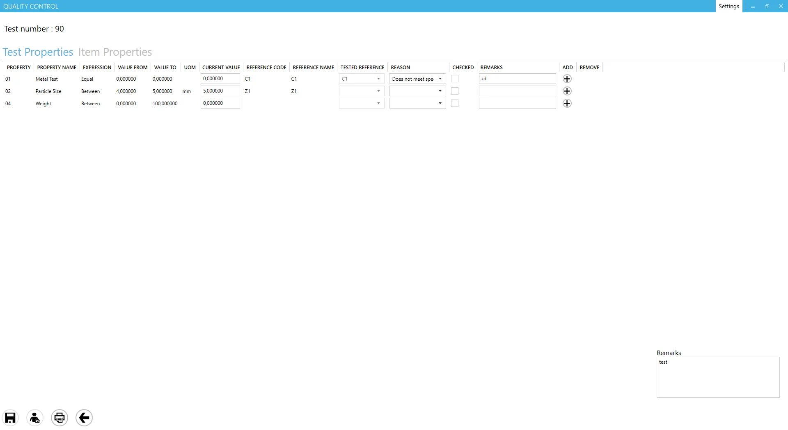

# Quality Control Test/Item Properties

The Quality Control Test/Item Properties feature enables users to review and record tests and item properties associated with a Quality Control Test. To activate this option, simply enable QC Test Properties from the [custom options for Task Panel](../../customization/overview.md#task-tile-and-task-panel-customization). Once enabled, the button becomes available when a Quality Control Test is linked to a specific Manufacturing Order or its associated Operation. For more details on verification, refer to the related [ProcessForce documentation entry](/docs/processforce/user-guide/quality-control/quality-control-test/overview#transaction).

## Header

Displays the related Quality Control Test document number.

## Test/Item Properties table

**From Property to Reason columns**: displays properties copied from the related Quality Control Test. Users can switch between Test Properties and Item Properties at the top of the table. Each line allows entry of either numeric or reference code values.

    - If a reference code and name are assigned to a property, values can only be selected from the drop-down list in the Tested Reference column (numeric input is not allowed).
    - If no reference is assigned, numeric values can be entered manually.

- **Checked column**: once a value is entered, check this box to save it. Checked lines will be saved upon clicking the Save icon.
- **Add/Remove column**: if multiple test results are enabled in ProcessForce, additional results can be added by clicking the plus (+) icon, and unnecessary lines can be removed using the minus (-) icon.
- **Remarks column**: allows users to enter text-based remarks for each line.

## Footer

- **Save icon**: after entering all necessary data and selecting the checked lines, click here to save the information.
- **Update As icon**: this option allows changes to be saved under a different employee’s login. Click the icon and enter the required login details.
- **Print icon**: this option is related to CompuTec Labels for printing.
- **Left Arrow icon**: closes the window without saving changes.
- **Remarks field**: allows users to add general remarks for the Quality Control Test, which will be stored in ProcessForce Quality Control Test > Defects tab > Remarks field.

---
