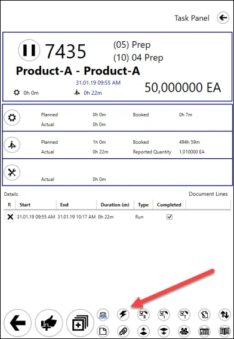
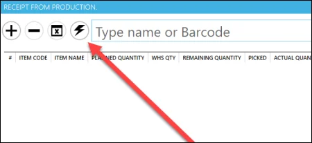
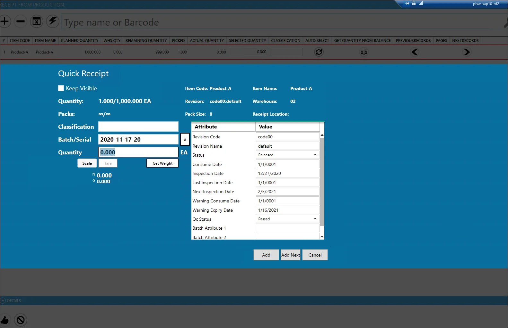
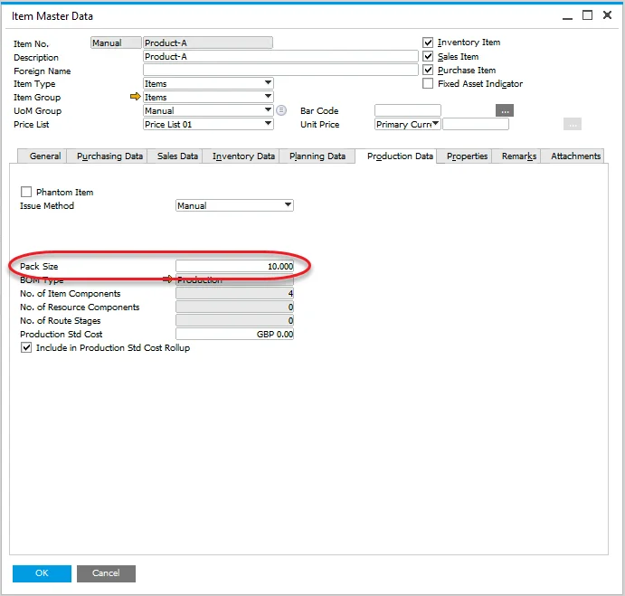
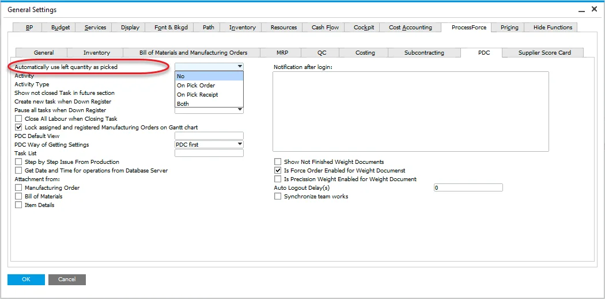
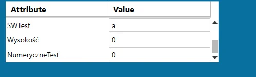

# Quick Receipt

The Quick Receipt feature streamlines the process of receiving Final Goods from production for a specific Manufacturing Order. By consolidating all necessary details into a single panel, this option speeds up the reception process, ensuring greater efficiency and accuracy in handling production receipts.

---

## Access

There are two ways to access the Quick Receipt panel:

- The Quick Receipt button is not available by default. You must assign it through the [Customization](../../customization/overview.md#task-tile-and-task-panel-customization) option):

    
- from Receipt from Production window:

    

## Usage

- Keep Visible checkbox – If checked, the Quick Receipt window remains open after adding a receipt.
- Packs – Displays the number of packs for both the current and overall quantity.
- Pack Size – Defines the quantity for a single pack.

    
- '#' button – Generates the first Batch number. Additional batch numbers are generated by clicking the "Add Next" button.
- Quantity field – Indicates the quantity for the current batch. This field can be automatically filled based on related ProcessForce settings.

    

    If set to 'No' or 'On Pick Order,' the Quantity field is filled from the Pack Size value (unless the remaining quantity is smaller than the Pack Size, in which case it will be set to 0). If set to 'Both' or 'On Pick Receipt,' the Quantity field will show the actual quantity.
- The attribute table allows defining attribute values for a receipt document (based on User-Defined Fields):

    

    

    

---
The Quick Receipt feature simplifies the process of receiving final goods from production by consolidating essential data into a single interface. By offering an intuitive design with customizable fields and settings, this tool ensures that your receipts are processed quickly and accurately. Whether accessed via Task Tile or the Receipt from Production window, Quick Receipt helps speed up workflows and improves operational efficiency in your manufacturing process.
