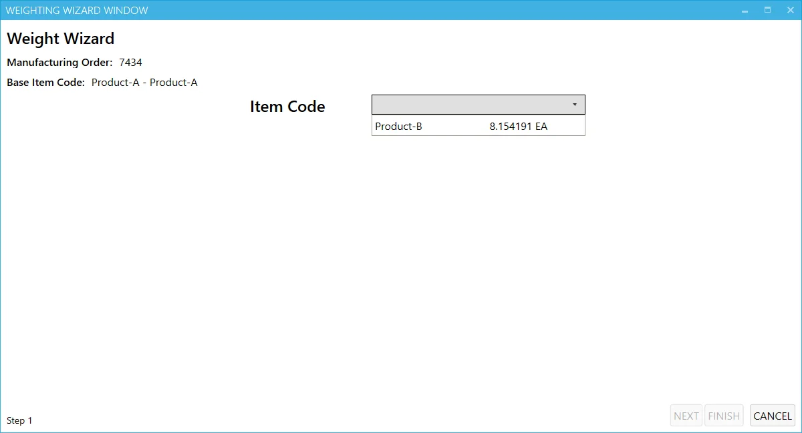
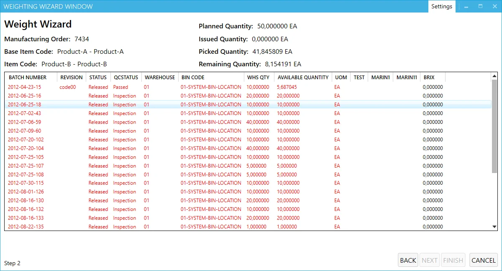
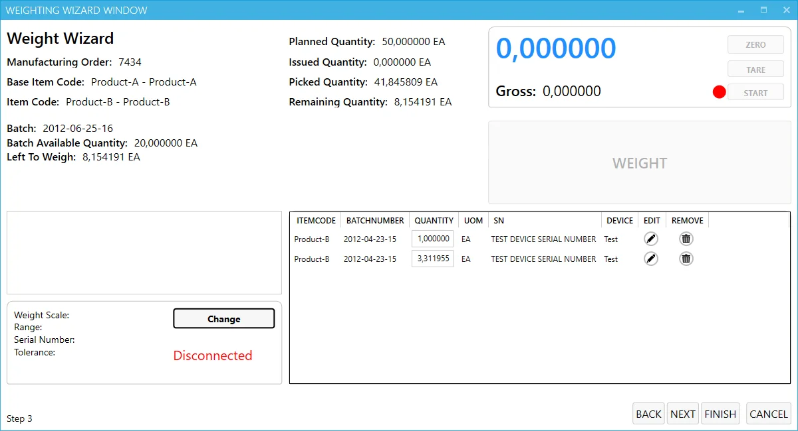
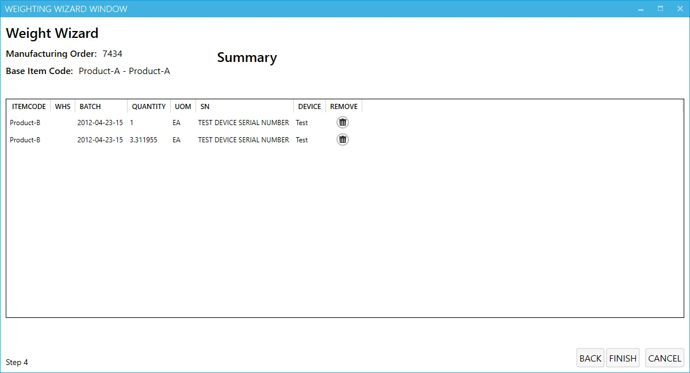

# Overview

The Weight Scale Module facilitates the Issue to Production process based on weight documents, integrating directly with weight scaling devices. This module simplifies material issuance by allowing you to track progress through a color-coded icon system, where the icon gradually fills with color to indicate the completion level of the process.

Clicking the options icon launches the Weighting Wizard, which guides you through several steps to create a weight-based Issue to Production.

The color of the icon reflects the progress of the material issuance process. A white icon represents 0% completion, and the color gradually fills as the process moves forward.

---

:::caution
    It is required to configure the connection to a weighing device before starting to work with this module. You can check how to do this [here](../../../../administrator-guide/weight-scales-integration/overview.md).
:::

## Step 1: Choosing an Item

In this step, you’ll select the Manufacturing Order and the final goods item to be issued for production. The system will display the item row from a drop-down list, which also shows the remaining quantity to be issued.

>**Note**: Currently, only Batch-managed Items are supported in the PDC weighting module.

Click "Next" after choosing an Item.

## Step 2: Quantity Window

In this window, apart from the information from the previous step, the following quantity details can be seen:

- Planned (Manufacturing Order's planned quantity),
- Issued (already issued on other Issues to Production),
- Picked (the quantity that already is on Pick Orders but is not published yet).

For Batch-managed Items, the available batch for selection will be shown. The color of each batch indicates its availability according to batch status. If a batch is not in the Released status, the system will prompt the user to confirm the selection.

Click "Next" after choosing a Batch.

## Step 3: Weighing

The upper left panel of the window displays previous step information, including available and remaining quantities in the selected batch.

The lower left panel displays the connected weighing device. You can change the device by selecting from the list of defined devices.

The lower right panel shows details of previous issues within the current weighing document. Only users with Management Board privileges can modify this section.

The upper right panel displays the information from the weighing device, including options like

- **Zero** – Zeroing the scale.
- **Tare** – Excluding the weight of the container from the final weight.
- **Start/Stop** – Begin or end the weighing process.
- **Weight** - The result of weighing.
- **Gross** – The combined weight of both the container and material (if Tare is used).

If the weighed value exceeds the remaining quantity, the field will turn red, and you will be unable to save it. Similarly, the batch available quantity will also turn red if the weighed quantity exceeds the available amount.

Click the "Weight" button to save the weighted value.

## Step 4: Summary

In the final step, you’ll see a summary of the entire Issue to Production process. Review the details, and click "Finish" to complete the process and record the issue to production.

---
The Weight Scale Module offers an efficient, weight-based solution for issuing materials to production. By guiding users through each step with clear instructions and visual cues, it ensures a streamlined process for managing and tracking material issuance based on weight. Whether handling batch-managed items or ensuring the accuracy of weighed quantities, this module simplifies the production workflow and enhances operational efficiency.
