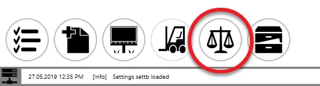
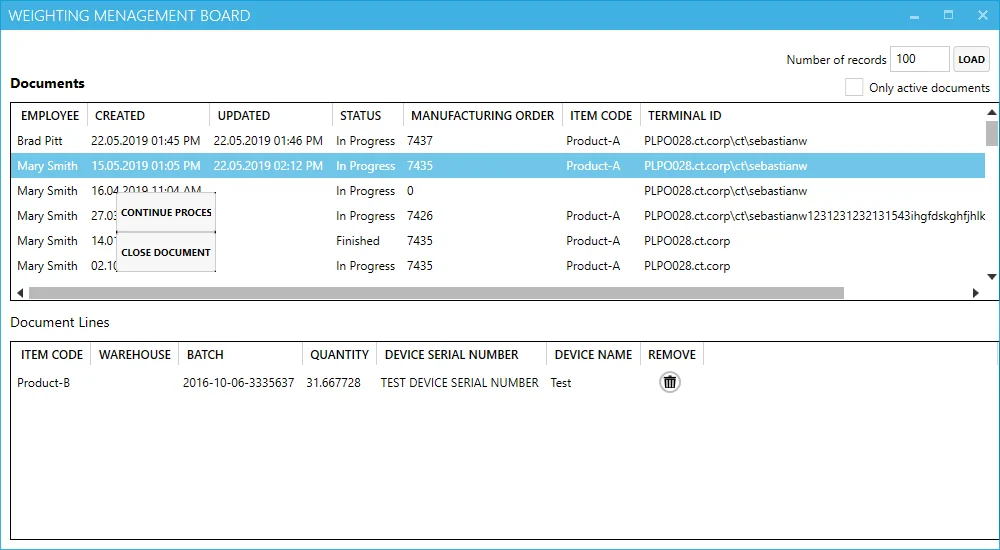

# Weight Management Board

The Weight Management Board provides users with a centralized interface to manage all weight-related documents efficiently.

:::note
    Only users with [Management Board privileges](../../../../administrator-guide/setting-up-the-application/overview.md) can access this feature.
:::

## Access

Users can access the Weight Management Board from the main application window:

## Weighting Management Board

### Header

- **Row Count**: defines the number of rows displayed in the Documents Table.
- **Only Active Documents**: when checked, this option filters the table to show only documents with an "In Progress" status.

### Documents Table

This table lists all weight documents. Right-clicking on a document in "In Progress" status opens a context menu with the following options:

- **Continue Process**: launches the [Weighting Wizard](./overview.md) for the selected document.
- **Close Document**: closes this document

### Document Lines

This section displays item details for the selected document.  Users can remove specific lines from the document as needed.

---
