# Overview

CompuTec PDC (Production Data Capture) is a versatile tool that can be tailored to meet the unique needs of your organization. Customizing the interface helps users interact with the tool in a way that suits their specific requirements, improving productivity and streamlining processes.

---

There are two main ways to customize CompuTec PDC: Form Settings and Task Tile and Task Panel Customization.

## Form Settings

:::info
    To use this option, it is required to activate this feature for a specific Employee within the Employee Master Data. For detailed instructions, click [here](../../administrator-guide/setting-up-the-application/overview.md#requirements).
:::

Form settings allow you to choose which columns are displayed on various CompuTec PDC forms. This includes:

- Task Panel:

  - Details section
  - Operation Bind
  - Operation Properties
  - Resource Properties
  - Item Details
  - Tools
- Select Task – By Resource tab

The customization option is available via the name bar of the respective forms. By checking or unchecking specific column options, you can determine which columns will appear.

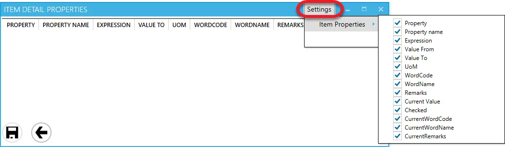

## Task Tile and Task Panel Customization

To customize the task tile and task panel, press and hold the Shift + Ctrl + Alt keys and click the Log In button on the login screen. This will activate the customization options.

Once activated, you can select which values will be displayed on the task tile by clicking the Change Icon: . Uncheck Default check box and select the desired value from the drop-down list. Check the Default check box to return to the default value:

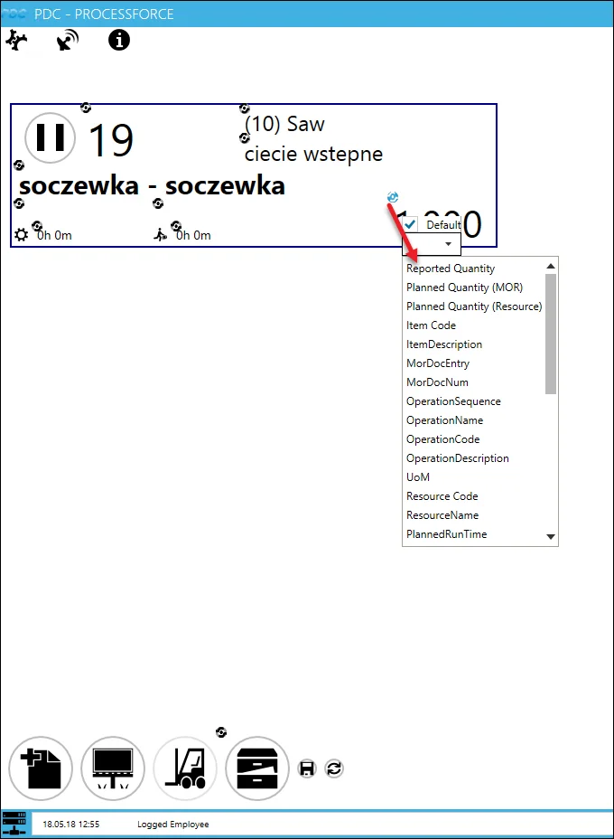

The customization option works in the same manner on the Task Panel form:

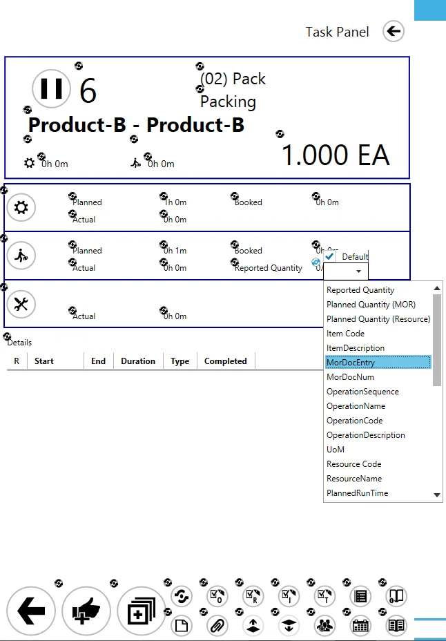

The icons in the lower part of a task tile are also customizable. You can rearrange them or assign different actions to them. If needed, you can hide one or more buttons by unchecking the Default and IsVisible checkboxes.

For example, you can configure a Quick Receipt action from the Receipt from the Production panel by choosing it from a dropdown list or assigning it to a button. After making adjustments, save the setup by clicking the save icon (the left one on the screenshot below), or revert to defaults by clicking the rollback icon (the right one on the screenshot):

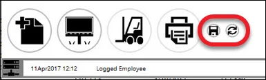

### Default View

To further customize the dropdown lists, you can use SQL views. This allows you to add custom values. Define the view in a database and enter its name in the PDC Default View field within ProcessForce.

:::info Path
    Administration → System Initialization → General Settings → ProcessForce → PDC
:::

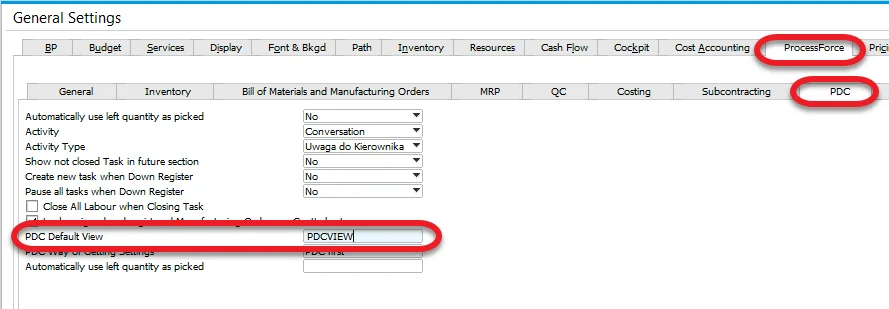

#### Example

**PDC Default View** = PDCVIEW for custom SQL View:

```sql title="MS SQL Example"
Create View [dbo].[PDCVIEW]
as
Select "DocEntry" ,"U_LineNum", U_RscCode+' | '+ U_RscType as "Description" from [@CT_PF_MOR16]
GO
```

```sql title="HANA Example"
Create View "PDCVIEW"
as
Select "DocEntry" ,"U_LineNum", "U_RscCode", "U_RscType" as "Description" from "@CT_PF_MOR16"
```


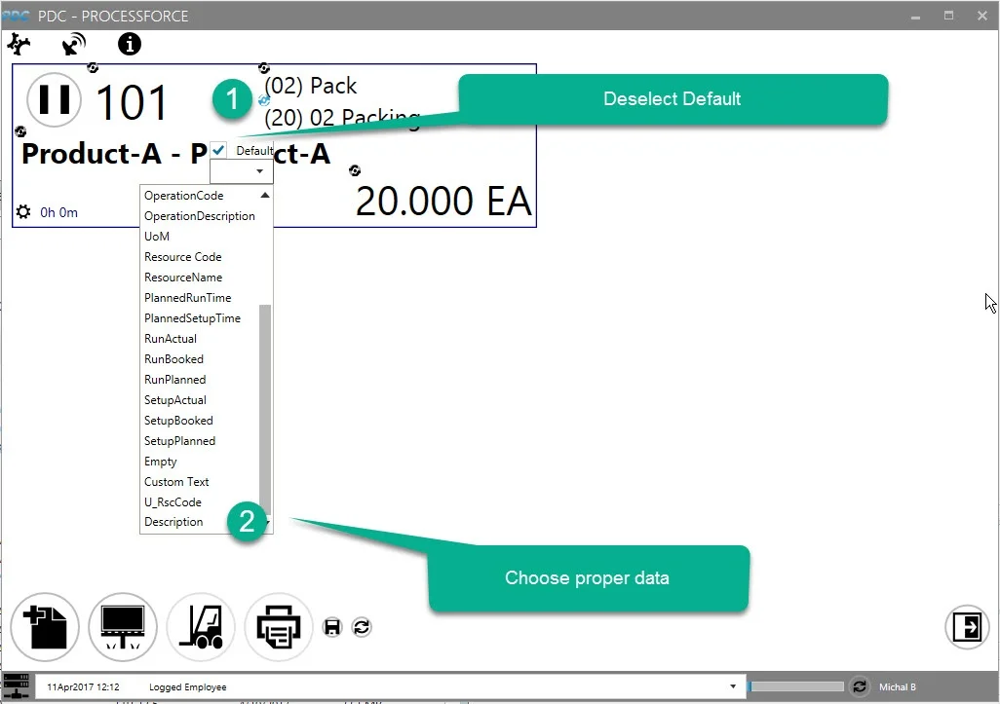

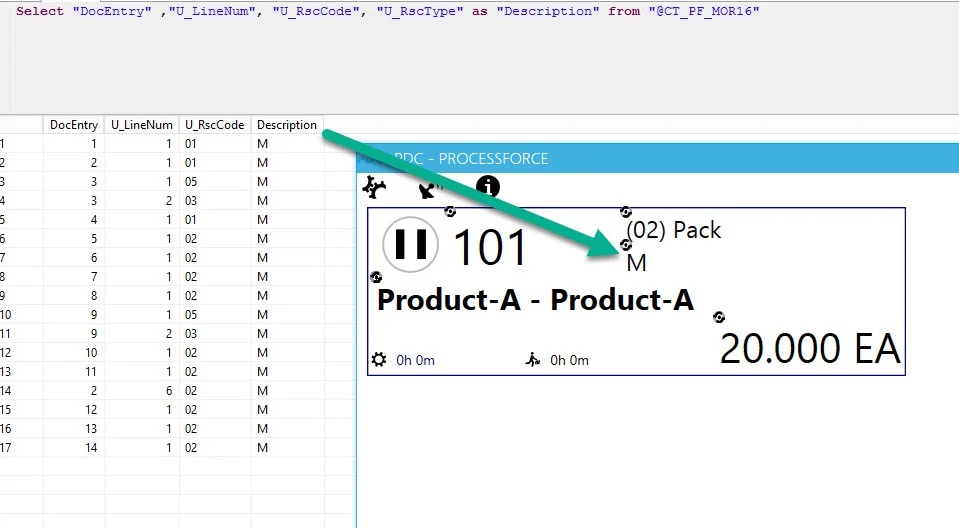

**Additional space to accommodate user-specific buttons, ensuring sufficient room for their inclusion**

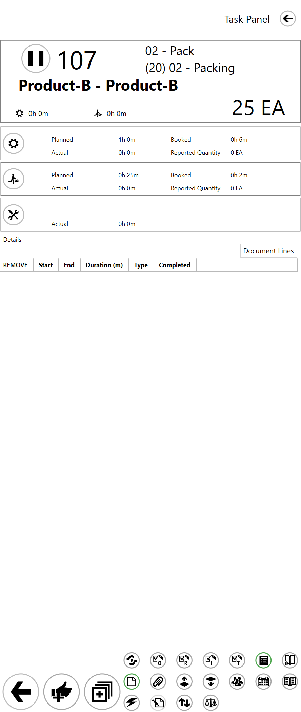

**Enhanced tile's capacity to incorporate additional custom fields**

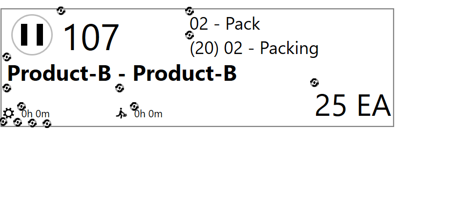
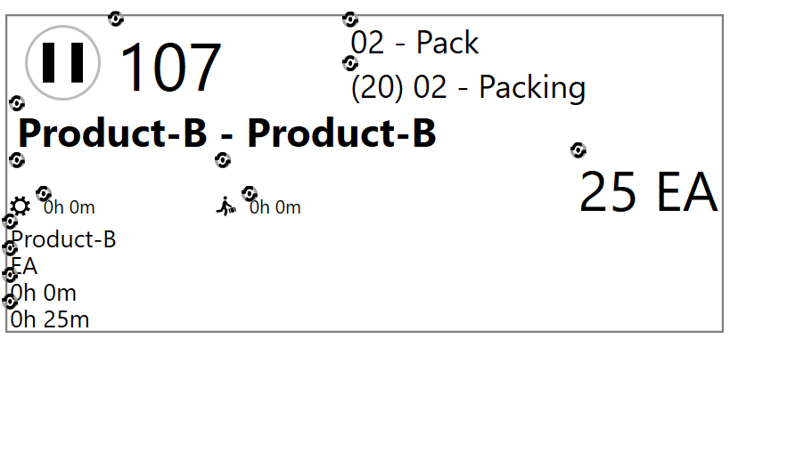
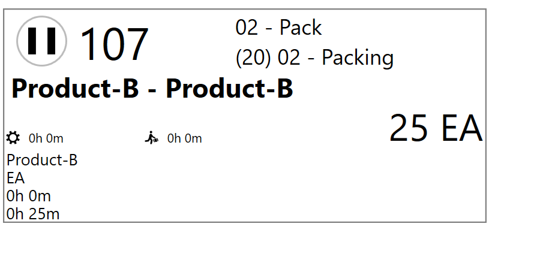

**Highlight PDC buttons to indicate the availability of additional information, such as drawings or instructions.**

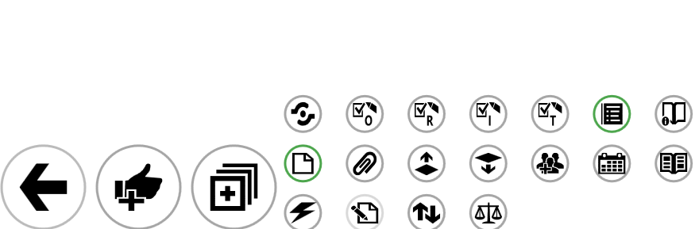

---
Customizing CompuTec PDC not only helps tailor the system to your organization's specific needs but also enhances user experience and operational efficiency. By adjusting form settings, task panels, and task tiles, you can ensure that the system displays only the most relevant data, streamlining workflows and improving productivity across the board. Whether through simple column adjustments or more complex SQL views, CompuTec PDC provides the flexibility to adapt to your business's evolving needs.
