# Management Board

Management Board is a CompuTec PDC function that allows managing work performed on any resource in a system. A straightforward graphic interface provides an easy and quick insight into past, current, and planned tasks, stating details like planned and actual work time or employee assigned to perform a specific work.

## Setting Management Board Privilege

:::warning
    To enable access to the Management Board function, an operating employee must be assigned a specific privilege.  You can check how to do that [below](#setting-management-board-privilege).
:::

## Management Board Main Form

To open the Management Board, click the designated icon in the main form of PDC.

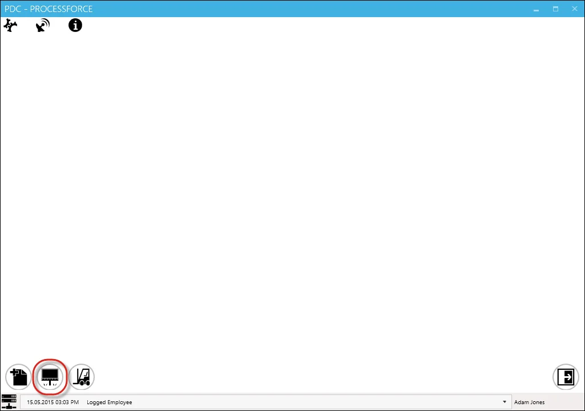

The main form of the Management Board will appear, displaying all available resources as graphic tiles.

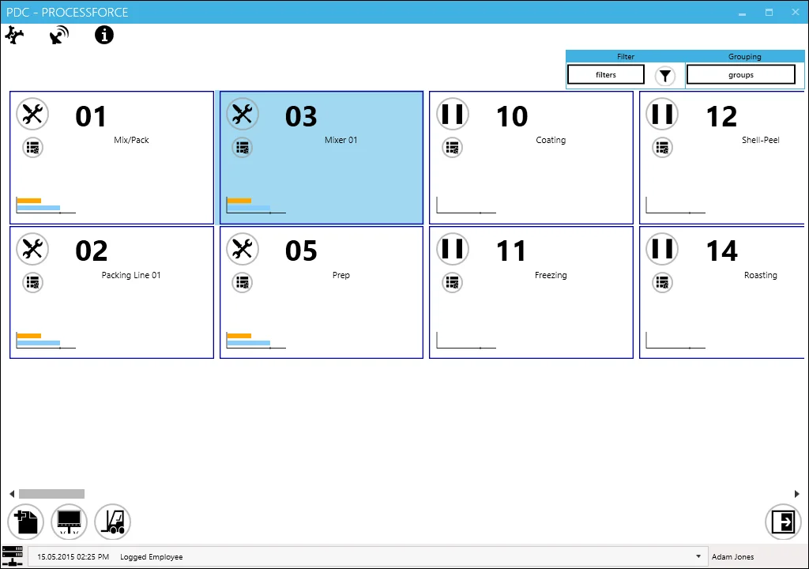

Resources can be displayed using two options: Filter and Grouping.

### Filter

This option allows filtering available records based on specific values.

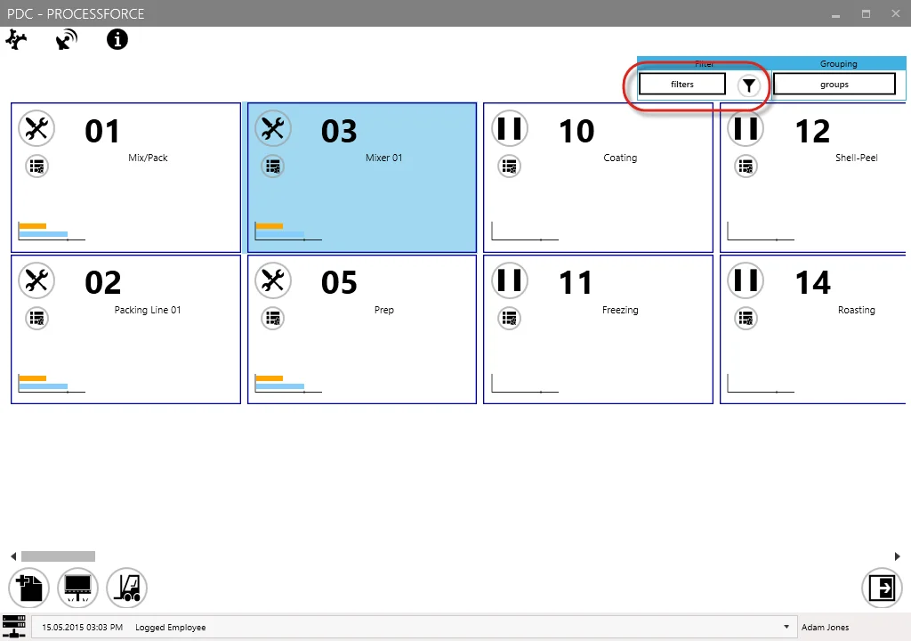

To apply a filter, click the Settings button next to the filter button (highlighted with a red frame in the image above). The following form will appear:

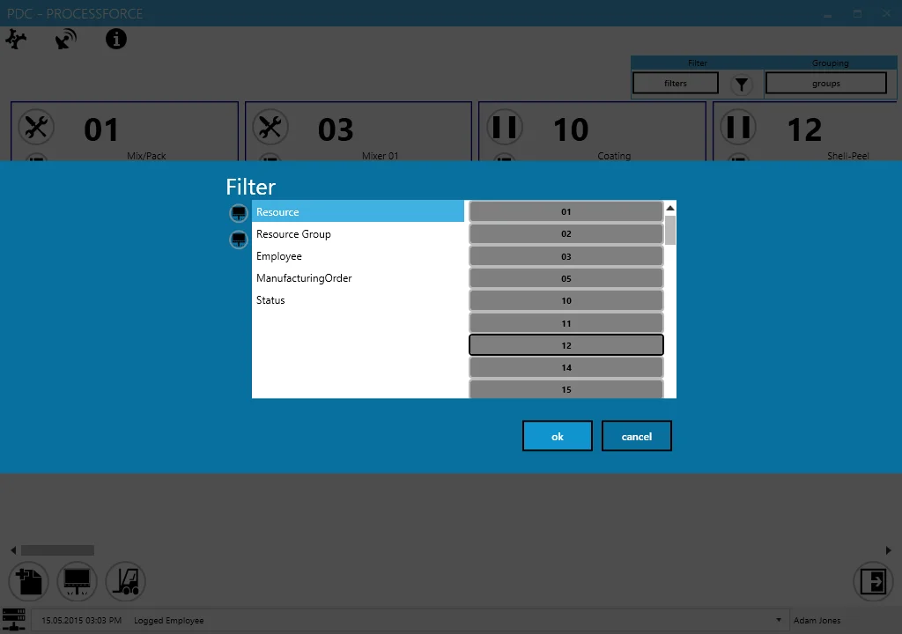

Select a required category from the left side of the table and choose a corresponding value from the right side. The selected value will be highlighted. In the example below, resource category values 02, 03, and 11 have been selected.

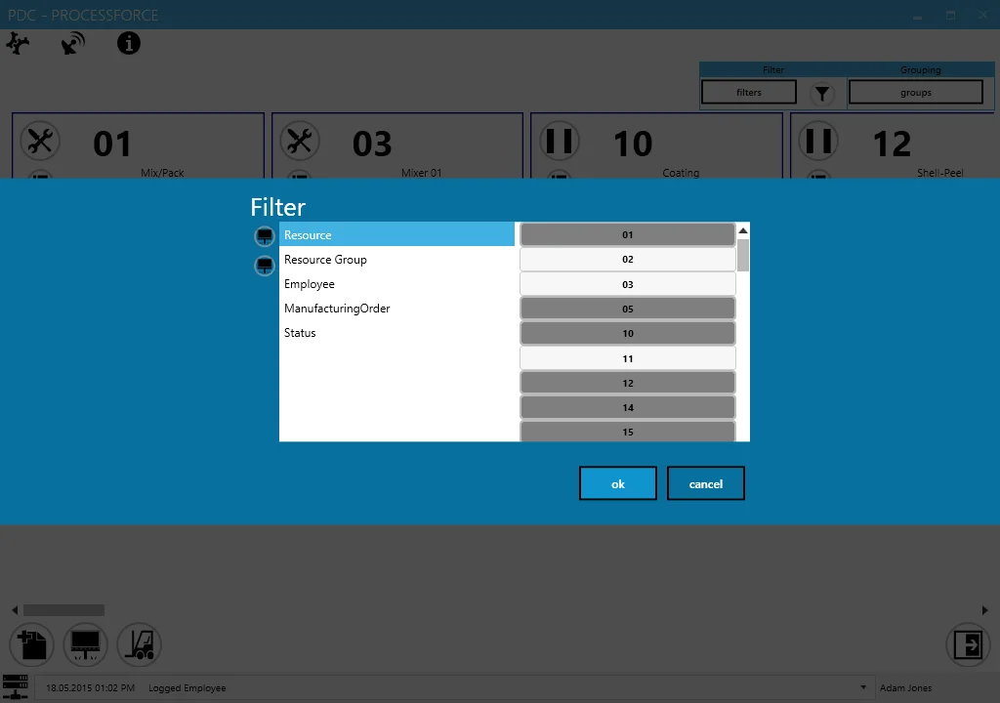

Use the icons on the right side of the filter box to select or deselect all values within a chosen category.

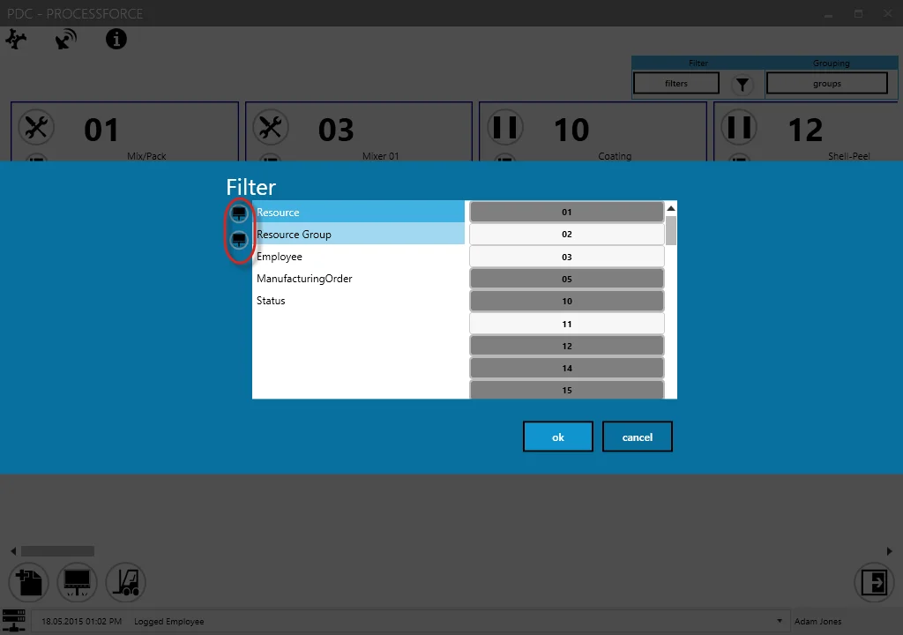

Click "OK" to confirm the selection. Then, click the Filter icon to apply the filtering. Only records matching the specified attributes will be displayed.

You can filter displayed tasks by:

- Resource
- Resource group
- Employee
- Manufacturing Order
- Status

Once values are set, filtering can be enabled or disabled by clicking the dedicated icon:

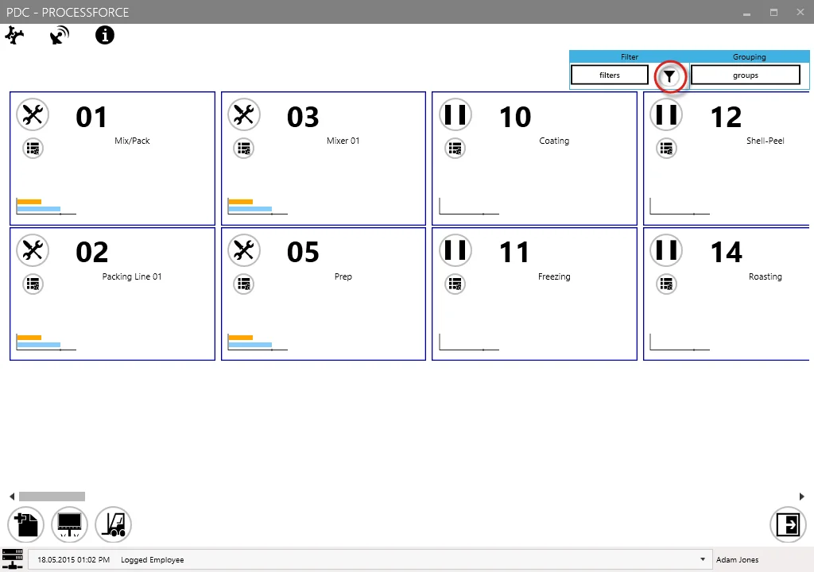

### Grouping

This option allows grouping records based on specific values, displaying them in separate frames.

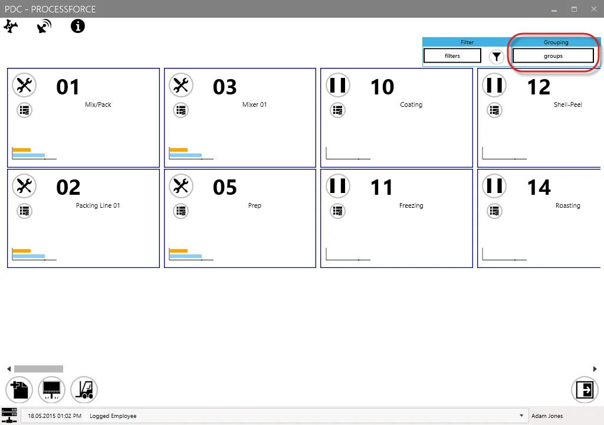

To enable grouping, click the Settings button next to the grouping button (highlighted with a red frame in the image above). The following form will appear:

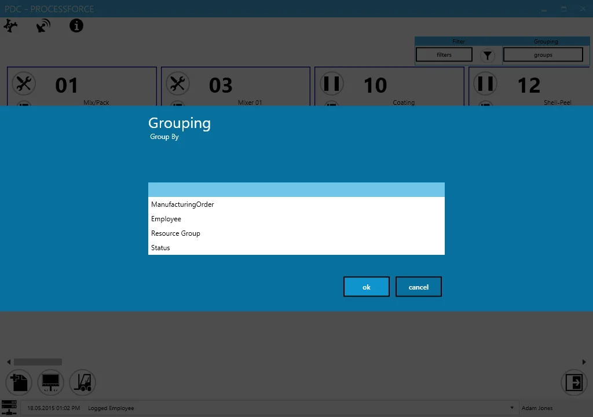

After selecting a grouping value, records will be organized accordingly. In the example below, records are grouped by Status (e.g., Downtime and Inactive Tasks).

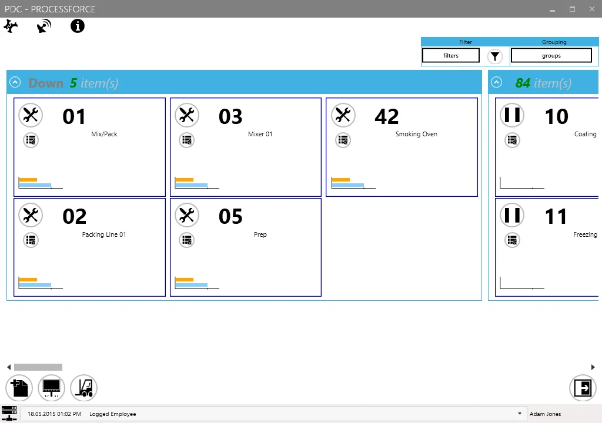

Use the icon highlighted in the image below to maximize or minimize a group window.

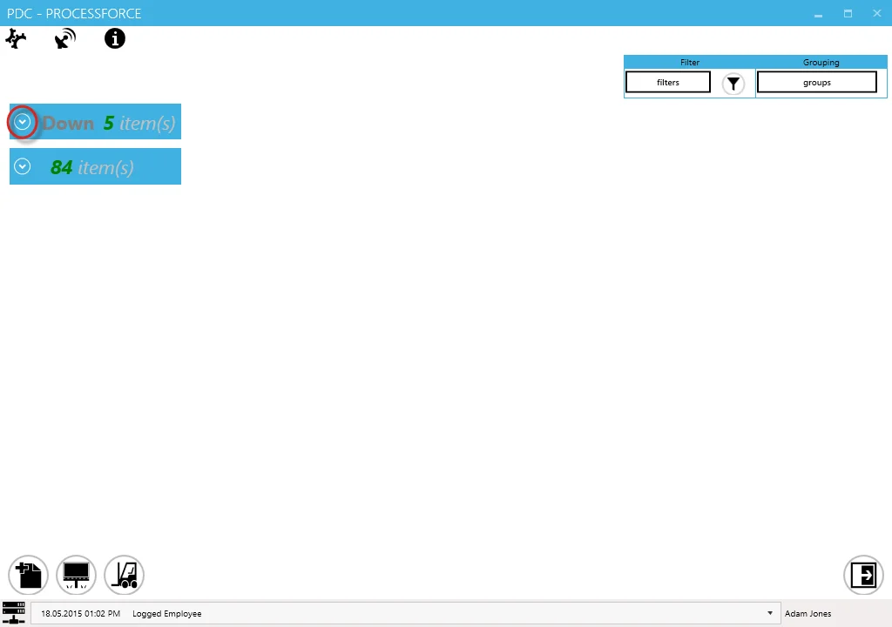

Tasks can be grouped by:

- Manufacturing Order
- Employee
- Resource Group
- Status

## Resource Tile

A task tile within the Management Board is a visual representation of a specific task, providing instant access to real-time task details and modification options.

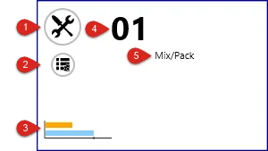

1. **Status icon**: indicates the task status (Setup, Run, Downtime). Clicking the icon opens the Task Panel for that task.
2. **Resource history**: displays the usage history of a specific resource.

    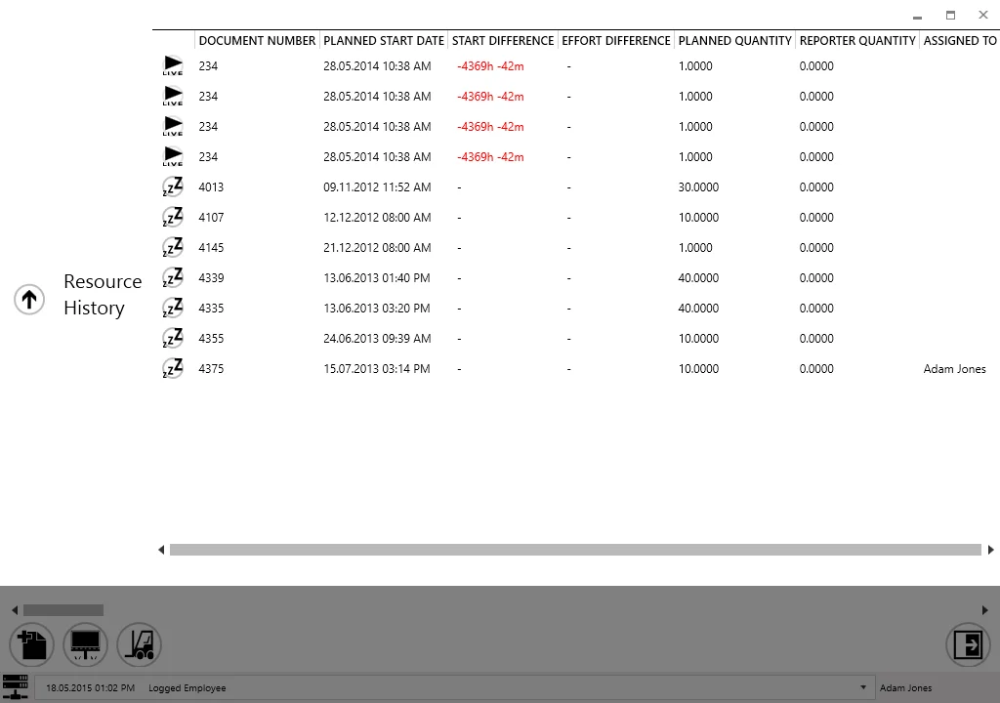

    Document Status:

    : finished and closed task,

    : task currently active,

    : planned task. It is possible to assign an employee to a task with this status. To do that, click the icon and choose an employee from the list.

    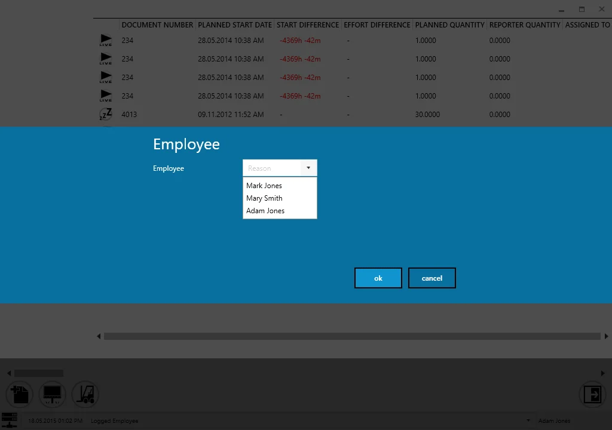
3. **Time graph**: a graphical representation of planned and current time:

    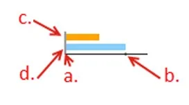

    1. a point of 0% progress, e.g., noon in planned 12:00-14:00 work time
    2. a point of 100% progress, e.g., 14:00 in planned 12:00-14:00 work time
    3. a bar of real progress
    4. a bar of planned progress

    **Example**:

    The planned progress bar indicates that the scheduled work period has ended, but the real progress bar shows that work stopped midway.

4. **Resource code**: unique identifier of the resource.
5. **Resource name**: name of the resource.

---
