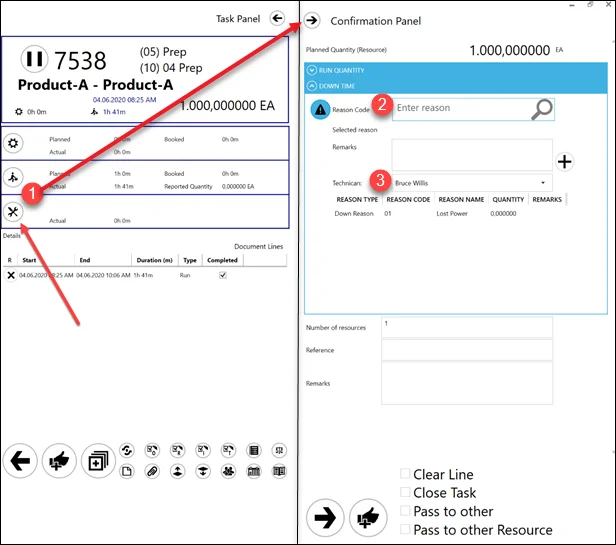
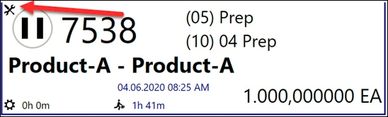
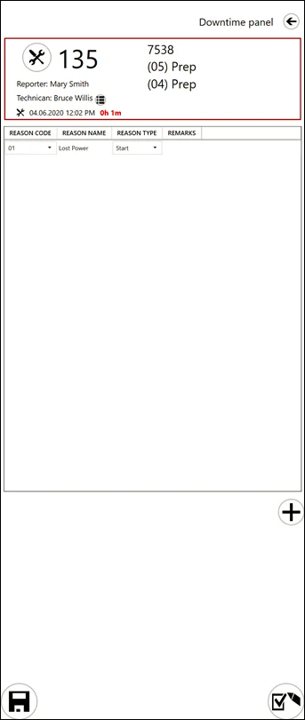

# Downtime

Downtime refers to a temporary break in work caused by unforeseen circumstances, such as power outages or equipment failures. Properly tracking and managing downtime is essential for maintaining operational efficiency and minimizing disruptions. CompuTec PDC offers a straightforward method to register and monitor downtime effectively.

---

## Downtime related settings

### Employee Master Data

[Technician / Is downtime Supervisor](../../administrator-guide/setting-up-the-application/overview.md)

### General Settings, CompuTec ProcessForce and PDC tab

Within the General Settings, several options in CompuTec ProcessForce and PDC tabs influence downtime registration behavior:

- create a new task when downtime is registered.
- pause all tasks when downtime is registered.
- action when downtime is registered.

To know more, click [here](../../administrator-guide/setting-up-the-application/overview.md#processforce-settings) – these options define additional behaviour during Downtime registration.

## Reporting Downtime

The process requires:

1. Downtime is reported using a Task Tile.
2. Setting a Downtime Reason.
3. Assigning a [Technician](../../administrator-guide/setting-up-the-application/overview.md#processforce-settings).
Saving the downtime entry.

    

## Interface Views

Adding a Downtime creates a Downtime tile available for the [Technician](../../administrator-guide/setting-up-the-application/overview.md#processforce-settings) chosen during creation and to [Supervisors](../../administrator-guide/setting-up-the-application/overview.md#processforce-settings):

**User view**:

**Technician and Supervisor view**:

Supervisors have additional capabilities to reassign technicians and modify downtime parameters.

---
