# Overview

## Functionality Available within the Task Panel

Clicking a status icon on a task tile in the main form leads to the task panel, where you can view and manage details about work periods.

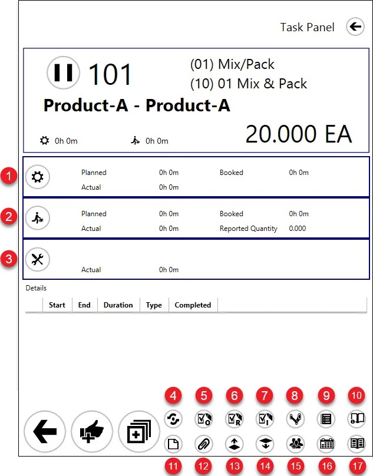

### Setup Time Tile

This tile represents the setup time required to prepare a resource before production begins. It displays planned, actual, and booked setup durations. Click the tile's icon to set the start and end times for the setup period.

### Run Time Tile

This tile represents the run time - a work period assigned to a specific resource. It shows planned, actual, and booked run durations, along with the reported quantity. Click the tile's icon to set the start and end times for the run time.

### Downtime Tile

This tile represents downtime - a period of interruption in work caused by an incident, such as a power outage. Click the icon on the tile to set the start and end times for downtime. Learn more about downtime [here](./downtime.md).

### Input/Output Properties

You can check if any Items are set as Input or Output for a specific operation.

Click here to expand

Defining Input/Output Items:
:::info Path
Production → Bill of Materials → Production Process → Operation Bind tab → Bind Operations
:::
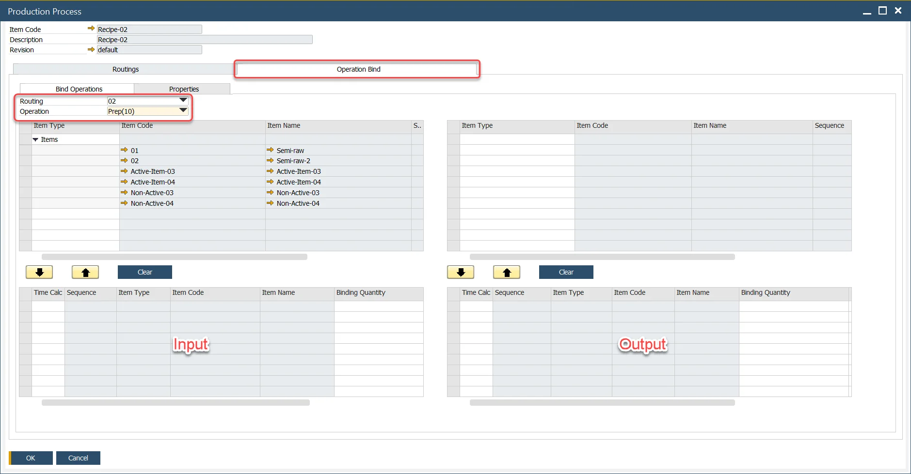

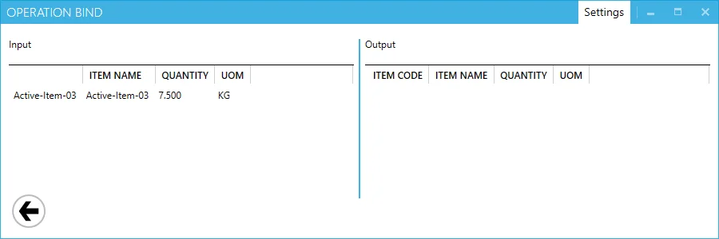

### Operation Properties

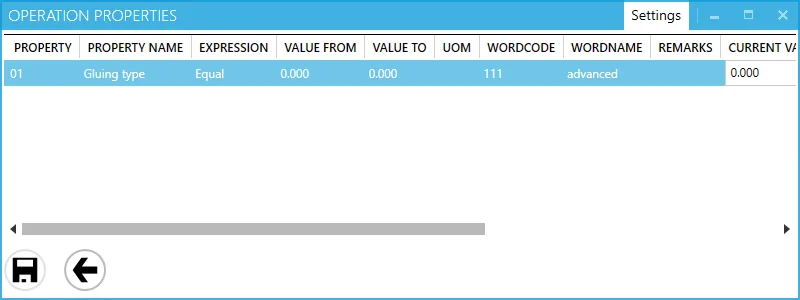

Operation properties and related data are displayed here. These properties can be defined in SAP Business One with CompuTec ProcessForce and assigned to an operation or to an operation on a specific manufacturing order. Operation properties cannot be defined directly from the CompuTec PDC level.

Click here to expand

**Defining Operation Properties**
:::info Path
    Administration → Setup → Production → Operation Properties
:::

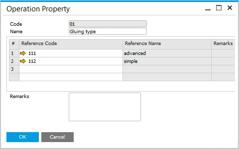

**Operation Property Assigning**
:::info Path
    Production → Routings → Operations → Properties tab
:::

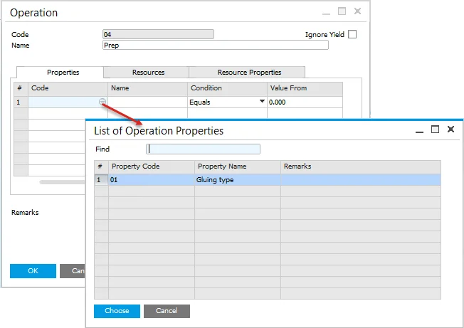

**Properties for Operation**
:::info Path
    Production → Manufacturing Order → Manufacturing Orders → Operations tab → Operations tab → [Operation context menu]
:::

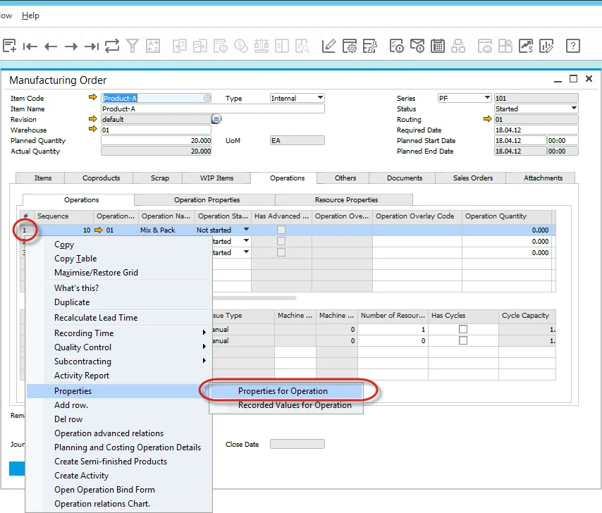

Using form settings, you can customize which columns are displayed and their order. Click [here](../../administrator-guide/setting-up-the-application/overview.md) to find out more.

A Specific Operation Property can have a predefined value assigned in the Manufacturing Order. This value can be numeric (e.g., greater than 10, equal to 10) or text-based (e.g., color: yellow, green, red). In the example below,  the property *Gluing type* has the value *advanced*.

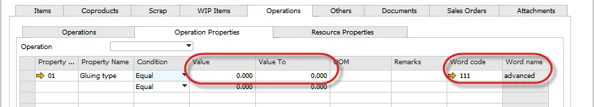

In the property form within CompuTec PDC, values assigned in SAP Business One are displayed:

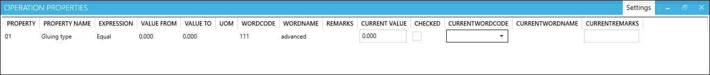

These are predefined planned values. During production, you can verify their accuracy by selecting the "Checked" checkbox and clicking the "Save" icon. If the actual properties differ from the planned ones, you can update the values accordingly:

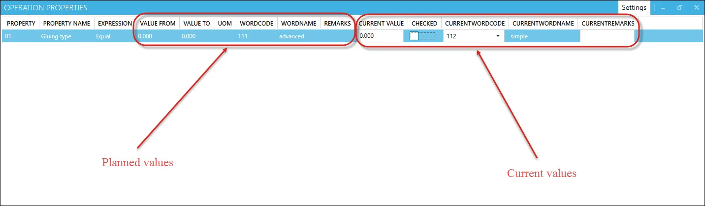

- In the example above, the current values differ from the planned ones - the employee chose a simple gluing type instead of the planned advanced type.
- To save the updated value, click the "Save" icon at the bottom of the Operation Properties form.
- Operation properties values recorded from CompuTec PDC level for specific Manufacturing Order Operation can be viewed in SAP Business One:

:::info Path
    Production → Manufacturing Order → Manufacturing Orders → Operations tab → Operations tab → [Operation context menu]
:::

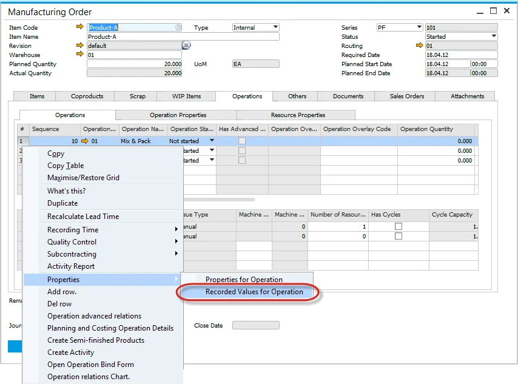

In the screenshot below, you can see the recorded value from the above example:

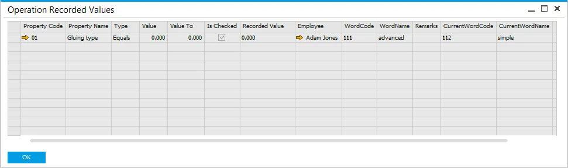

### Resource Properties

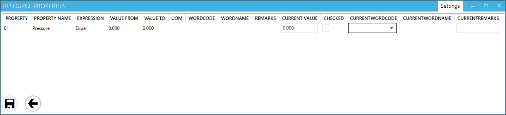

Resource Properties and their associated data are displayed here. These properties are defined in SAP Business One using ProcessForce and cannot be configured directly within CompuTec PDC. They can be assigned either to a Resource or to a specific Resource within a particular Manufacturing Order.

Click here to expand

**Defining Resource Property**
:::info Path
    Administration → Setup → Production → Resource Properties
:::

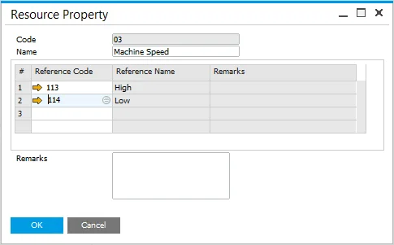

**Resource Property Assigning**
:::info Path
    Production → Routings → Resources
:::

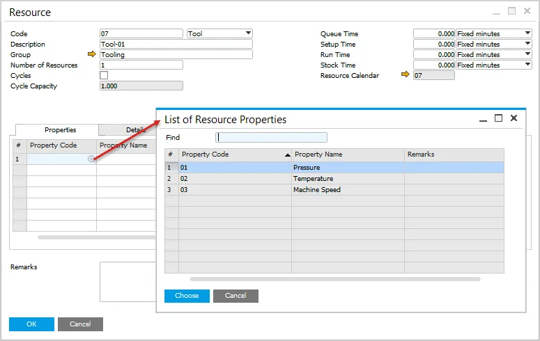

**List of Resource Properties**

:::info Path
    Production → Manufacturing Order → Manufacturing Orders → Operation tab → Resource Properties tab
:::

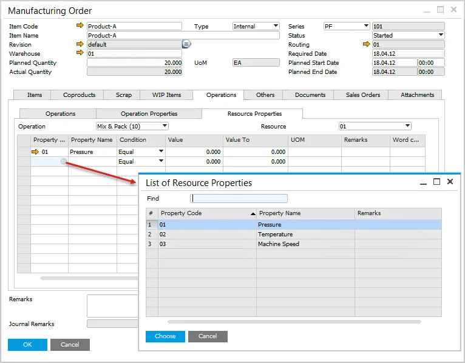

You can customize which columns are displayed and their order using form settings. Click [here](../../administrator-guide/setting-up-the-application/overview.md) to find out more.

A Specific Resource Property can have particular values assigned to it on a Manufacturing Order. These value can be numeric (e.,g. greater than 10, equal to 10) or text-based (e.g., for pressure: high, low). In the example below, the Pressure property is set to High:

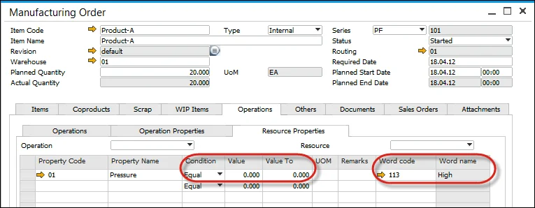

In the Resource Property form within CompuTec PDC, values assigned in SAP Business One are displayed:

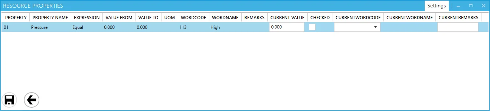

These values represent predefined planned data. During production, you can verify their accuracy by selecting the "Checked" checkbox and clicking the Save icon. If the actual values differ from the planned ones, you can update them accordingly:

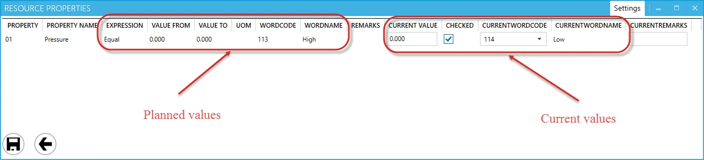

In the example above, the actual value differs from the planned one—the employee selected low pressure instead of the planned high pressure.

To save the updated value, click the Save icon at the bottom of the Resource Properties form.

Resource property values recorded in CompuTec PDC for specific Manufacturing Order Resources can be viewed in SAP Business One:

:::info Path
    Production → Manufacturing Order → Manufacturing Orders → Operations tab → Operations tab → [Resource context menu] → Properties > Recorded Values for Resource
:::

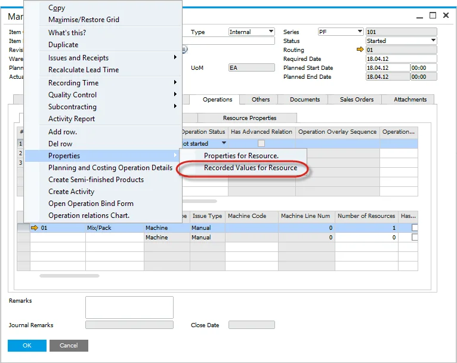

Below is an example of a recorded value:

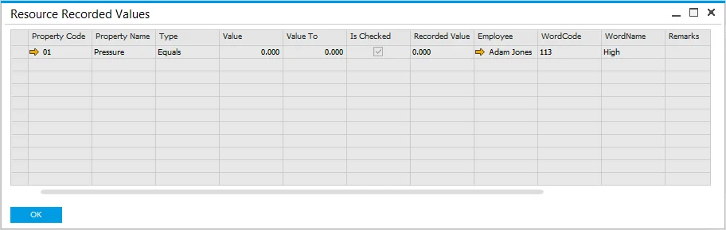

### Item Details

Item details are displayed here, allowing you to record current values against the original values, similar to how operation and resource properties are recorded. You can also sort the records based on a specific value (e.g., Property Name).

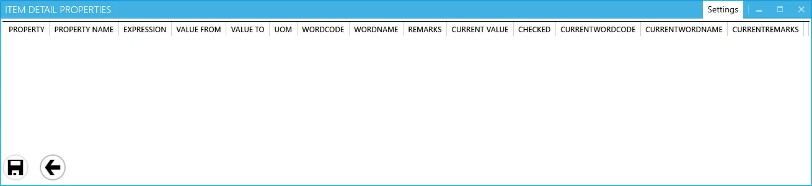

### Tools

Tool properties are displayed here. If a specified resource is linked to a tool with defined properties, you can review and confirm them, similar to resource properties. You can also sort the records based on a chosen value (e.g., Tool Name).

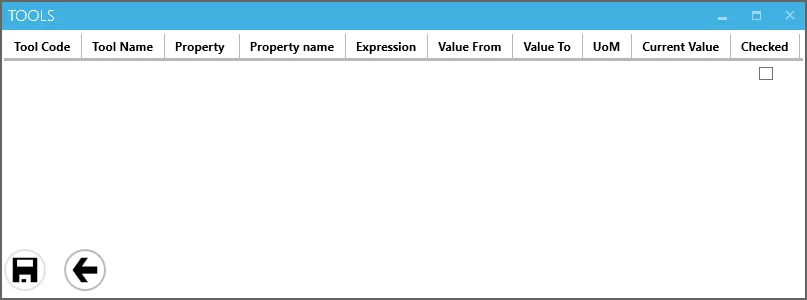

### Bill of Materials Preview

Displays the default printing layout set for a specific SAP Business One user logged into CompuTec PDC. If no default layout is assigned to the user, nothing will be displayed when selecting this option.

    
Click here to check how to assign a default printing layout

    

        1. Go to SAP Business One → Administration → Setup → General → Report and Layout Manager. In the form choose the List tab and go to Add-On Layouts > ProcessForce and choose Bill of Materials:

            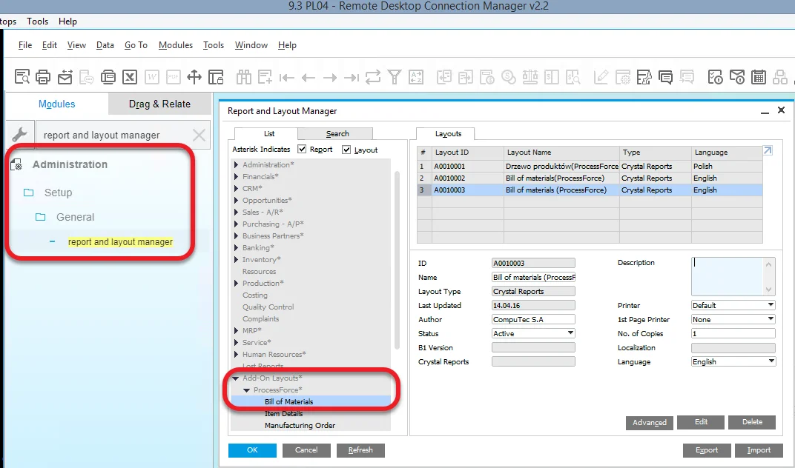
        2. In the Layouts tab, you will see a list of all layouts assigned to the Bill of Materials. You can import new layouts or modify existing ones. For more details on using Crystal Reports in SAP Business One, refer to this related [SAP Business One documentation entry](https://help.sap.com/docs/SAP_BUSINESS_ONE/68a2e87fb29941b5bf959a184d9c6727/99dc3f80935640a38b30a37dc688d6e8.html?version=9.3&locale=en-US).
        3. Open Bill of Materials (1), click the Layout Designer icon (2), select the required layout (3), then click Set as Default and confirm with OK:

            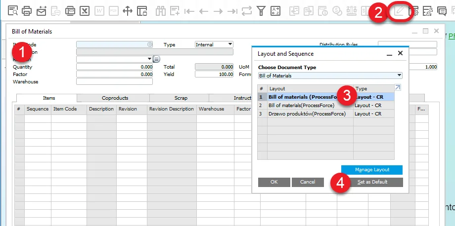
        4. A Bill of Materials preview, generated based on the default layout, will now be available in PDC under Task Tile > Bill of Materials preview icon.
        5. To view the BOM preview, database credentials must be entered. To avoid entering them each time, you can save the credentials in the application settings.
    

### Bill of Materials Instructions

Here, you can find instructions stored in the Bill of Materials → Instruction tab.

:::info Path
    Production → Bill of Materials → Bill of Materials
:::

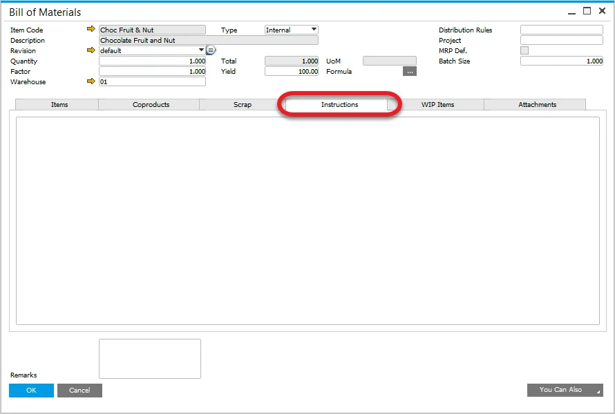

### Manufacturing Order Preview

Displays the default printing layout assigned to the logged-in SAP Business One user in CompuTec PDC. If no default layout is set, nothing will be shown upon selection.

    
Click here to check how to assign a default printing layout

    

        1. Navigate to SAP Business One → Administration → Setup → General → Report and Layout Manager. In the form, select the List tab, then go to Add-On Layouts → ProcessForce and choose Manufacturing Order:

            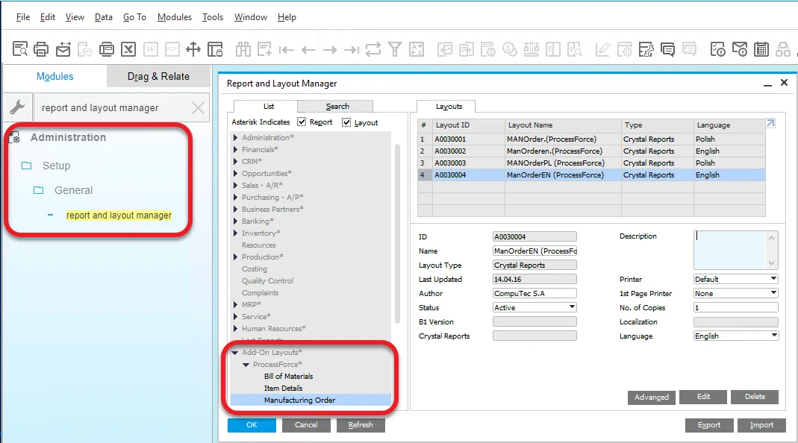
        2. In the Layouts tab, you will find a list of all layouts assigned to the Manufacturing Order. You can import new layouts or modify existing ones. For more details on working with Crystal Reports in SAP Business One, refer to this [SAP Business One documentation entry](https://help.sap.com/viewer/68a2e87fb29941b5bf959a184d9c6727/9.3/en-US/99dc3f80935640a38b30a37dc688d6e8.html).
        3. Open Manufacturing Order (1), click the Layout Designer icon (2), select the desired layout (3), then click Set as Default and confirm with OK:

            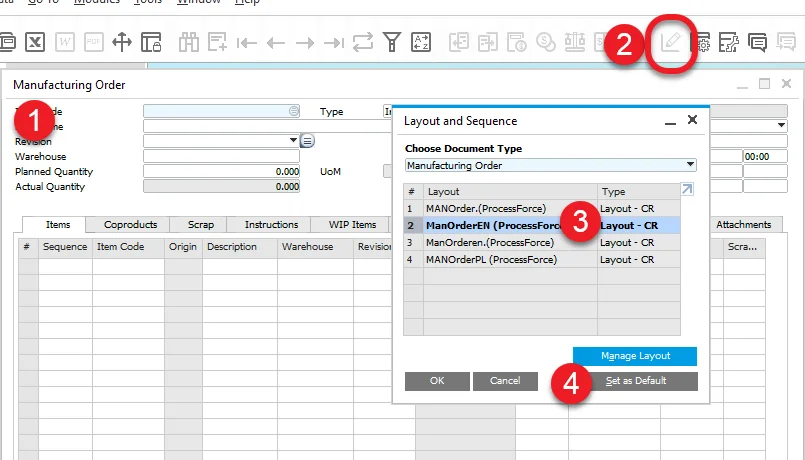
        4. A preview of the Manufacturing Order, generated based on the default layout, will now be available in PDC under Task Tile → Manufacturing Order preview icon.
        5. To view the Manufacturing Order preview, database credentials must be entered. To avoid entering them each time, you can save the credentials in the  [application settings](../../administrator-guide/setting-up-the-application/overview.md).
    

### Attachments

You can view, browse and open Attachments connected to a current Manufacturing Order.

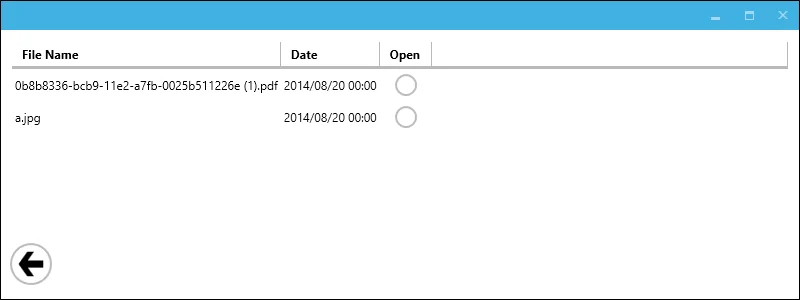

### Production Issue

:::caution
This option is available when a specific resource has a default issue warehouse (or both a warehouse and location if the Enable Bin Locations option is selected). If this setup is missing, the system will display a message indicating the lack of required settings.
:::

Click here to find out how to enable Bin Locations

:::info Path
    SAP Business One → Administration → Setup → Inventory → Warehouses → General tab
:::

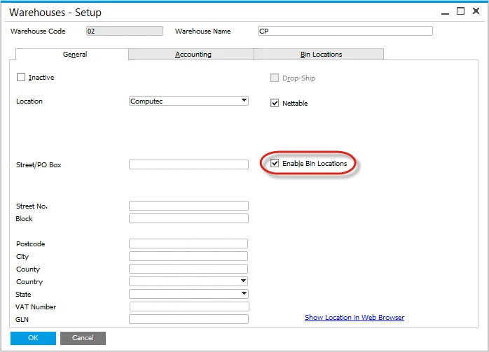

Click here to check how to define Warehouse and Location for Resource

:::info Path
    SAP Business One → Production → Routings → Resources → Details tab
:::

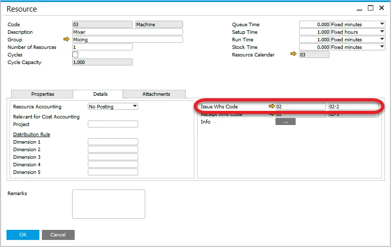

Use this option to issue Items to production.

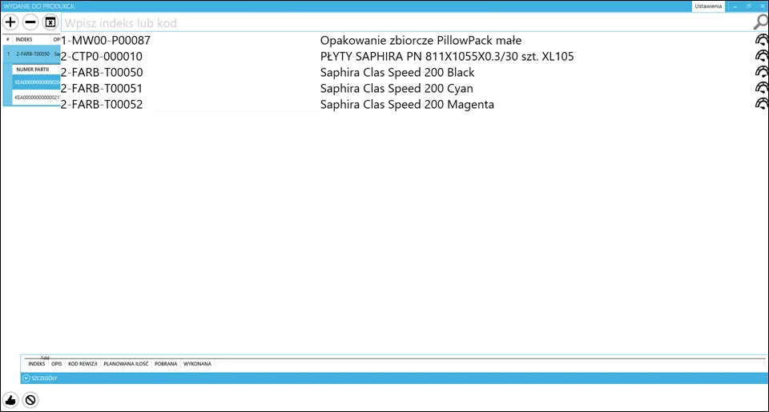

Production items can be selected from the list. Once an item is chosen, a list of all its components will be displayed, allowing you to select the required ones. If all necessary components are available in the warehouse, click the thumbs-up icon.

Materials issued to production are automatically deducted from the warehouse, eliminating the need for confirmation in CompuTec WMS or SAP Business One.

### Production Receipt

:::caution
    This option is available when a specific resource has a default receipt warehouse (or both a warehouse and location if the Enable Bin Locations option is selected). If this setup is not configured, the system will display a message indicating the missing settings.
:::

Click here to find out how to enable Bin Locations

:::info Path
    SAP Business One → Administration → Setup → Inventory → Warehouses → General tab
:::

Click here to check how to define Warehouse and Location for Resource

:::info Path
    SAP Business One → Production → Routings → Resources → Details tab
:::

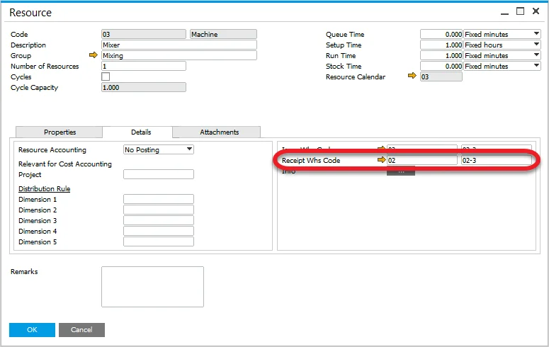

- To perform production receipt, choose produced Item from the list. Click the following icon to generate a batch number: 
- Click the thumb-up icon to confirm and perform it again in the panel on the right. A message In Progress. Issue from Production will be displayed.
- Receipt from production has to be confirmed from SAP Business One level by going to Production → Inventory Transactions → Pick Receipts. Pick the required document, click the right mouse button, and choose Receipt from production.
    Check also the [Quick Receipt](../customization/optional-functions/quick-receipt.md) option.

**Auto Select All**: The "Auto Select All" button has been added at the top of the PDC Receipt/Issue window.
This button automatically assigns quantities for all items in the Pick and Pack window.

    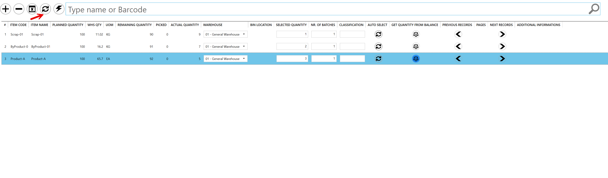

### Team Log in

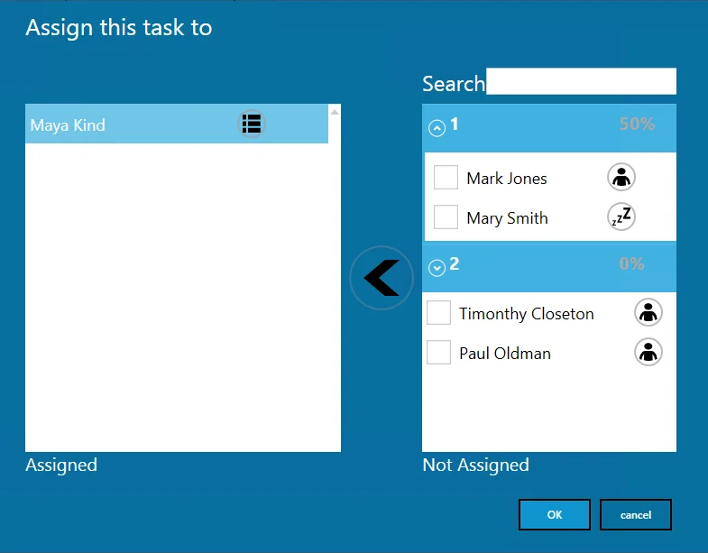

A team leader can assign employees to a task, with no limit on the number of employees that can be assigned.

:::caution
    Please note that an Employee must have a [Labour](../../administrator-guide/setting-up-the-application/overview.md) assigned to be able to be chosen from the list.
:::

To assign employees to a task, select the checkboxes next to the required employees and click the left arrow icon.

Each employee has an icon indicating their current assignment status:

- A **man icon** shows the employee is assigned to a task.
- A **sleep icon** indicates they are not assigned to any task.

Click the icon to view a list of tasks assigned to that employee.

**Team Assignments**

This option also supports Teams, a standard SAP Business One feature that can be configured in Human Resources > Employee Master Data > Membership tab.

- Each team is represented by a header displaying the team name (e.g., 1 and 2 in the example screenshot).
- You can expand or collapse the team list using the up/down icon next to the team name.
- The header also shows a percentage value, representing the proportion of team members without any assigned task.

After selecting all required employees, move them to the Assigned section and click the OK icon.

**Task Exceution & Completion**

- Once the team leader assigns employees and confirms the selection, the task status changes to "Run" for all assigned employees.
- When the team leader finishes work, it is marked as complete for all assigned employees.
- Additionally, the team leader sets the produced quantity on the resource upon completion.
- Instead of creating separate Time Booking entries for each employee, a One-Time Booking document is generated for the resource and the assigned employees.

Click [here](/docs/processforce/user-guide/manufacturing/time-booking/teams) to find out more about related ProcessForce options.

**Independent Work Completion**

Each employee can finish work independently, for instance, to change resources or leave the workstation.

- Finishing work for one employee does not complete it for others.
- An employee does not declare quantity when finishing work independently.

### Activity

This feature is part of the standard SAP Business One functionality. You can configure an Activity (e.g., Conversation, Note) and an Activity Type (e.g., General, Internal) in [ProcessForce General Settings](../../administrator-guide/setting-up-the-application/overview.md#processforce-settings).
When selecting the Activity option from the CompuTec PDC interface, an activity is automatically created with predefined settings. This ensures the activity is linked to a specific Manufacturing Order, Operation, or Resource (depending on the Task tile from which it is initiated) and the employee currently logged into CompuTec PDC.

### Technical Instruction

Here, you can find instructions stored in Manufacturing Order → Operations → Instruction tab.

:::info Path
    Production → Manufacturing Order → Manufacturing Order
:::

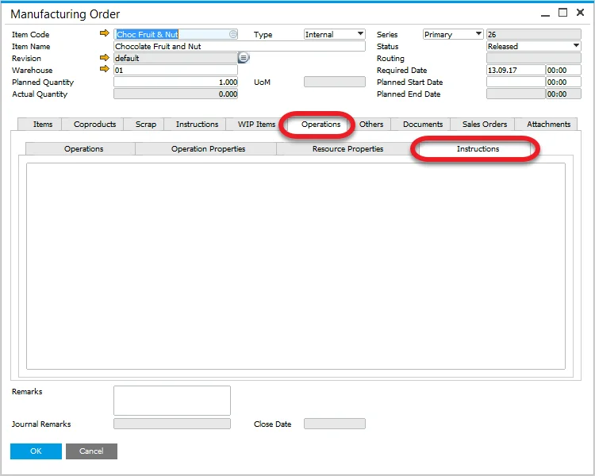

### Additional Options

Some of the available options are not present on a Task Tile by default. You can reach them by using the [Customization option](../customization/overview.md).

## Example

In this section, you can find a step-by-step guide on setting work time on a task based on a specific example.

### Adding a New Task

To get information on this, click [here](../adding-new-task.md).

### Click a Status Icon on a Task Tile to Open a Task Panel of a Specific Task

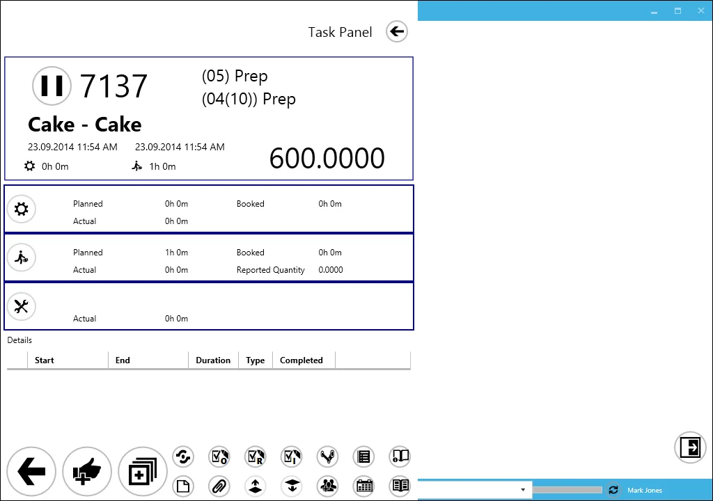

### Setting set-up time

1. Click the Setup icon on the Setup Time tile. You can configure whether clicking the icon starts the timer immediately or opens a manual date and time selection panel (based on the Show Date Picker option).
2. Setup Time begins counting, indicated by:

    - The Setup Time and Period turning green.
    - The Period updating in real-time.
    - The Setup icon on the Setup Tile being highlighted in blue.

    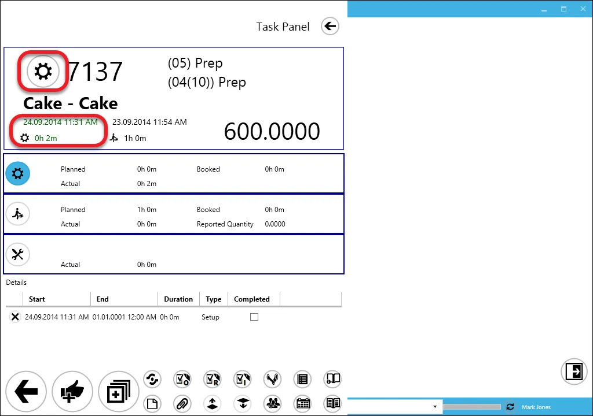
3. Click the Setup icon again to stop Setup Time. This can also be done after logging out and back in. This action will stop the time counting, indicated by the setup time and period turning blue.

    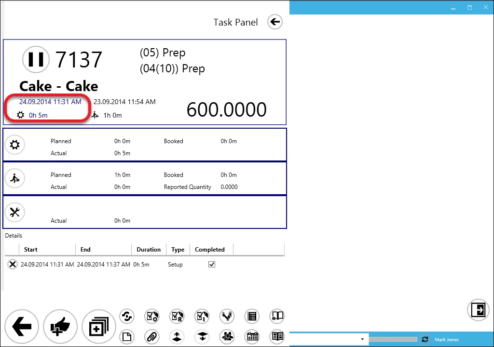

    :::caution
        Clicking the Status icon on a Task Tile displays or hides a log of actions performed on the current task in CompuTec PDC. You can delete an activity by clicking the X icon next to it.
    :::

    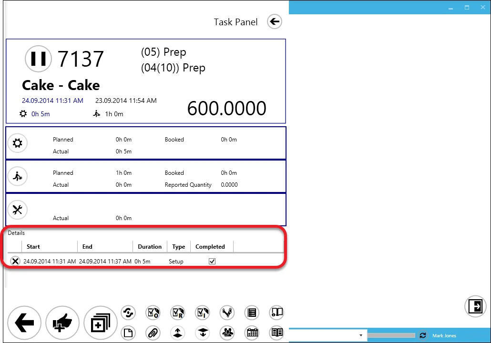

### Setting Run Time

Run Time is set the same way as Setup Time, but using the Run Time tile.

- Setup Time automatically ends when Run Time starts.
- If you click the Confirmation button before ending Run Time, a message will appear:

    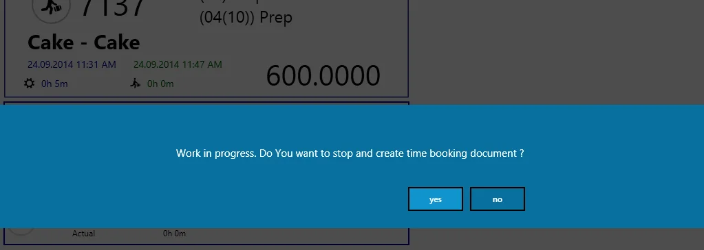

- Click Yes to end Run Time and proceed to the Confirmation Panel.
- Click No to cancel the action.

### Setting Downtime

Click [here](./downtime.md) to find out more.

### Confirmation of Time Periods in a Task

:::warning
    All time changes are recorded in CompuTec PDC. However, they are only posted to the selected database after confirming the task in the Confirmation Panel.
:::

1. After setting all the periods, click the "complete" icon:

    

    The Confirmation Panel will appear:

    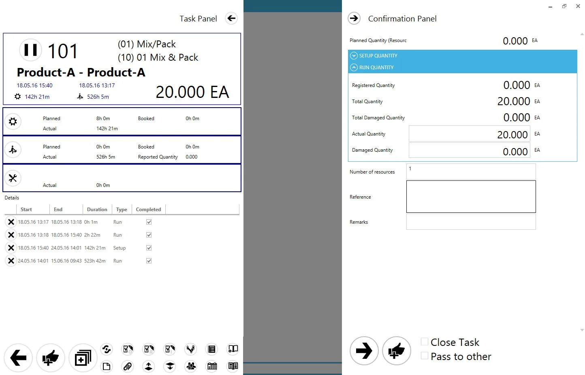

        You can enter quantities for Setup Time (if applicable) and Run Time (number of items produced). If a damaged quantity is recorded, the Reason Code and Rework Remarks fields will appear for input.

    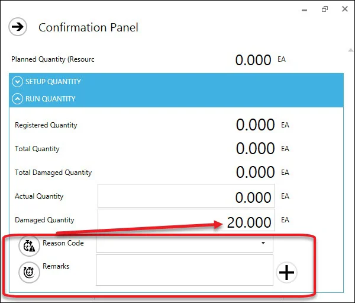
2. After setting quantities, choose an action:

    - Keep the task open (leave all checkboxes unchecked).
    - Close the task (removes it from the task list and updates its status).
    - Pass the task to another employee (select an employee from the dropdown).

        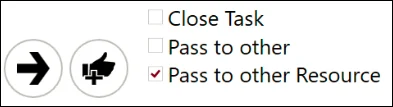

    **Close Task**: checking this option causes the following:

        - a task with this option checked is removed from the list of tasks to do – and receives a Closed status on a Gantt chart
        - in the Manufacturing Order, on the Operation tab, the Resource line is grayed out and the value in the Resource column Active is set to "N"
        - a Resource for an Operation with the Close Task option enabled is not available for selection for a new task on CompuTec PDC.

        When all resources in an operation have their Active status set to "N," the operation receives a Finished status.

        To unblock a resource for operation within the scope of a manufacturing order, add a Timebooking correction document and ensure the Close Task option is unchecked.

    **Pass to other**: this option adds the task to a specified employee. After accepting the task, it is passed to the chosen employee. It has to be started manually from the chosen employee level.

    **Pass to other Resource**: this option allows you to transfer a task to another resource when registering a time booking or downtime. Upon selecting this option, a drop-down list of alternative resources defined for the current resource will appear. You can only switch the task to an alternative resource with the same machine type as the current resource. Click [here](/docs/processforce/user-guide/scheduling/gantt-chart/alternative-resources) to learn more about defining alternative resources in ProcessForce.

    To be able to pass a Task to another Resource it is required to check Is enabled Move to Other Resource in [Employee Master Data](../../administrator-guide/setting-up-the-application/overview.md#setting-up-computec-pdc-application).

    Click the confirmation icon to register work.
3. Number of Resources: in this field, you can specify the number of resources of the same type for which work is to be recorded. For example, if you have a resource called "Oven," you can define how many units of this equipment were used, such as 5 ovens. By default, the value is set to 1. If a higher value is entered, the recorded duration represents the cumulative effort of each piece of equipment.

#### Example

We recorded 48 hours and 25 seconds of work and set the Number of Resources to 5. Since the work was performed on five pieces of equipment simultaneously, the total effort is multiplied by 5, resulting in an accumulated work duration of 240 hours, 2 minutes, and 5 seconds.

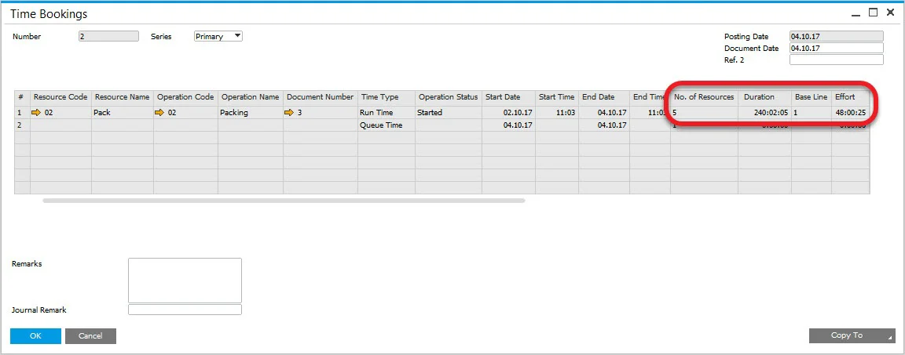

:::info Path
    Please mind that the Number of Resources field value is set up to 1 by default, regardless of the Number of Resources field value of a corresponding Resource record in ProcessForce.
:::

### Recording Quantity without Closing a Task

You can use the plus icon to record quantity without closing a Task: 

This opens a panel similar to the Confirmation Panel, where you can enter the required quantities. Entering these quantities updates the Reported Quantity on the Task Panel. The task remains open and active afterward.

---
