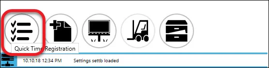
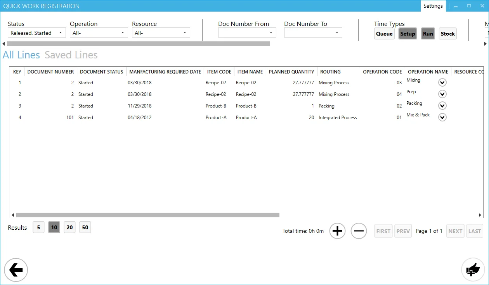
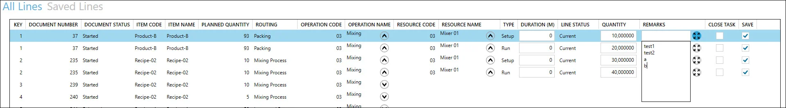

# Quick Time Booking

Managing time bookings efficiently is crucial in streamlining manufacturing operations. The Quick Time Booking feature allows you to record time bookings for multiple Manufacturing Orders simultaneously, all from a single panel. This eliminates the need to create and open separate task tiles, saving time and enhancing productivity.

---

The Quick Time Booking option is accessible from the main panel:

Clicking the option opens the Quick Time Booking panel:

## Header

The header of the Quick Time Booking form enables you to define filter options to display only the required tasks. The available options include:

- **Status** – Filter tasks by Manufacturing Order Status (options: Released, Started, or both).
- **Operation** – Choose a specific Operation or display all Operations.
- **Resource** – Choose a specific Resource or display all Resources.
- **Doc Number from and Doc Number to** – Define a range for Manufacturing Order document numbers.
- **Time Types** – Select time types for the tasks. Note that Queue and Stock time types cannot be accessed from the CompuTec PDC level; they can only be managed in SAP Business One.
- **Manufacturing Required Date From and Manufacturing Required Date To** – Specify a date range for Manufacturing Order required dates.
- **Task Start Date from and Task Start Date to** – Filter tasks by their starting time range.
- **Save icon** – Save the current filter settings for reuse.
- **Restore to default values icon** – Reset all filters to their default values.

## Table Section

In this section, all the records defined by the filters option from the header are displayed.

Click the icon next to the Operation Name to expand the line to Resources. More than one resource can be assigned to an operation. Clicking the icon next to the resource expands this line to Times. For each of the resources, setup and run time can be defined, followed by quantity, remarks, and the [Close Task](./overview.md) option.

Use the Save column checkbox to choose which lines are to be saved eventually. Click on "Saved Lines" to view only the lines with the Save checkbox checked.

After setting up all the details and checking the "Save" checkbox, click the confirmation icon in the lower right corner of the form to record the time bookings.

## Footer

The footer of the form contains the following display options:

- **Results** – Define how many records are shown per page in the table.
- **Total time** – View the cumulative duration of all setup and run times.
- **'+'/'-' icon** – Expand or collapse all rows to one level (Operation > Resource > Times).
- **Pages** – Navigate between pages in the table.

---
The Quick Time Booking feature simplifies the process of recording time for Manufacturing Orders, making it both efficient and user-friendly. By utilizing its powerful filtering, editing, and saving options, you can manage time bookings seamlessly and focus on optimizing your manufacturing operations.
