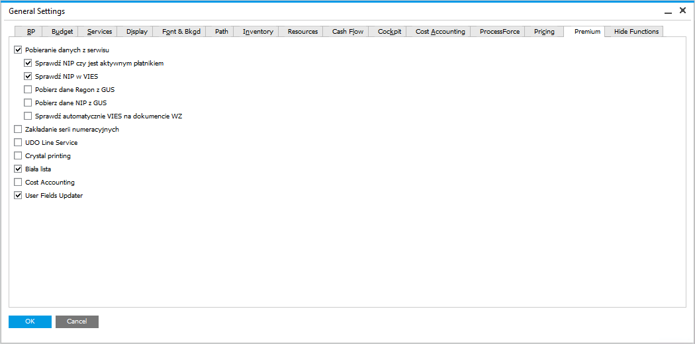

# Overview

CompuTec Premium extends the functionality of SAP Business One by offering advanced automation and validation features. These enhancements streamline operations, improve data accuracy, and ensure compliance with tax regulations.

---

## Key functions include

- **Taxpayer Verification**: automatically checks the NIP (Taxpayer Identification Number) in the Polish Tax Office and VIES databases to confirm if a business partner is an active taxpayer.
- **GUS Service Integration**: enables automatic data retrieval from the Central Statistical Office [(GUS)](gus-service.md) for business partners using a WCF service.
- **Numbering Series Management**: allows users to edit and create new numbering series while reassigning default users.
- **UDO Line Service**: automatically adds a new line when a current line is filled in User Defined Objects (UDOs).
- **Crystal Printing for UDOs**: supports printing documents related to UDOs using Crystal Reports.
- **VAT Payers Whitelist Check**: verifies if a business partner is an active VAT payer and confirms the associated bank account number.
- **User Fields Updater**: enables modifications to User Defined Fields (UDFs) in accounting sale and purchase document lines, even after document posting.
- **Cost Accounting**: automatically generates accounting entries that allocate costs to cost centers according to predefined rules, based on previously entered documents (e.g., invoices, journal entries).

Availability of these functions can be controlled from the General Settings level, by checking the right checkboxes. To access Premium tab, navigate to:

:::info Path
Administration > System Initialization > General Settings > Premium tab
:::

    

---
