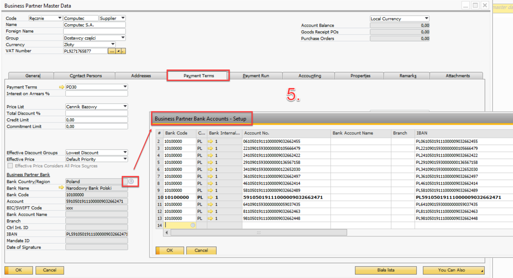

# Downloading Bank Accounts to the Business Partner Master Data

In SAP Business One, when a Business Partner (BP) does not have a predefined default bank account, users can conveniently retrieve all available bank accounts from the official whitelist and set one as the default. This functionality ensures compliance and accuracy in financial transactions by pulling verified data directly from the whitelist registry.

---

## Process Overview

- **Access the Business Partner Master Data**: After adding a new Business Partner, navigate back to the Business Partner Master Dta screen.
- **Launch the “Biała lista” Field**: Click on the “Biała lista” field (1). This action will trigger the appearance of the “Ustaw konto bankowe” field.
- **Select the Default Bank Account**: Expand the list (2) to view all available bank accounts retrieved from the whitelist. Select the appropriate account to set it as the default.

    
- **Confirmation Message**: Once a bank account is selected, the system will display the message “Konto bankowe dodane pomyślnie” (3), confirming that the account has been successfully added.
- **Update the Business Partner Master Data**: After the confirmation, the Business Partner’s master data should be updated accordingly (4).

    

## Results of This Functionality (5)

- **Bank Code**: This is a mandatory field in the system, but it is not used directly. The fixed code 10100000 is always applied.
- **Account Number**: Pulled directly from the whitelist registry.
- **IBAN**: Also retrieved from the whitelist, prefixed with PL to comply with Polish banking standards.

    

---
