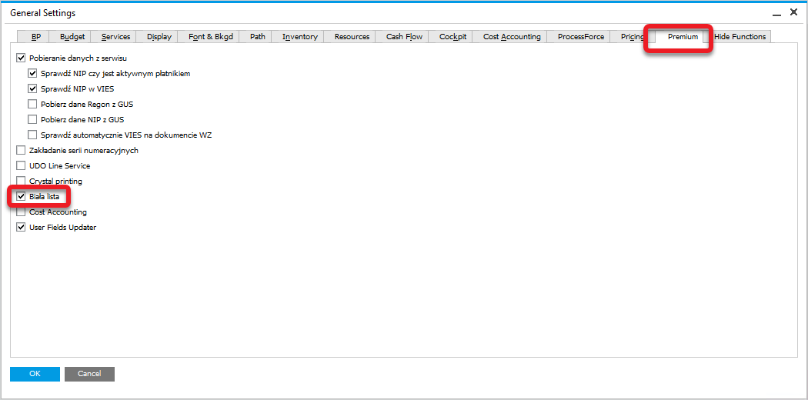
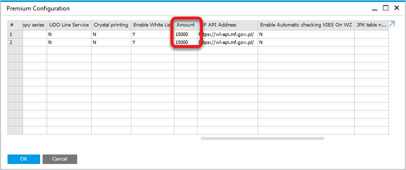
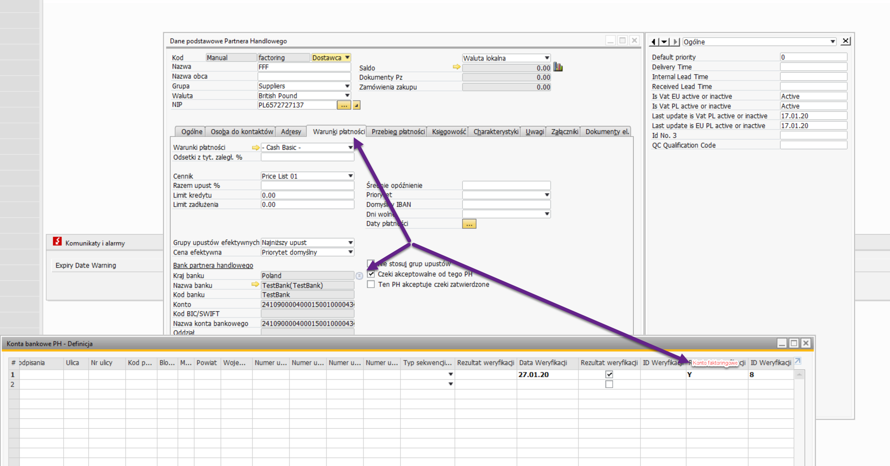
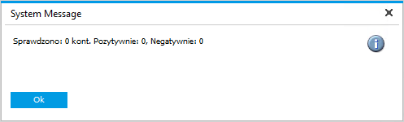
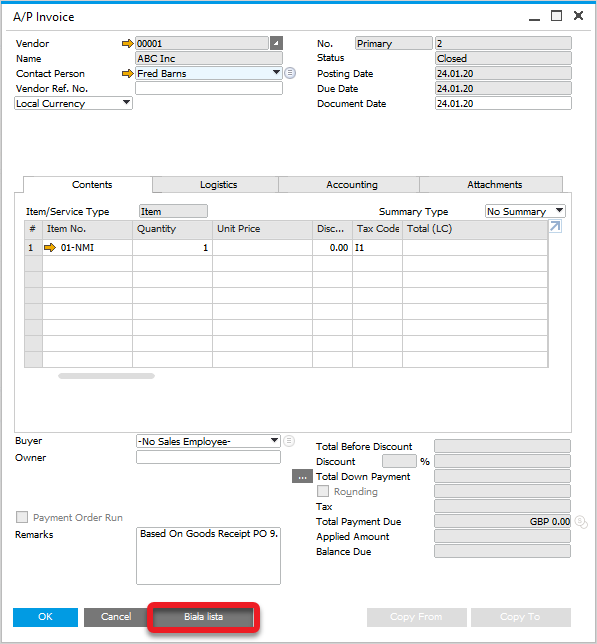
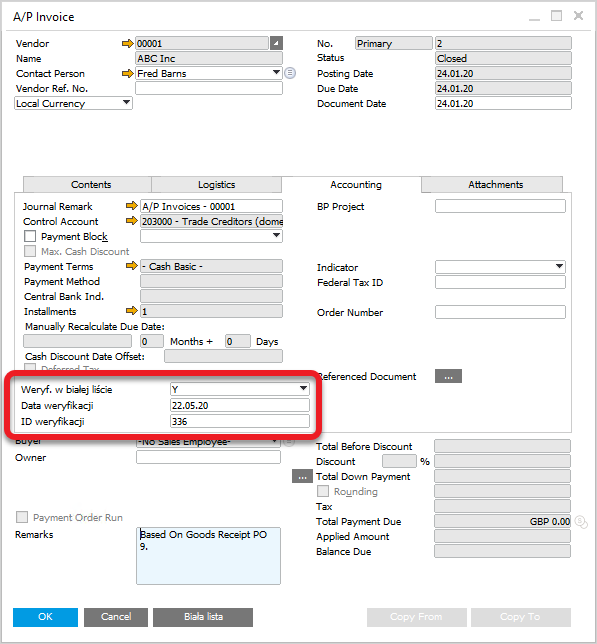
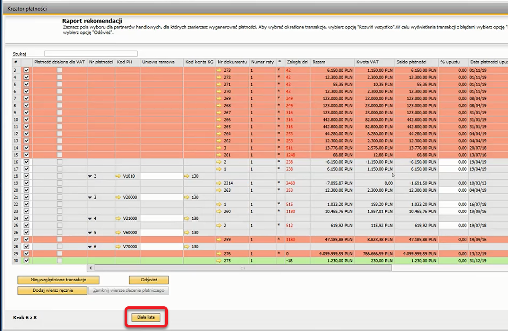

# Overview

The CompuTec Premium extension simplifies the process of verifying Business Partners on the VAT payers white list. This feature enables businesses to ensure compliance with tax regulations by confirming the VAT status of their partners, checking if a business has been denied registration, and verifying bank account details before processing payments.

---

## What is the VAT Payers White List?

The [VAT payers white list](https://www.podatki.gov.pl/wykaz-podatnikow-vat-wyszukiwarka), introduced on September 1, 2019, serves as a consolidated database for instant verification of Business Partners' VAT status. It replaced previous lists of registered, unregistered, and removed VAT payers.

- The white list allows businesses to:
- Verify if a Business Partner is an active VAT payer.
- Check if a Business Partner was denied VAT registration, removed, or reinstated, along with the legal justification.
- Confirm the bank account number to which payments should be made.

## Configuration

### General Configuration

To use a specific option, check the related checkbox in General Settings:

To enable the feature, navigate to Tools → User-Defined Windows → CT_PR_Conf – Premium Configuration. In the Premium Configuration window, set the verification threshold:

- 0: checks all documents.
- 15,000 zł: checks documents with an overall value of 15,000 zł or more.

### Factoring Account

If the account being verified is a factoring account, enable the corresponding option in the account settings.

## Usage

### Business Partner Master Data

The extension checks bank account numbers assigned to a Business Partner against the white list. The results display:

- The number of assigned accounts.
- The number of positively verified accounts.
- The number of negatively verified accounts.

### A/P Invoice

In the A/P Invoice form, under the Accounting tab, users can verify the NIP (Tax Identification Number) and bank account number pairing against the white list. The field Verification in the white list will display:

- Y: positive verification.
- Er: negative verification.

### Payment Wizard

The Payment Wizard checks bank account numbers linked to documents against the white list. The results are visually highlighted:

- Red rows: negative verification.
- Green rows: positive verification.
- No highlight: not verified (based on configuration settings).

---
