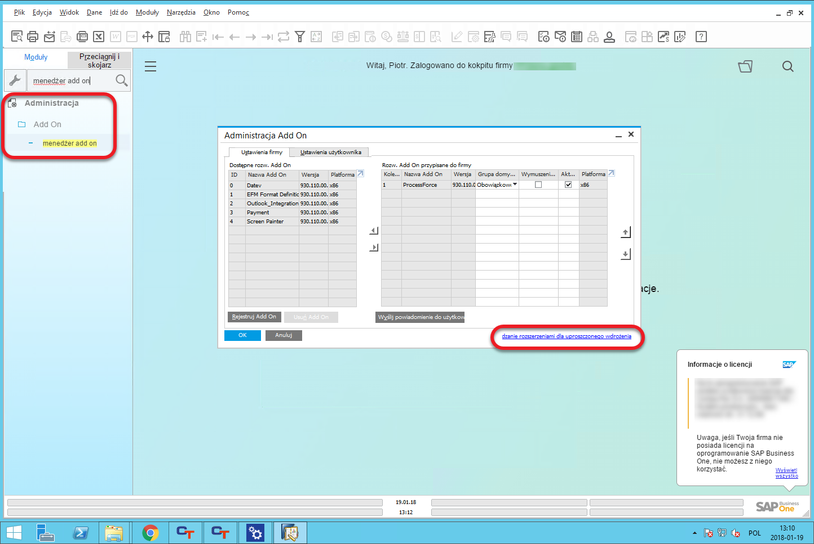
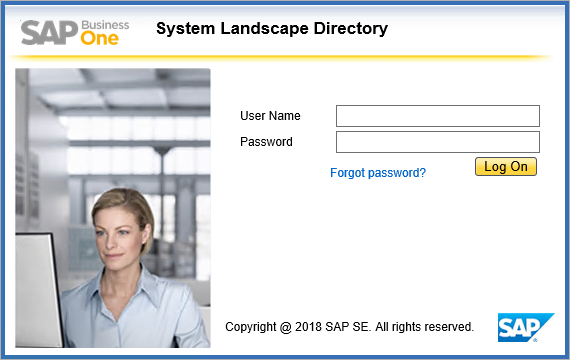
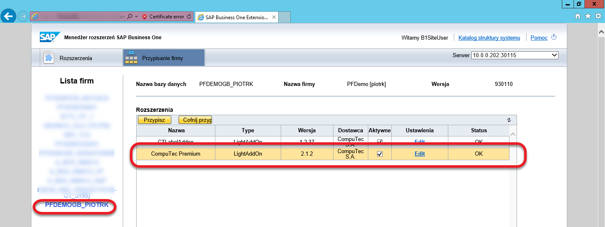
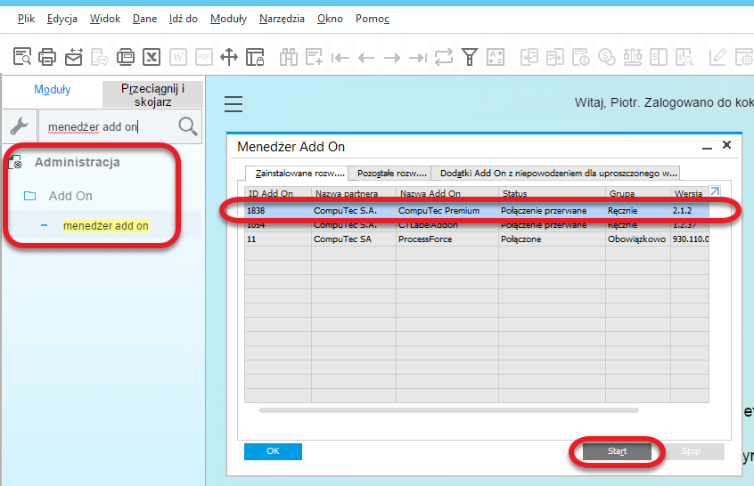
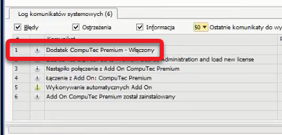

# Premium Extension Installation

CompuTec Premium is a lightweight deployment extension for SAP Business One that enhances system functionality. This guide provides step-by-step instructions for downloading, installing, and configuring the add-on, including firewall settings to ensure seamless operation.

---

You can download installation files from [here](../../administrator-guide/download.md).

## Extension Installation in SAP Business One

Since CompuTec Premium is a lightweight deployment extension, it must be added and assigned to a specific company or database via the System Landscape Directory (SLD). Follow these steps for installation:

1. **Access Add-On Administration**

    - In SAP Business One, navigate to Main Menu → Administration → Add-Ons → Add-On Administration.
    - Click Manage Extensions for Lightweight Deployment at the bottom of the Add-On Administration window.

        

2. **Log in to the System Landscape Directory (SLD)**

    - Open the System Landscape Directory and log in.

        

3. **Import the Installation Files**

    - Select Import, then click Browse to locate the installation package.
    - Click Upload to begin the installation.

        

4. **Configure Installation Parameters**

    - Set additional parameters if needed, or click Next twice and then Save.
    - The CompuTec Premium extension will now appear in the main window.

5. **Assign the Extension to a Company**

    - Select the CompuTec Premium extension and go to the Company Assignment tab.

        

    - Choose the required company and click Assign.

        

6. **Finalizing the Setup**

    - Check the field in the first column and click Next.
    - Set up the necessary parameters and proceed by clicking Next again.

        
    - Choose the starting method, which is automatically assigned to all users. This default setting can be adjusted per customer requirements.
    - Click Finish, log out of the System Landscape Directory, and re-log into the assigned company.

7. **Running the Extension**

    - If the starting method was set to manual, you must manually launch the extension.

         

    - Once the system displays the message "Dodatek CompuTec Premium - Włączony", the extension is successfully installed and ready for use.

        

## Firewall Configuration

CompuTec Premium relies on external services for certain functionalities. Ensure your firewall settings allow access to the following services from end-user devices:

| Service | Port | Purpose |
| --- | --- | --- |
| service.computec.pl | 443/tcp (HTTPS) | Fetching Business Partner information from the public GUS listing|
| sprawdzenie-status-vat.mf.gov.pl | 443/tcp (HTTPS) | Checking VAT taxpayer status in Poland |
| ec.europa.eu/taxation_customs/vies/services/checkVatService | 443/tcp (HTTPS) | Verifying VAT taxpayer status within the European Union |
| wl-api.mf.gov.pl | 443/tcp (HTTPS) | Validating a supplier’s bank account number on the white list |

By following these steps, you can successfully install and configure CompuTec Premium, ensuring smooth integration with SAP Business One.

---
