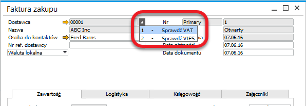
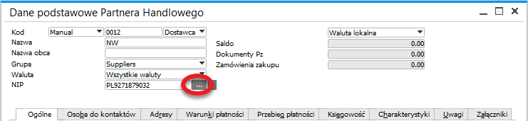
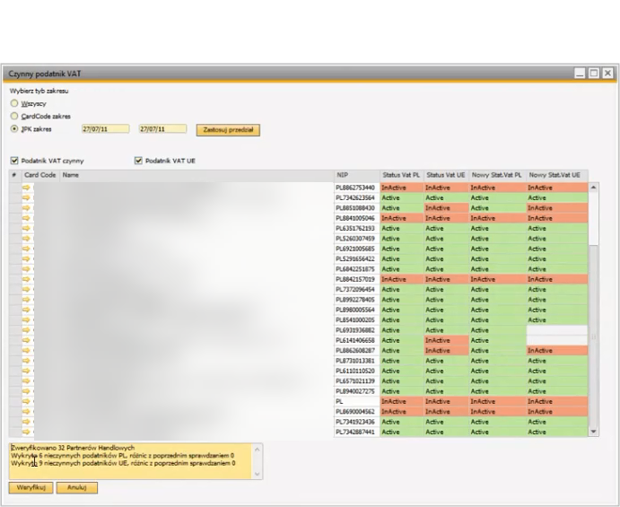
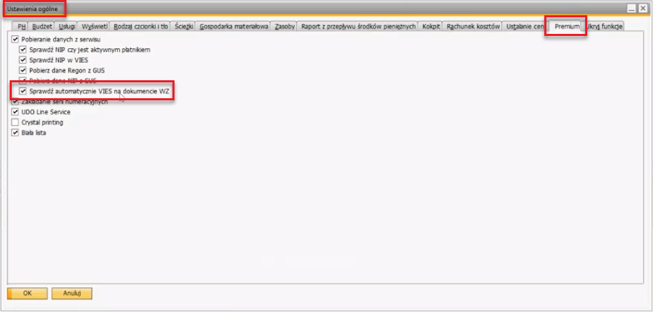
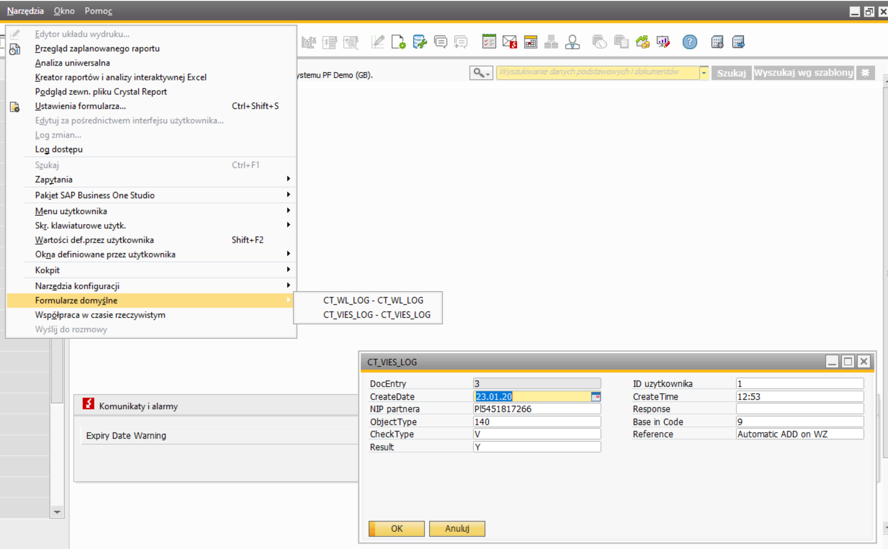

# GUS Service

GUS Service provides a seamless way to verify a Business Partner's VAT registration status using both national (VAT) and EU-wide (VIES) databases. This ensures compliance and transparency in business transactions.

---

## Downloading Data from the Services

The first-two options ("Check NIP if Business Partner is active VAT payer" and "Check NIP in VIES") are available (after enabling the related General Settings options) from a drop-down list next to Business Partner field on the following forms:

- Business Partner Master Data
- A/P Invoice
- A/R Invoice

    

Additionally, users can retrieve Business Partner details from the GUS database using the following options, available in the Business Partner Master Data form:

- Get REGON data from GUS
- Get NIP data from GUS

    

For the REGON data retrieval, a CAPTCHA code must be entered to proceed.

## Checking the Last VAT Status Update

To check the last recorded VAT status change for a Business Partner:

- Navigate to Business Partner Master Data (Main menu → Business Partner → Business Partner Master Data).
- Click View in the upper menu.
- Select User Defined Fields to display the relevant fields in the right panel.
- A list of all Business Partners and their latest VAT status verification can be accessed via the Active VAT Payer option.

## Active VAT Payer List

To view a consolidated list of Business Partners and their latest VAT activity status from both the Treasury Department and VIES lists:

:::info Path
Main menu → Administration → Utilities → Active VAT Payer
:::

In this form, users can:

- Filter records by CardCode range or SAF-T range (Standard Audit File for Tax).
- Click Verify to refresh the VAT status of listed Business Partners.
- View a Remarks summary displaying the number of checked partners, inactive entities, and any status discrepancies.

    

## Automatic VIES Checking on Delivery Documents

This feature automatically verifies and displays a Business Partner's VIES status in the Delivery document header.

**To enable automatic VIES checking**:

- Enable the relevant option in system settings.

    

- Once activated, the system will check VIES status and display in the form header upon opening the Delivery form in adding mode.

    

- The verification record can be accessed via:

    :::info Path
    Tools → Default Forms → CT_VIES_LOG
    :::

    

---
