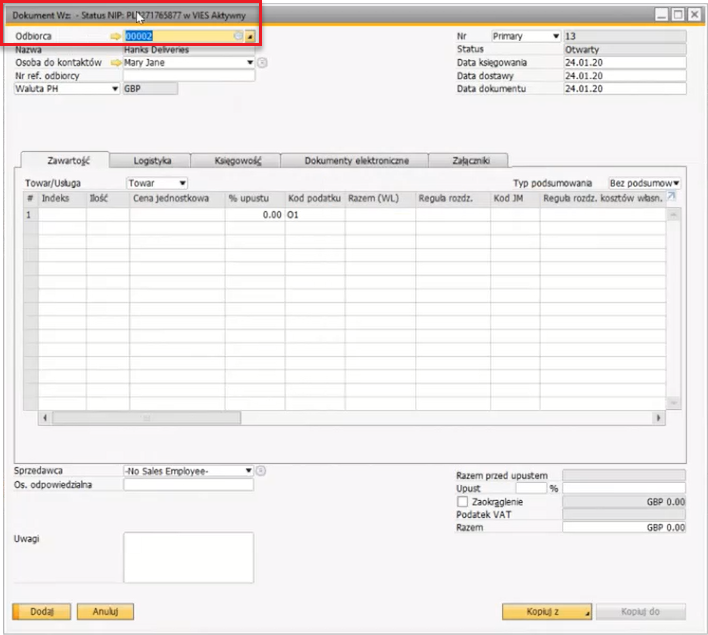

# Usługa GUS

Usługa GUS umożliwia łatwą weryfikację statusu rejestracji VAT kontrahenta przy użyciu krajowych (VAT) oraz unijnych (VIES) baz danych. Zapewnia to zgodność z przepisami i przejrzystość w transakcjach biznesowych.

---

## Pobieranie danych z usług

Dwie pierwsze opcje („Sprawdź NIP, czy kontrahent jest czynnym podatnikiem VAT” oraz „Sprawdź NIP w VIES”) są dostępne (po ich wcześniejszym włączeniu w ustawieniach ogólnych) w rozwijanym menu obok pola Kontrahent w następujących formularzach:

- Dane podstawowe kontrahenta
- Faktura zakupu (A/P Invoice)
- Faktura sprzedaży (A/R Invoice)

    

Dodatkowo użytkownicy mogą pobrać dane kontrahenta z bazy GUS, korzystając z poniższych opcji dostępnych w formularzu Dane podstawowe kontrahenta:

- Pobierz dane REGON z GUS
- Pobierz dane NIP z GUS

    

W przypadku pobierania danych REGON wymagane jest wprowadzenie kodu CAPTCHA.

## Sprawdzanie ostatniej aktualizacji statusu VAT

Aby sprawdzić ostatnią zarejestrowaną zmianę statusu VAT dla kontrahenta:

- Przejdź do Dane podstawowe kontrahenta (Menu główne → Kontrahent → Dane podstawowe kontrahenta).
- Kliknij Widok w górnym menu.
- Wybierz Pola zdefiniowane przez użytkownika, aby wyświetlić odpowiednie informacje w panelu bocznym.
- Lista wszystkich kontrahentów oraz ich ostatnie weryfikacje statusu VAT jest dostępna w opcji Czynny podatnik VAT.

## Lista czynnych podatników VAT

Aby wyświetlić zbiorczą listę kontrahentów oraz ich najnowszy status VAT w bazach Ministerstwa Finansów i VIES:

:::info Ścieżka
Menu główne → Administracja → Narzędzia → Czynny podatnik VAT
:::

W tym formularzu użytkownicy mogą:

- Filtrować rekordy według zakresu CardCode lub SAF-T (Standardowy Plik Kontrolny dla Podatków).
- Kliknąć Sprawdź, aby zaktualizować status VAT dla wybranych kontrahentów.
- Przejrzeć podsumowanie w polu Uwagi, które wyświetla liczbę sprawdzonych kontrahentów, nieaktywnych podmiotów i wszelkie rozbieżności statusu.

    

## Automatyczna weryfikacja VIES na dokumentach dostawy

Funkcja ta automatycznie sprawdza status kontrahenta w bazie VIES i wyświetla go w nagłówku dokumentu Dostawy.

**Aby włączyć automatyczną weryfikację VIES**:

- Aktywuj odpowiednią opcję w ustawieniach systemowych.

    

- Po włączeniu system automatycznie sprawdzi status VIES i wyświetli wynik w nagłówku dokumentu Dostawy w trybie dodawania.

    

- Rejestr weryfikacji można przeglądać w:

    :::info Ścieżka
    Narzędzia → Domyślne formularze → CT_VIES_LOG
    :::

    

---
