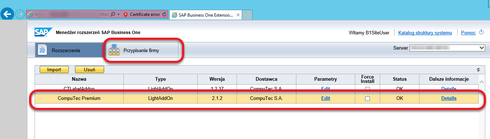

# Instalacja rozszerzenia Premium

CompuTec Premium to lekkie rozszerzenie dla SAP Business One, które zwiększa funkcjonalność systemu. Ten przewodnik zawiera szczegółowe instrukcje dotyczące pobierania, instalacji i konfiguracji dodatku, w tym ustawień zapory sieciowej, aby zapewnić jego płynną pracę.

---

Możesz pobrać pliki instalacyjne tutaj.

## Instalacja rozszerzenia w SAP Business One

Ponieważ CompuTec Premium jest lekkim rozszerzeniem wdrożeniowym, musi zostać dodane i przypisane do określonej firmy lub bazy danych za pośrednictwem System Landscape Directory (SLD). Wykonaj następujące kroki, aby przeprowadzić instalację:

1. **Dostęp do administracji Dodatkami**

    - W SAP Business One przejdź do: Menu główne → Administracja → Dodatki → Zarządzanie dodatkami.
    - Kliknij Zarządzaj rozszerzeniami dla lekkiego wdrożenia na dole okna Zarządzanie dodatkami.

        

2. **Zaloguj się do System Landscape Directory (SLD)**

    - Otwórz System Landscape Directory i zaloguj się.

        

3. **Importuj pliki instalacyjne**

    - Wybierz Importuj, a następnie kliknij Przeglądaj, aby znaleźć pakiet instalacyjny.
    - Kliknij Prześlij, aby rozpocząć instalację.

        

4. **Konfigurowanie parametrów instalacji**

    - Jeśli konieczne, ustaw dodatkowe parametry lub kliknij Dalej dwa razy, a następnie Zapisz.
    - Rozszerzenie CompuTec Premium pojawi się teraz w głównym oknie.

5. **Przypisz rozszerzenie do firmy**

    - Wybierz rozszerzenie CompuTec Premium i przejdź do zakładki Przypisanie firmy.

        

    - Wybierz odpowiednią firmę i kliknij Przypisz.

        

6. **Finalizacja konfiguracji**

    - Zaznacz pole w pierwszej kolumnie i kliknij Dalej.
    - Ustaw wymagane parametry i ponownie kliknij Dalej.

        
    - Wybierz metodę uruchamiania (domyślnie przypisana do wszystkich użytkowników, ale można ją dostosować do indywidualnych potrzeb klienta).
    - Kliknij Zakończ, wyloguj się z System Landscape Directory i ponownie zaloguj się do przypisanej firmy.

7. **Uruchamianie rozszerzenia**

- Jeśli metoda uruchamiania była ustawiona na ręczną, należy ręcznie uruchomić rozszerzenie.

    

- Po wyświetleniu komunikatu "Dodatek CompuTec Premium - Włączony", rozszerzenie zostało pomyślnie zainstalowane i jest gotowe do użycia.

    

## Konfiguracja zapory Sieciowej

CompuTec Premium korzysta z usług zewnętrznych w celu realizacji określonych funkcjonalności. Upewnij się, że ustawienia zapory sieciowej pozwalają na dostęp do następujących usług z urządzeń końcowych użytkowników:

| Usługa | Port | Cel |
| --- | --- | --- |
| service.computec.pl | 443/tcp (HTTPS) | Pobieranie danych partnerów handlowych z publicznego rejestru GUS |
| sprawdzenie-status-vat.mf.gov.pl | 443/tcp (HTTPS) | Sprawdzenie statusu podatnika VAT w Polsce |
| ec.europa.eu/taxation_customs/vies/services/checkVatService | 443/tcp (HTTPS) | Sprawdzenie statusu podatnika VAT w Uni Europejskiej |
| wl-api.mf.gov.pl | 443/tcp (HTTPS) | Sprawdzanie konta bankowego dostawcy na białej liście |

Postępując zgodnie z powyższymi krokami, można pomyślnie zainstalować i skonfigurować CompuTec Premium, zapewniając jego płynną integrację z SAP Business One.

---
